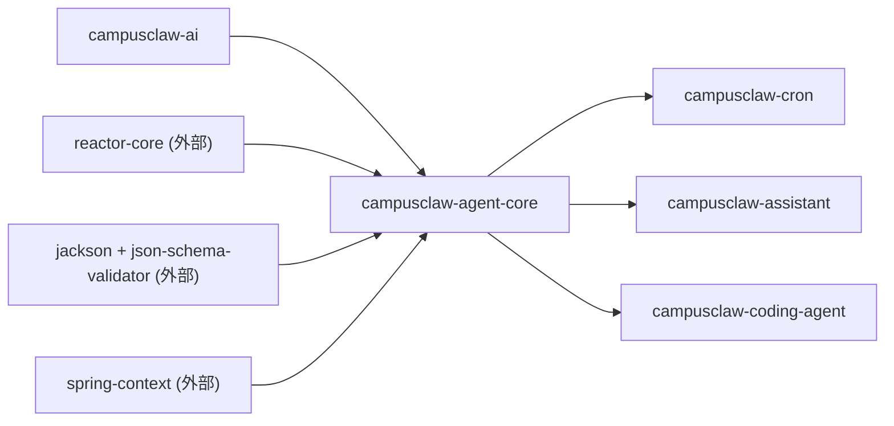
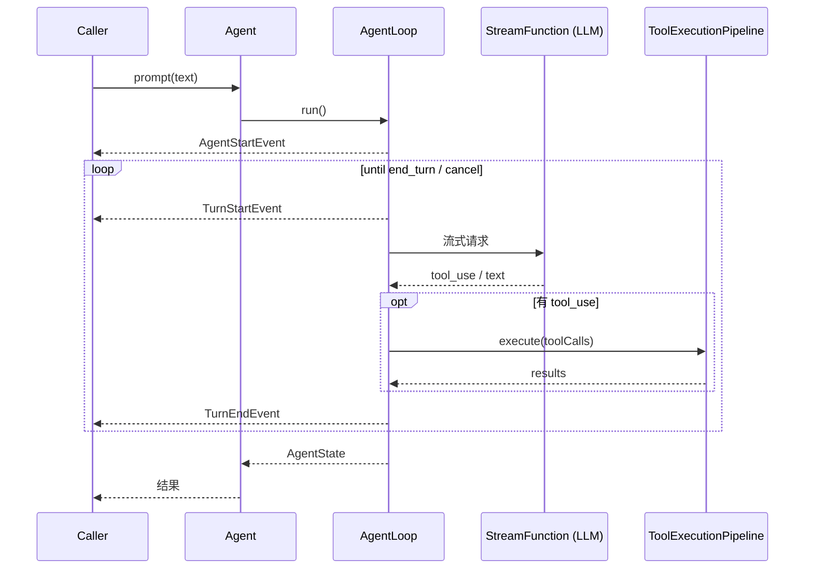
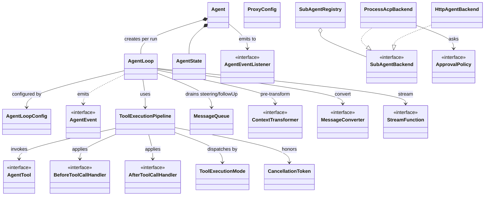

# agent-core 模块实现设计文档（基于代码 v1）

## 文档信息

| 项目 | 内容 |
|---|---|
| Story 编号 | （待补充） |
| Story 名称 | agent-core 设计文档（基于代码 v1） |
| 负责人 | （待补充） |
| 创建日期 | 2026-05-14 |
| 版本 | v1.0 (code-derived) |

---

## 1. Story 背景

### 1.1 需求来源

待开发者补充。代码仓库未提供独立的 README/`*-design.md`；从仓库根 `CLAUDE.md` 与 `docs/module-architecture.md` 可知 agent-core 是 CampusClaw 项目（前身 pi-mono-java）的 "agent runtime" 抽象层，承载 LLM 与工具执行循环。可推断为"演进式架构治理"——把分散在 CLI / TUI 中的 agent 编排逻辑下沉到独立 lib，便于 cron / assistant / coding-agent-cli 多上游复用。

### 1.2 需求背景/价值/详情

**背景：** agent-core 位于 `campusclaw-ai`（LLM 抽象）之上、`campusclaw-coding-agent`（CLI）之下，是整个项目里"对话编排"的运行时核心。所有面向 LLM 的多轮对话、工具调用、流式事件分发都通过本模块。

**价值（公开 API 反推）：** 对外提供以下能力——

- `Agent` 门面：管理 agent 生命周期（model/prompt/tools 配置、prompt/continue/abort、事件订阅）；
- `AgentLoop` + `AgentLoopConfig`：可独立装配的"LLM↔Tool"多轮循环；
- `ToolExecutionPipeline`：工具调用前/后 hook、JSON-Schema 校验、顺序/并行执行模式；
- 完整的 sealed `AgentEvent` 事件流（10 种），便于 UI/Persistence 订阅；
- `SubAgentBackend` 子代理抽象（ACP 进程后端 + HTTP 后端 + 审批策略）；
- 系统级 HTTP/SOCKS5 代理装配（`ProxyConfig`）。

**详情：** 详见第 3 章。

### 1.3 关联需求

| 关联 Story/需求 | 关联关系 | 说明 |
|---|---|---|
| campusclaw-ai | 依赖 | 使用其 `CampusClawAiService`、`Message`、`AssistantMessage`、`Tool`、`StopReason` 等类型驱动 LLM 流 |
| campusclaw-cron | 被依赖 | `CronTool` / `CronEngine` / `CronJobExecutor` 依赖 agent-core 的 `Agent`、`AgentTool` 抽象进行定时调用 |
| campusclaw-assistant | 被依赖 | `GatewayWebSocketHandler` 依赖 agent-core 的 `AgentEvent`/`Agent` 进行会话回放 |
| campusclaw-coding-agent | 被依赖 | CLI 模块装配 `Agent` 实例、注册 `AgentTool` 实现、订阅 `AgentEvent` 渲染 TUI |

---

## 2. Story 分析

### 2.1 Story 上下文

文字补充：

- **本模块 artifactId**：`campusclaw-agent-core`
- **上游（pom 内项目依赖）**：`campusclaw-ai`
- **下游（grep 反查 import）**：`campusclaw-cron`、`campusclaw-assistant`、`campusclaw-coding-agent`
- **外部依赖（top）**：`reactor-core`（流式）、`jackson-databind` + `com.networknt:json-schema-validator`（参数校验）、`spring-context`（`@Service`/`@Component`）、`micrometer-core`（指标埋点保留）

### 2.2 功能点分解

| 序号 | 功能点 | 描述 | 优先级 | 预估工作量 |
|---|---|---|---|---|
| 1 | Agent 生命周期管理 | 通过 `Agent` 门面配置 model/prompt/tools；prompt/continue/abort；订阅事件 | 高 | - |
| 2 | LLM↔工具多轮循环 | `AgentLoop.runInternal` 驱动 turn 循环，处理流式 → tool_use → tool_result → 续 turn | 高 | - |
| 3 | 工具执行管道 | `ToolExecutionPipeline` 提供 beforeToolCall/afterToolCall hook、JSON-Schema 校验、SEQUENTIAL/PARALLEL 模式 | 高 | - |
| 4 | Agent 事件流 | sealed `AgentEvent` 10 个子类，覆盖 agent/turn/message/tool 各阶段 | 高 | - |
| 5 | Steering / Follow-up 消息注入 | `MessageQueue` 支持运行时插入 user 消息（中途引导 / 续 turn 输入） | 中 | - |
| 6 | 子代理（SubAgent）框架 | `SubAgentRegistry` + `SubAgentBackend` 抽象，提供 ACP 进程后端与 HTTP 后端 | 中 | - |
| 7 | 子代理审批策略 | `ApprovalPolicy` / `ApprovalClassifier` + `ParentPermissionResolver`，把子 agent 的敏感操作上抛给父 agent | 中 | - |
| 8 | HTTP/HTTPS 代理装配 | `ProxyConfig` 解析 `--proxy` URL / 环境变量 / Windows 注册表，并安装为 JVM 全局 ProxySelector | 中 | - |
| 9 | 上下文转换 | `ContextTransformer` / `MessageConverter` 在 LLM 调用前异步改写消息列表（压缩、注入系统提示等） | 中 | - |

---

## 3. 实现设计

### 3.1 功能实现思路

agent-core 把"如何与 LLM 聊天 + 调工具"这件事抽象成单一的事件驱动循环：

1. `Agent` 是面向调用方的门面（`@Service`），承载可变 `AgentState`（系统提示、model、tools、历史消息），通过 `prompt(...)` / `continueExecution()` 启动一次执行，并把执行体托管到**虚拟线程**（`Thread.ofVirtual()`）异步运行；
2. 真正的多轮编排放在 `AgentLoop`，它消费 `campusclaw-ai` 的 `AssistantMessageEventStream`（Reactor Flux），把流上的增量事件翻译成 agent 自己的 sealed `AgentEvent`，并在每个 turn 末决定"继续 / 跑工具 / 结束"；
3. 工具执行解耦到 `ToolExecutionPipeline`：参数走 JSON-Schema（2020-12）校验，支持 before/after hook 拦截或改写结果，单工具失败封装为 `ToolResultMessage` 而非抛出，保证主循环不中断；
4. 取消通过 `CancellationToken` + Reactor `Sinks.One` 同时打断"消费流"和"工具内部 IO"，并合成一条 `StopReason.ABORTED` 的 assistant message 让主循环干净退出；
5. 子代理通过 `SubAgentBackend` SPI 暴露——ACP 后端用 `ProcessBuilder` 拉起 stdio 协议子进程，HTTP 后端走 SSE/WS 协议，审批策略与父 agent 解耦。

整体设计取向：**只暴露稳定的 Java 抽象（interface / sealed / record），具体策略（converter、transformer、stream function、tool execution mode）通过 `AgentLoopConfig` 注入**，让 CLI / cron / assistant 各自按需组合。

### 3.2 功能实现设计

核心主流程位于 `AgentLoop.runInternal(...)`。下面是从源码抽出的 step 序列，与时序图一一对应：

1. `prompt(text)`：调用方在 `Agent.prompt(String)` 上传入用户消息；
2. `run()`：`Agent.startExecution` 构造 `AgentLoop` 并把执行体提交给虚拟线程；
3. `AgentStartEvent`：循环开始时发射，订阅方据此重置渲染状态；
4. `TurnStartEvent`：进入每个 turn；
5. `流式请求`：`AgentLoop.invokeModel` 经 `MessageConverter.convert` + `ContextTransformer.transform` 后调 `StreamFunction.stream(...)` 拿到 `AssistantMessageEventStream`；
6. `tool_use / text`：`consumeStream` 把 SDK 增量事件翻译为 `MessageStartEvent` / `MessageUpdateEvent`；流结束后产出最终 `AssistantMessage`；
7. `execute(toolCalls)`：若 assistant 输出了 `ToolCall`，`runToolPhase` 调 `ToolExecutionPipeline.executeAll`，按 `ToolExecutionMode` 顺序或并行执行；
8. `results`：每个工具产出 `ToolResultMessage`，追加到上下文；中途如有 steering 消息也并入；
9. `TurnEndEvent`：turn 收尾，附带本轮 `ToolResultMessage` 列表；
10. `AgentState`：循环退出后写回最终 message 列表与 streaming 状态；
11. `结果`：`Agent.prompt(...)` 返回的 `CompletableFuture<Void>` complete，调用方可取 `state.getMessages()`。

**事件清单（sealed `AgentEvent` 子类型）：**

| 事件类型 | 触发时机 |
|---|---|
| `AgentStartEvent` | 主循环开始 |
| `AgentEndEvent` | 主循环退出（含异常 / cancel） |
| `TurnStartEvent` | 每个 turn 起始 |
| `TurnEndEvent` | 每个 turn 收尾，携带本轮 `ToolResultMessage[]` |
| `MessageStartEvent` | 新 user / assistant 消息开始流出 |
| `MessageUpdateEvent` | assistant 流增量（含 text / thinking / tool_call delta） |
| `MessageEndEvent` | 消息完成 |
| `ToolExecutionStartEvent` | 工具被 pipeline 接管前 |
| `ToolExecutionUpdateEvent` | 工具流式中间结果回调 |
| `ToolExecutionEndEvent` | 工具产出最终 `AgentToolResult` |

### 3.3 GUI 前端设计

本模块不涉及前端界面（作为 lib 由上游 `coding-agent-cli`/`assistant` 等消费）。事件流通过 sealed `AgentEvent` 暴露，前端模块（如 TUI / WebSocket gateway）订阅 `AgentEventListener` 自行渲染。

### 3.4 接口描述

#### 程序接口（Java SPI）

| 接口 / 类 | 方法 | 入参 | 返回 | 说明 |
|---|---|---|---|---|
| `Agent` | `prompt` | `String` 或 `Message` | `CompletableFuture<Void>` | 启动新一次执行 |
| `Agent` | `continueExecution` | - | `CompletableFuture<Void>` | 不附新输入，继续多轮循环 |
| `Agent` | `abort` | - | `void` | 触发当前 `CancellationToken` |
| `Agent` | `subscribe` | `AgentEventListener` | `Runnable` (取消订阅) | 订阅事件流 |
| `Agent` | `steer` / `followUp` | `Message` | `void` | 注入运行时引导 / 续 turn 输入 |
| `AgentTool` | `execute` | `toolCallId, params, signal, onUpdate` | `AgentToolResult` | 工具实现契约（含流式部分结果回调） |
| `AgentEventListener` | `onEvent` | `AgentEvent` | `void` | 事件订阅者契约 |
| `ContextTransformer` | `transform` | `List<Message>, CancellationToken` | `CompletableFuture<List<Message>>` | LLM 调用前异步改写上下文 |
| `MessageConverter` | `convert` | `List<Message>` | `List<Message>` | 内部 → LLM-shaped 消息 |
| `BeforeToolCallHandler` | `handle` | `BeforeToolCallContext` | `BeforeToolCallResult` (含 `block` + `reason`) | 工具前置拦截 |
| `AfterToolCallHandler` | `handle` | `AfterToolCallContext` | `AfterToolCallResult` (覆盖 content/details/isError) | 工具后置改写 |
| `SubAgentBackend` | `open` / `prompt` / `cancel` / `close` | `OpenRequest` / `text` / `reason` | `SubAgentSession` / `Flux<SubAgentEvent>` / `void` | 子代理后端 SPI |
| `ApprovalPolicy` | `decide` | `ApprovalClassifier` 上下文 | `ApprovalDecision` | 子代理操作的审批策略 |
| `StreamFunction` | `stream` | `Model, Context, SimpleStreamOptions` | `AssistantMessageEventStream` | LLM 流式可插拔入口 |

#### LLM Tool 接口

agent-core 不内置具体 Tool 实现（read / write / bash 等在 `coding-agent-cli` 内），只定义 `AgentTool` 接口：方法 `name() / label() / description() / parameters(): JsonNode / execute(...)`。`parameters()` 返回 JSON-Schema (2020-12)，由 `ToolExecutionPipeline.validateArguments` 强校验。

#### HTTP 接口

本模块不暴露 HTTP 接口（lib 性质）。其中 `HttpAgentBackend` 是**消费者**而非服务端——它作为 `SubAgentBackend` 实现，向外部 HTTP/SSE 子代理服务发起请求。

### 3.5 数据库及持久化设计

本模块不涉及数据库持久化（无 `schema.sql`、无 `@Entity`、无 MyBatis Mapper）。Agent 状态保留在内存 `AgentState`（`ReentrantReadWriteLock` 保护）；子代理会话仅做内存 `ConcurrentHashMap` 注册，可选通过 `SubAgentSessionStore`（接口）持久化，默认 `NOOP`。

### 3.6 代码设计

按一级包列出对外/核心抽象类，每个类一行职责：

**`com.campusclaw.agent`**
- `Agent`：agent 实例门面（`@Service`），封装 LLM + tools + state + 事件流
- `CampusClawAgentCore`：Spring 配置 / 包扫描入口

**`com.campusclaw.agent.loop`**
- `AgentLoop`：多轮 turn 循环驱动；消费 LLM Flux，编排工具调用
- `AgentLoopConfig`：循环配置 record，注入 `StreamFunction` / converter / pipeline / queues
- `StreamFunction`：LLM 流式可插拔抽象（默认包装 `CampusClawAiService::streamSimple`）
- `SteeringMessageSupplier`：steering / follow-up 消息供应商抽象

**`com.campusclaw.agent.tool`**
- `AgentTool`：工具契约接口
- `AgentToolResult`：工具产出（`List<ContentBlock>` + `details`）
- `ToolExecutionPipeline`：执行管道（before/after hook、JSON-Schema 校验、SEQUENTIAL/PARALLEL）
- `ToolExecutionMode`：枚举 `SEQUENTIAL` / `PARALLEL`
- `BeforeToolCallHandler` / `AfterToolCallHandler`：执行前后 hook 抽象
- `CancellationToken`：跨流式 / 工具的协作式取消
- `AgentContext`：传给 hook / 工具的运行时只读上下文

**`com.campusclaw.agent.event`**
- `AgentEvent`：sealed 接口，10 个子类组成的事件代数
- `AgentEventListener`：事件订阅者接口

**`com.campusclaw.agent.state`**
- `AgentState`：线程安全的 agent 可变状态容器
- `AgentStateSnapshot`：状态快照 record（持久化 / 序列化用）

**`com.campusclaw.agent.queue`**
- `MessageQueue`：线程安全的 steering / follow-up 消息队列

**`com.campusclaw.agent.context`**
- `ContextTransformer`：异步上下文改写抽象
- `MessageConverter`：内部 → LLM-shaped 消息转换
- `DefaultMessageConverter`：默认实现

**`com.campusclaw.agent.proxy`**
- `ProxyConfig`：HTTP/SOCKS5 代理解析与 JVM `ProxySelector` 装配

**`com.campusclaw.agent.subagent`**
- `SubAgentBackend`：子代理后端 SPI
- `SubAgentRegistry`：进程级注册表（Spring `@Component`，自动收集 backends）
- `SubAgentSession` / `SubAgentSessionStore`：会话与可选持久化

**`com.campusclaw.agent.subagent.acp.backend`**
- `ProcessAcpBackend`：通用 ACP stdio 子进程后端
- `ClaudeCodeAcpBackend` / `CodexAcpBackend`：具体 ACP 后端实例

**`com.campusclaw.agent.subagent.http`**
- `HttpAgentBackend`：HTTP/SSE 子代理后端
- `HttpAgentConfig`：HTTP 后端配置 record（含 `AuthType` 枚举）

**`com.campusclaw.agent.subagent.approval`**
- `ApprovalPolicy` / `ApprovalClassifier`：子代理操作审批策略
- `ParentPermissionResolver` / `ParentPermissionRequest` / `ParentPermissionDecision`：父 agent 决策接口
- `TimeoutDeniedResolver`：默认超时拒绝实现

### 3.7 安装部署设计

本模块作为 lib 由 `coding-agent-cli`（或 `cron` / `assistant`）聚合，不单独部署，无 `application.yml`、无 `main`。Spring 装配点：

- `Agent` 标注 `@Service`，被上游 Spring 上下文自动扫描；
- `SubAgentRegistry` 标注 `@Component`，构造时通过 `ObjectProvider<SubAgentBackend>` 自动收集所有 backend bean；
- `CampusClawAgentCore` 提供包扫描入口（如有 `@Configuration`，被上游 import）。

运行期外部依赖：JDK 21（虚拟线程 `Thread.ofVirtual()`）、reactor-core、jackson、networknt json-schema-validator。

环境变量（仅 `ProxyConfig.fromEnvironment()` 读取）：`HTTP_PROXY` / `http_proxy` / `HTTPS_PROXY` / `https_proxy` / `NO_PROXY` / `no_proxy`。Windows 下还会回退读注册表 `HKCU\Software\Microsoft\Windows\CurrentVersion\Internet Settings`。

---

## 4. DFX 设计

### 4.1 性能设计

- **并发模型**：
  - `Agent.startExecution` 把整个 loop 派发到**虚拟线程**（`Thread.ofVirtual().start(...)`），实现 per-run 隔离且开销极低；
  - `ToolExecutionPipeline.executeInParallel` 使用 `Executors.newVirtualThreadPerTaskExecutor()`，工具间 IO 并行不阻塞平台线程；
  - LLM 流式消费基于 **Reactor `Flux`**（`stream.asFlux().takeUntilOther(cancelSink)`），cancel 通过 `Sinks.One` 信号一阶触发；
- **取消传播**：单个 `CancellationToken` 同时驱动流终止 + 工具 `signal` 检查，避免双重 abort 路径；
- **状态读写**：`AgentState` 使用 `ReentrantReadWriteLock` 区分读多写少场景，`pendingToolCalls` 走 `ConcurrentHashMap.newKeySet()`；
- **指标埋点**：依赖中包含 `micrometer-core` 但代码中尚未 grep 到 `MeterRegistry` / `@Timed` 实际使用——预留扩展点。

性能目标待定，当前实现关注**正确性与可取消性**而非具体延迟数字。

### 4.2 兼容性设计

- **JDK 版本**：21（root pom `<java.version>21</java.version>`、`<release>21</release>`）；使用 sealed interface（`AgentEvent`）、record（`AgentLoopConfig`、`SubAgentBackend.OpenRequest` 等）、pattern matching switch、虚拟线程；
- **接口稳定性**：所有对外 API 标注 `@version [br_eCampusCore 25.1.0_Next, YYYY/MM/DD]` + `@since`；`AgentLoopConfig` 提供 9 参 legacy 构造器 + 12 参 canonical 构造器同时存在，**向后兼容**新增 `StreamFunction` / `SteeringMessageSupplier`；
- **未发现 `@Deprecated` 标记**；
- 协议版本：`AcpProtocol` 内部固定 ACP 版本字符串，HTTP 后端通过 `HttpAgentConfig.protocolVersion` 暴露。

### 4.3 可维护性设计

- **日志**：所有需要日志的类走 SLF4J（`LoggerFactory.getLogger(...)`），命中类含 `ProxyConfig`、`SubAgentRegistry`、`ProcessAcpBackend`、`HttpAgentBackend`、`AcpClient` 等；未发现 `System.out.println` / `e.printStackTrace()`；
- **错误信息**：`Agent.formatError` 主动展开 `CompletionException` / `ExecutionException` 包装，并把 cause / root cause 拼到最终 message，避免"Request failed" 这类无信息异常透出；连接错误自动追加 proxy 提示；
- **未捕获异常**：`com.campusclaw.agent.util.LoggingUncaughtExceptionHandler` 为后台线程的标准 handler（被全仓使用）；
- **指标**：依赖了 `micrometer-core`，尚未发现 active 使用——属于预留埋点位；
- **健康检查**：本模块无 `HealthIndicator`（lib 性质，由上游报告）。

### 4.4 全球化设计

本模块不涉及多语言资源/多时区处理。所有 `.toLowerCase(Locale.ROOT)` / `.toUpperCase(Locale.ROOT)` 显式使用 `Locale.ROOT`（合规），用例集中在 proxy host 匹配、subagent id 归一化、ACP stop reason 解析等"机器可读字符串"。无 `ResourceBundle` / i18n properties。

`Agent.formatError` 内含一条中文提示串（"提示: 如需使用代理..."），属于面向用户的最终 error message——由调用方决定是否再次本地化，本模块未做。

### 4.5 产品资料设计

| 资料 | 关系 |
|---|---|
| `docs/module-architecture.md` | 包含 agent-core 模块说明段落，需要随接口变更同步 |
| `docs/agent-core-architecture.pdf` | 现有架构图（pdf） |
| `CLAUDE.md`（仓库根） | 描述 agent-core 在整体依赖图与运行时中的角色 |
| `docs/openapi/campusclaw-api.yaml` | HTTP server 模式 API（消费 agent-core 的事件），间接相关 |

---

## 5. 安全 Checklist

| 序号 | 检查项 | 是否涉及 | 说明 |
|---|---|---|---|
| 5.1 | 是否有认证机制 | 是 | `HttpAgentBackend` 支持 NONE/BEARER/HEADER 三种 auth 模式（`HttpAgentConfig.AuthType`），在请求头注入 `Authorization: Bearer <token>`；`ProxyConfig` 通过 `PasswordAuthentication` 装配 HTTP 代理基本认证。本模块作为 lib 自身不暴露需鉴权的对外接口 |
| 5.2 | 纵向/横向越权 | 不涉及 | 本模块无多租户 / 资源属主概念，调用上下文由上游传入 |
| 5.3 | 记录操作日志 | 是 | `SubAgentRegistry` 记录 backend 注册替换、session cancel 失败；`ProcessAcpBackend` 记录子进程拉起/退出；`Agent.formatError` 错误信息透传给上游记录 |
| 5.4 | SQL 注入 | 不涉及 | 本模块无数据库访问（无 `executeQuery` / JPQL / MyBatis） |
| 5.5 | XSS 注入 | 不涉及 | 纯后端 lib，无 HTML 渲染；事件中携带的文本由上游 UI 负责转义 |
| 5.6 | XML 注入 | 不涉及 | 无 `DocumentBuilderFactory` / `SAXParserFactory` 使用，全链路 JSON |
| 5.7 | 命令注入 | **是** | 两处 `ProcessBuilder`：（1）`ProxyConfig.regQuery` 调用 `reg query` 读 Windows 注册表，参数为**固定字符串字面量** + 固定 valueName，无外部输入注入；（2）`ProcessAcpBackend.startProcess` 拉起 ACP 子进程，argv 由 `config.command()` + `config.args()` 组装，且 **`ProcessBuilder(List<String>)` 形式天然避免 shell 解析**（不经 `/bin/sh -c`）。风险点：Windows 路径下若 `command` 不是 `.exe`/`.com` 会用 `cmd.exe /c` 包裹，此时 `command` 字符串若由不可信源提供仍存在风险——当前 backend 配置来自仓库内 `@Configuration`，由部署者可信注入。建议：审计 `config.command()` 的来源，禁止用户输入直接传入 |
| 5.8 | 输入校验 | 是 | `ToolExecutionPipeline.validateArguments` 使用 networknt `JsonSchema` (2020-12) 校验工具入参；`Agent` 各 setter 用 `Objects.requireNonNull`；`SubAgentBackend.OpenRequest` 在 compact 构造器中校验 `parentAgentId` 非空 |
| 5.9 | 敏感数据/个人隐私数据 | 是 | `HttpAgentConfig.authToken`、`ProxyConfig.ProxyEntry.password` 持有 token/密码。`HttpAgentConfig` 未在 `toString` / 日志中打印 token；`ProxyConfig` 的 `toUrl()` **会输出 `username` 但不输出 `password`**，规避明文外泄。需要 review：error message 中是否会间接带出 token（当前未发现） |
| 5.10 | 加解密 | 不涉及 | 无 `Cipher` / `MessageDigest` 使用 |
| 5.11 | 文件上传下载 | 不涉及 | 无 `MultipartFile` / `Files.copy` 文件流处理；`ProcessAcpBackend` 通过 stdio 与子进程通讯而非文件 |
| 5.12 | 硬编码 | 否 | 未发现硬编码密钥/口令；`HttpAgentConfig` / `ProxyConfig` 均通过构造器 / 工厂方法接收外部值；ACP 命令固定常量为协议 method 名而非凭据 |
| 5.13 | 安全资料（通信矩阵/用户清单等） | 否 | 待补充 |
| 5.14 | 不安全算法/协议 | 否 | 未使用 MD5/SHA1/DES；未自管 TLS；`Math.random` / `new Random` 未在主路径发现 |
| 5.15 | 文件权限 | 不涉及 | 本模块未创建文件 |
| 5.16 | 权限最小化 | 不涉及 | lib 性质，权限由上游进程决定 |
| 5.17 | Sudo 提权 | 不涉及 | 无 `sudo` 调用 |

---

## 6. Story 转测 Checklist

| 序号 | 检查项 | 是否完成 | 说明 |
|---|---|---|---|
| 6.1 | 串讲与反串讲是否完成 | 否 | 待执行 |
| 6.2 | 设计文档是否齐全 | 是 | 本文档即设计文档 v1（基于代码逆向） |
| 6.3 | CodeChecker 是否清零 | 否 | 需跑 `./mvnw -pl modules/agent-core validate` 后填 |
| 6.4 | 代码审视意见是否清零 | 否 | 待 review |
| 6.5 | 接口是否已经归档 | 否 | 待归档（接口列表见 3.4） |
| 6.6 | 是否完成开发自测用例输出并且用例和 US 关联 | 否 | 现有 `src/test/java` 共 18 个 `*Test.java`，待与 Story 关联 |

---

## 7. Story 讨论与决策记录

| 日期 | 提出人 | 角色 | 问题/议题 | 讨论过程 | 决策结论 | 状态 |
|---|---|---|---|---|---|---|
| 2026-05-14 | - | - | 设计文档由 codebase-module-design skill 基于代码逆向生成 v1 | - | 由开发者补充关键决策 | 开放 |
