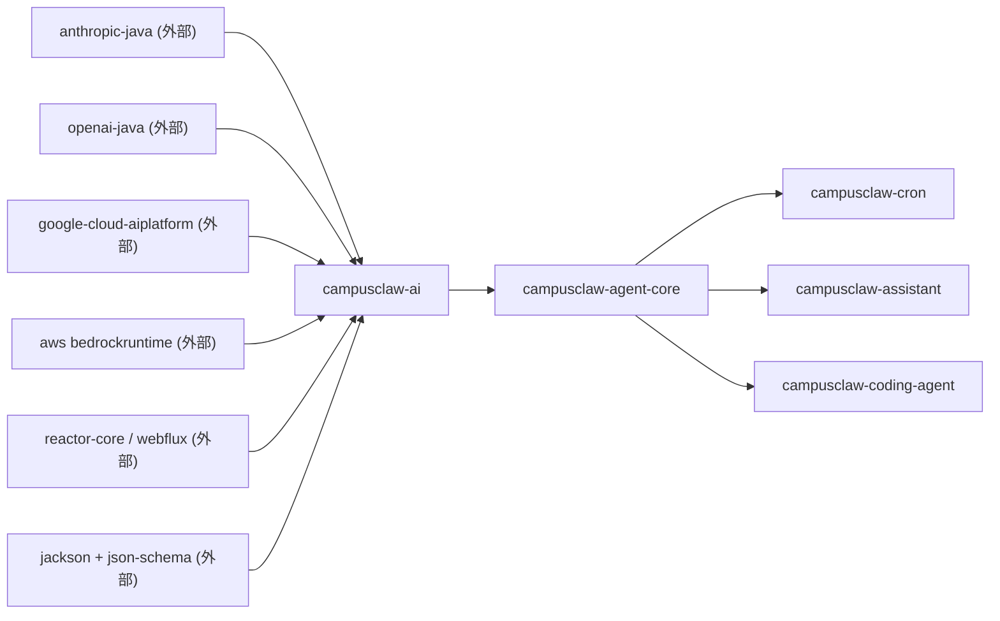
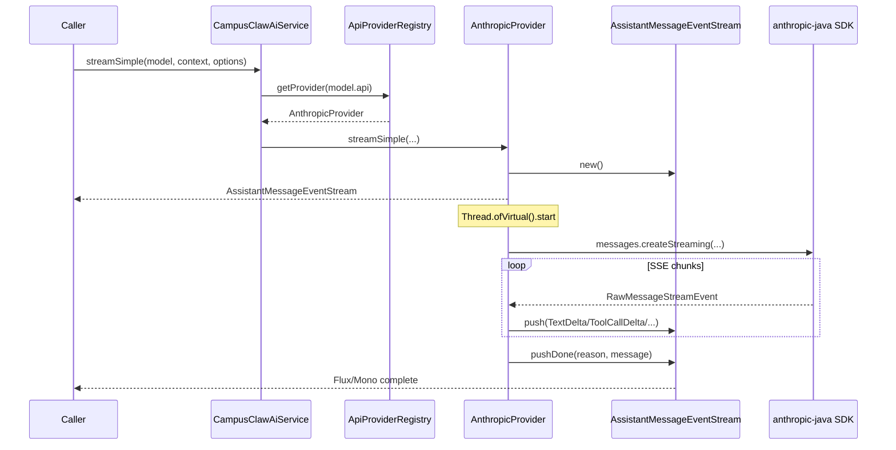
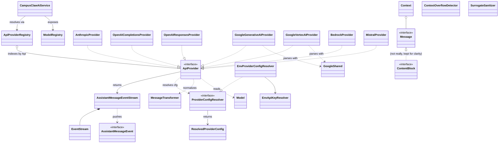

# ai 模块实现设计文档（基于代码 v1）

## 文档信息

| 项目 | 内容 |
|---|---|
| Story 编号 | （待补充） |
| Story 名称 | ai 设计文档（基于代码 v1） |
| 负责人 | （待补充） |
| 创建日期 | 2026-05-14 |
| 版本 | v1.0 (code-derived) |

---

## 1. Story 背景

### 1.1 需求来源

待开发者补充。代码仓库未为本模块提供独立 README / `*-design.md`；从仓库根 `CLAUDE.md` 与 `docs/module-architecture.md` 可知 ai 模块的定位是 **CampusClaw 项目（前身 pi-mono-java）的"LLM 多供应商抽象层"**。多处源文件注释"Aligned with TypeScript campusclaw <foo>.ts" / "Corresponds to the top-level stream()/complete() functions in the TypeScript campusclaw-ai module"，可推断本模块系按 TypeScript 版 campusclaw-ai 的形状在 Java 侧对位实现，目标是把分散的 LLM SDK（Anthropic / OpenAI / Google / Bedrock / Mistral 等）以及若干 OpenAI 兼容 flavor（z.ai、Kimi、MiniMax、GitHub Copilot、xAI、Groq、Cerebras、OpenRouter 等）收敛到统一的 Java 抽象上，供 agent-core 及上游 cron / assistant / coding-agent-cli 复用。

### 1.2 需求背景/价值/详情

**背景：** ai 模块是依赖图最底层的 lib（被 agent-core 直接依赖、并通过 agent-core 间接被 cron / assistant / coding-agent-cli 消费）。多个 LLM 服务商各有自己的 SDK、SSE 协议、思考块（thinking）/工具调用（tool_use）/缓存（cache_control）/usage 字段差异；如果没有这一层，每个上游都要重写适配代码且无法跨模型迁移消息。

**价值（公开 API 反推）：** 对外提供以下能力——

- `CampusClawAiService` 顶层门面：根据 `Model.api` 路由到合适的 `ApiProvider`，对外暴露 `stream` / `streamSimple` / `complete` / `completeSimple`；
- 统一的消息代数：sealed `Message`（UserMessage / AssistantMessage / ToolResultMessage）、sealed `ContentBlock`（TextContent / ImageContent / ThinkingContent / ToolCall）、`Tool`、`Context`；
- 统一的流式协议：sealed `AssistantMessageEvent` 12 种事件（start / text_* / thinking_* / toolcall_* / done / error），由 `AssistantMessageEventStream`（基于 Reactor `Sinks` 的 `EventStream<T,R>`）承载；
- `ApiProviderRegistry` + `ModelRegistry`：可运行时注册 / 替换 / 按 sourceId 批量卸载 provider；模型目录支持 built-in、classpath 资源、`~/.campusclaw/agent/models.json` 三级覆盖；
- `MessageTransformer`：跨 provider 消息归一化（tool call id 截断到 ≤ 64、跨模型剥离 textSignature/thoughtSignature、孤儿 tool_use 补合成 tool_result）；
- `ProviderConfigResolver` SPI + 默认 `EnvProviderConfigResolver`：API key 解析（环境变量 + ADC / AWS 凭据自动嗅探），可被上游 `@Primary` 覆盖；
- `ContextOverflowDetector`：18 种 provider 的"上下文溢出"错误信息正则匹配 + z.ai 风格的"静默溢出"判定；
- `SurrogateSanitizer`：JSON 序列化前清理未配对的 UTF-16 代理对。

**详情：** 详见第 3 章。

### 1.3 关联需求

| 关联 Story/需求 | 关联关系 | 说明 |
|---|---|---|
| campusclaw-agent-core | 被依赖 | `AgentLoop` 通过 `StreamFunction`（默认包装 `CampusClawAiService::streamSimple`）消费本模块的 `AssistantMessageEventStream`；`Agent` / `AgentState` 直接引用 `Model` / `AssistantMessage` / `StopReason` |
| campusclaw-cron | 被依赖（经 agent-core 间接） | `CronJobExecutor` / `CronTool` 通过 agent-core 间接调用本模块 |
| campusclaw-assistant | 被依赖 | 会话记忆持久化复用 `Message` / `AssistantMessage` 等类型 |
| campusclaw-coding-agent | 被依赖 | CLI 装配 `CampusClawAiService` / `ApiProviderRegistry` / `ModelRegistry`；override `ProviderConfigResolver` 以读取 `settings.json` |
| anthropic-java / openai-java / google-cloud-aiplatform / aws bedrockruntime SDK | 依赖（外部） | 各 `*Provider` 的底层传输与协议实现 |
| reactor-core / spring-webflux / reactor-netty-http | 依赖（外部） | 流式抽象（`Mono` / `Flux` / `Sinks`）与 HTTP 客户端 |
| jackson-databind / com.networknt:json-schema-validator | 依赖（外部） | JSON 多态序列化（`@JsonTypeInfo` 见 `Message` / `ContentBlock` / `AssistantMessageEvent`） |

---

## 2. Story 分析

### 2.1 Story 上下文

文字补充：

- **本模块 artifactId**：`campusclaw-ai`
- **上游（pom 内项目依赖）**：无（本模块是依赖图叶子）
- **下游（grep 反查 import）**：`campusclaw-agent-core`（一级消费者）；`campusclaw-cron` / `campusclaw-assistant` / `campusclaw-coding-agent` 经 agent-core 间接消费
- **外部依赖（top）**：`anthropic-java`、`openai-java`、`google-cloud-aiplatform`、`software.amazon.awssdk:bedrockruntime`、`reactor-core` + `spring-webflux` + `reactor-netty-http`、`jackson-databind` + `jackson-core`、`com.networknt:json-schema-validator`、`spring-context`、`jakarta.annotation-api`

### 2.2 功能点分解

| 序号 | 功能点 | 描述 | 优先级 | 预估工作量 |
|---|---|---|---|---|
| 1 | 多 Provider 统一抽象 | `ApiProvider` SPI + `ApiProviderRegistry` 自动收集 Spring 内 7 个 built-in provider，并支持运行时按 sourceId 注册/卸载 | 高 | - |
| 2 | 流式协议归一化 | 各 SDK 的 SSE 增量翻译成 sealed `AssistantMessageEvent`（12 子类）；通过 `AssistantMessageEventStream` 暴露 `Flux<event>` + `Mono<result>` | 高 | - |
| 3 | 统一消息/内容/工具类型 | sealed `Message` / `ContentBlock` / `Tool` / `Context` + `Model` + `Usage` + `Cost` + `StopReason` | 高 | - |
| 4 | 跨模型消息变换 | `MessageTransformer` 处理 tool call id 长度、thinking signature 复用 / 跨模型降级为文本、孤儿 tool_use 补 tool_result | 高 | - |
| 5 | 模型目录管理 | `ModelRegistry` 17 个 provider 族的 built-in 模型 + classpath `/campusclaw-models.json` + 用户 `~/.campusclaw/agent/models.json` 三级合并 | 高 | - |
| 6 | Provider 配置解析 | `ProviderConfigResolver` SPI；默认 `EnvProviderConfigResolver` + `EnvApiKeyResolver` 覆盖 20+ provider 的环境变量与 ADC / AWS 凭据嗅探 | 中 | - |
| 7 | 上下文溢出探测 | `ContextOverflowDetector` 用 18 条 provider 专属正则匹配错误信息 + z.ai 静默溢出判定 | 中 | - |
| 8 | Unicode 安全 | `SurrogateSanitizer` 清理未配对的 UTF-16 surrogate，避免 provider 端 JSON 解码错误 | 低 | - |

---

## 3. 实现设计

### 3.1 功能实现思路

ai 模块把"和任何 LLM 服务商对话"这件事抽象为单一接口 `ApiProvider`，并通过四层结构组织：

1. **types/**（数据形状）：sealed `Message` / `ContentBlock` / `Tool` / `Model`、枚举 `Api` / `Provider` / `StopReason` / `InputModality` / `Transport` / `CacheRetention` / `ThinkingLevel` 等。所有类型都是 `record` 或枚举，**Jackson 多态序列化** 通过 `@JsonTypeInfo(use=Id.NAME, property="role"/"type")` 完成；
2. **stream/**（流式抽象）：通用 `EventStream<T, R>` 把命令式 `push(event)` 桥接到 Reactor 的 `Sinks.Many` + `Sinks.One`，并由 `isComplete` 谓词自动从终止事件抽取最终结果；`AssistantMessageEventStream` 是 `EventStream<AssistantMessageEvent, AssistantMessage>` 的具体化，把 `DoneEvent` / `ErrorEvent` 视为终止事件；
3. **provider/**（SDK 适配器）：每个 `ApiProvider` 实现负责自己 API 协议的 SSE → `AssistantMessageEvent` 翻译。`Anthropic` / `OpenAIResponses` / `OpenAICompletions` / `GoogleGenerativeAI` / `GoogleVertexAI` / `Bedrock` / `Mistral` 7 个 provider 注册为 Spring `@Component`，`ApiProviderRegistry` 通过构造函数注入 `List<ApiProvider>` 自动收集；
4. **model/** + **env/**（注册表 + 配置）：`ModelRegistry` 用两级 `Map<Provider, Map<String, Model>>` 索引模型；`EnvApiKeyResolver` 用 `switch(Provider)` 表达式覆盖 20+ provider 的环境变量回退顺序，遇到 Google ADC / AWS 多凭据源时返回 `<authenticated>` 哨兵让上层 SDK 自己拿凭据。

整体取向：**对外只暴露稳定的 record / sealed / interface，provider 实现细节封死在包内；流式 IO 集中在每个 `*Provider.doStream(...)` 里启动一个虚拟线程，在虚拟线程里阻塞读 SDK 的 SSE 迭代器并往 `EventStream` 推事件**，调用方只需消费 `Flux` 或 `Mono` 即可。

### 3.2 功能实现设计

`CampusClawAiService.streamSimple(model, context, options)` 是最常用入口，下面是从源码抽出的 step 序列：

1. `stream(model, context, options)`：调用方传入 `Model` + `Context`（systemPrompt + List<Message> + List<Tool>） + `SimpleStreamOptions`；
2. `resolveProvider(model)`：`CampusClawAiService` 用 `model.api()` 在 `ApiProviderRegistry` 里查 `ApiProvider`，缺失即抛 `IllegalArgumentException`；
3. `streamSimple(...)`：把调用透传给具体 provider（如 `AnthropicProvider.streamSimple`）；
4. `resolve(provider, model)`：provider 通过 `ProviderConfigResolver` 解析 apiKey / baseUrl / 自定义 headers（依次：`SimpleStreamOptions.apiKey` → `Model.apiKey` → 环境变量 → ADC/AWS 嗅探）；
5. `Thread.ofVirtual().start(...)`：provider 在虚拟线程里执行 `executeStream(...)`；同步路径返回空 `AssistantMessageEventStream` 给调用方；
6. `SSE chunks`：虚拟线程里调用具体 SDK（`AnthropicClient.messages().createStreaming(...)`、`OpenAIClient.responses().createStreaming(...)`、`BedrockRuntimeAsyncClient.converseStream(...)` 等）拿到原生 SSE 迭代器；
7. `push(event)`：对每个 SDK 原生增量，翻译成 `AssistantMessageEvent` 子类（含 partial `AssistantMessage` 累积态）push 到 `EventStream`，期间维护 contentIndex、tool call accumulator、thinking signature 等状态；
8. `pushDone(reason, message)` / `pushError(reason, error)`：SDK 流终止后，根据最后 chunk 的 `stop_reason` 决定推 `DoneEvent` 还是 `ErrorEvent`；`EventStream` 内部 `isTerminal` 命中即自动 complete `Sinks`；
9. `asFlux() / result()`：调用方（通常是 agent-core 的 `AgentLoop.consumeStream`）订阅 `Flux<AssistantMessageEvent>` 渲染增量，或拿 `Mono<AssistantMessage>` 等终态。

**事件清单（sealed `AssistantMessageEvent` 子类型）：**

| 事件类型 | 触发时机 |
|---|---|
| `StartEvent` | 流开始，携带初始 partial `AssistantMessage` |
| `TextStartEvent` | 新的 text content block 在 contentIndex 处开始 |
| `TextDeltaEvent` | text 增量 |
| `TextEndEvent` | text content block 完成 |
| `ThinkingStartEvent` | 新的 thinking content block 开始 |
| `ThinkingDeltaEvent` | thinking 增量 |
| `ThinkingEndEvent` | thinking content block 完成 |
| `ToolCallStartEvent` | 新的 tool call content block 开始 |
| `ToolCallDeltaEvent` | tool call 参数 JSON 片段增量 |
| `ToolCallEndEvent` | tool call 完成，附带最终解析的 `ToolCall` |
| `DoneEvent` | 流成功完成，携带 `StopReason` 和最终 `AssistantMessage` |
| `ErrorEvent` | 流以错误终止（含 "error" / "aborted"） |

**Provider 实现清单（7 个 `@Component`）：**

| Provider 类 | 处理的 `Api` 值 | 主要协议 | 行数 |
|---|---|---|---|
| `AnthropicProvider` | `ANTHROPIC_MESSAGES` | Anthropic Messages SSE | 878 |
| `OpenAICompletionsProvider` | `OPENAI_COMPLETIONS` | OpenAI Chat Completions SSE（兼容 Mistral / Groq / xAI 等 OpenAI flavor） | 721 |
| `OpenAIResponsesProvider` | `OPENAI_RESPONSES` / `AZURE_OPENAI_RESPONSES` / `OPENAI_CODEX_RESPONSES` | OpenAI Responses SSE | 692 |
| `GoogleGenerativeAIProvider` | `GOOGLE_GENERATIVE_AI` / `GOOGLE_GEMINI_CLI` | Google AI Studio Streaming | 412 |
| `GoogleVertexAIProvider` | `GOOGLE_VERTEX` | Vertex AI Streaming | 379 |
| `BedrockProvider` | `BEDROCK_CONVERSE_STREAM` | AWS Bedrock Converse Stream | 827 |
| `MistralProvider` | `MISTRAL_CONVERSATIONS` | Mistral Conversations API | 524 |
| `GoogleShared` | -（utility） | Google 两个 provider 共享的 chunk 解析（`ParsedChunk` record） | 267 |

### 3.3 GUI 前端设计

本模块不涉及前端界面（纯 lib，由上游 `coding-agent-cli` / `assistant` 消费）。流式事件通过 `AssistantMessageEventStream.asFlux()` 暴露，由上游 TUI / WebSocket gateway 自行渲染。

### 3.4 接口描述

#### 程序接口（Java SPI）

| 接口 / 类 | 方法 | 入参 | 返回 | 说明 |
|---|---|---|---|---|
| `CampusClawAiService` | `stream` | `Model, Context, StreamOptions?` | `AssistantMessageEventStream` | 完整选项的流式调用入口 |
| `CampusClawAiService` | `streamSimple` | `Model, Context, SimpleStreamOptions?` | `AssistantMessageEventStream` | 简化（含 thinking 配置）流式入口 |
| `CampusClawAiService` | `complete` / `completeSimple` | 同上 | `Mono<AssistantMessage>` | 阻塞式：消费流到 Done/Error 后返回最终消息 |
| `CampusClawAiService` | `complete(Model, String)` | 单段 user 文本 | `Mono<AssistantMessage>` | 便捷重载 |
| `ApiProvider` | `getApi` | - | `Api` | 声明本 provider 处理的 API 协议 |
| `ApiProvider` | `stream` / `streamSimple` | `Model, Context, options?` | `AssistantMessageEventStream` | 协议实现入口 |
| `ApiProviderRegistry` | `getProvider` / `getProviders` | `Api` / - | `Optional<ApiProvider>` / `List<ApiProvider>` | 查询 |
| `ApiProviderRegistry` | `register` / `unregister` / `clear` | `ApiProvider + sourceId` / `sourceId` / - | `void` | 运行时注册管理 |
| `ModelRegistry` | `getModel` / `getModels` / `getProviders` | `Provider, modelId` / `Provider` / - | `Optional<Model>` / `List<Model>` / `List<Provider>` | 查询 |
| `ModelRegistry` | `register` / `registerAll` / `loadFromJsonFile` / `clear` | - | `void` / `int` | 动态注册 |
| `ModelRegistry` | `calculateCost` / `supportsXhigh` / `modelsAreEqual` | 静态工具 | `Cost` / `boolean` | 成本与能力查询 |
| `ProviderConfigResolver` | `resolve` | `Provider, Model` | `ResolvedProviderConfig` | API key / baseUrl / headers 三合一解析 SPI |
| `EnvApiKeyResolver` | `resolve` | `Provider` | `Optional<String>` | 环境变量回退表（含 Google ADC / AWS 凭据嗅探） |
| `MessageTransformer` | `transform` | `List<Message>, Model` | `List<Message>` | 跨 provider 消息归一化（静态） |
| `AssistantMessageEventStream` | `push` / `pushTextDelta` / `pushDone` / `pushError` / `end` / `error` | - | `void` | 命令式事件推送（由 provider 内部使用） |
| `AssistantMessageEventStream` | `asFlux` / `result` | - | `Flux<AssistantMessageEvent>` / `Mono<AssistantMessage>` | 消费侧入口 |
| `ContextOverflowDetector` | `isContextOverflow` | `AssistantMessage[, contextWindow]` | `boolean` | 上下文溢出探测（静态） |
| `SurrogateSanitizer` | `sanitize` | `String` | `String` | UTF-16 surrogate 修复（静态） |

#### LLM Tool 接口

本模块只定义 `Tool` record（`name` / `description` / `inputSchema` / 等元数据），不提供工具执行；具体 `AgentTool` 接口与执行逻辑在 agent-core / coding-agent-cli。

#### HTTP 接口

本模块不暴露 HTTP 接口（lib 性质）。各 `*Provider` 是 HTTP/SSE 客户端而非服务端，依赖各自厂商 SDK 内置的 OkHttp / Netty / AWS SDK 完成传输。

### 3.5 数据库及持久化设计

本模块不涉及数据库持久化（无 `schema.sql`、无 `@Entity`、无 MyBatis Mapper）。`ApiProviderRegistry` / `ModelRegistry` 状态均存于内存 `ConcurrentHashMap`，`ModelRegistry` 在 `@PostConstruct` 时从以下三处加载初始目录：

| 来源 | 路径 | 是否必需 |
|---|---|---|
| 编译内置 | `ModelRegistry.builtInModels()` 静态表（17 个 provider 族） | 是 |
| classpath 资源 | `/campusclaw-models.json` | 否（缺省即跳过） |
| 用户配置 | `~/.campusclaw/agent/models.json` | 否（缺省即跳过） |

后两者覆盖前者，键为 `(provider, id)`。

### 3.6 代码设计

按一级包列出对外/核心类，每个类一行职责：

**`com.campusclaw.ai`**
- `CampusClawAi`：模块占位类（仅含私有构造器）
- `CampusClawAiService`：顶层门面（`@Service`），路由到 `ApiProvider`

**`com.campusclaw.ai.types`**
- `Message` / `ContentBlock`：sealed 消息与内容代数（Jackson 多态根）
- `UserMessage` / `AssistantMessage` / `ToolResultMessage`：`Message` 三个 record 子类
- `TextContent` / `ImageContent` / `ThinkingContent` / `ToolCall`：`ContentBlock` 四个 record 子类
- `Model` / `ModelCost` / `Usage` / `Cost`：模型定义与成本/用量
- `Context` / `Tool` / `SimpleStreamOptions` / `StreamOptions` / `SimpleStreamOptionsFactory`：请求上下文与选项
- `Api` / `Provider` / `StopReason` / `InputModality` / `Transport` / `CacheRetention` / `ThinkingLevel` / `ThinkingBudgets`：枚举与简单 record

**`com.campusclaw.ai.stream`**
- `AssistantMessageEvent`：sealed 事件代数（12 个 record 子类）
- `EventStream`：泛型推送式流（`Sinks.Many` + `Sinks.One` + `isComplete` 谓词）
- `AssistantMessageEventStream`：`EventStream<AssistantMessageEvent, AssistantMessage>` 具体化

**`com.campusclaw.ai.provider`**
- `ApiProvider`：provider SPI 接口
- `ApiProviderRegistry`：`@Service`，按 `Api` 索引、按 `sourceId` 分组管理
- `MessageTransformer`：跨 provider 消息归一化（静态工具）

**`com.campusclaw.ai.provider.anthropic`**
- `AnthropicProvider`：Anthropic Messages SSE 适配器

**`com.campusclaw.ai.provider.openai`**
- `OpenAICompletionsProvider`：Chat Completions SSE 适配器（兼容多家 OpenAI flavor）
- `OpenAIResponsesProvider`：Responses SSE 适配器（OpenAI / Azure / Codex）

**`com.campusclaw.ai.provider.google`**
- `GoogleGenerativeAIProvider`：AI Studio Streaming 适配器
- `GoogleVertexAIProvider`：Vertex AI Streaming 适配器
- `GoogleShared`：两 Google provider 共享的 chunk 解析

**`com.campusclaw.ai.provider.bedrock`**
- `BedrockProvider`：AWS Bedrock Converse Stream 适配器

**`com.campusclaw.ai.provider.mistral`**
- `MistralProvider`：Mistral Conversations 适配器

**`com.campusclaw.ai.model`**
- `ModelRegistry`：`@Service`，按 `(Provider, modelId)` 索引，built-in + classpath + user 三级合并

**`com.campusclaw.ai.env`**
- `ProviderConfigResolver`：配置解析 SPI
- `EnvProviderConfigResolver`：默认实现（`@Service`）
- `EnvApiKeyResolver`：环境变量 + ADC / AWS 凭据嗅探
- `ResolvedProviderConfig`：解析结果 record（apiKey / baseUrl / headers）

**`com.campusclaw.ai.utils`**
- `ContextOverflowDetector`：18 条 provider 专属正则 + z.ai 静默溢出判定
- `SurrogateSanitizer`：UTF-16 surrogate 清理

### 3.7 安装部署设计

本模块作为 lib 由 `agent-core`（再向上 cli / cron / assistant）聚合，不单独部署，无 `application.yml`、无 `main`。Spring 装配点：

- `CampusClawAiService`、`ApiProviderRegistry`、`ModelRegistry`、`EnvApiKeyResolver`、`EnvProviderConfigResolver` 标注 `@Service`；
- 7 个 `*Provider` 标注 `@Component`，由 `ApiProviderRegistry` 构造时通过 `@Autowired List<ApiProvider>` 自动收集；
- 上游可注册 `@Primary ProviderConfigResolver` Bean 覆盖默认 env-only 行为（coding-agent-cli 即如此做以加入 settings 文件）。

运行期外部依赖：JDK 21（虚拟线程 `Thread.ofVirtual()` 用于在每个 provider 内驱动 SDK 流）、reactor-core、jackson、各 LLM 厂商 SDK。

环境变量（`EnvApiKeyResolver.resolve` 列出的完整集合）：

| Provider | 环境变量回退顺序 |
|---|---|
| ANTHROPIC | `ANTHROPIC_API_KEY` → `ANTHROPIC_OAUTH_TOKEN` |
| OPENAI / OPENAI_CODEX | `OPENAI_API_KEY` |
| GOOGLE | `GOOGLE_API_KEY` → `GOOGLE_CLOUD_API_KEY` → ADC（`GOOGLE_APPLICATION_CREDENTIALS` 或 `~/.config/gcloud/application_default_credentials.json`） |
| GOOGLE_VERTEX | `GOOGLE_CLOUD_API_KEY` → ADC |
| AMAZON_BEDROCK | `AWS_PROFILE` / `AWS_ACCESS_KEY_ID`+`AWS_SECRET_ACCESS_KEY` / `AWS_BEARER_TOKEN_BEDROCK` / `AWS_CONTAINER_CREDENTIALS_*` / `AWS_WEB_IDENTITY_TOKEN_FILE` 任一存在即返回 `<authenticated>` |
| AZURE_OPENAI | `AZURE_OPENAI_API_KEY` |
| MISTRAL | `MISTRAL_API_KEY` |
| ZAI / KIMI_CODING / MINIMAX / MINIMAX_CN / XAI / GROQ / CEREBRAS / OPENROUTER / OPENCODE | `<NAME>_API_KEY` 直读 |
| VERCEL_AI_GATEWAY | `AI_GATEWAY_API_KEY` |
| HUGGINGFACE | `HF_TOKEN` |
| GITHUB_COPILOT | `COPILOT_GITHUB_TOKEN` → `GH_TOKEN` → `GITHUB_TOKEN` |
| GOOGLE_GEMINI_CLI / GOOGLE_ANTIGRAVITY | `GOOGLE_API_KEY` |

外部文件（可选）：classpath `/campusclaw-models.json`、用户 `~/.campusclaw/agent/models.json`。

---

## 4. DFX 设计

### 4.1 性能设计

- **并发模型**：
  - 每个 `*Provider.doStream(...)` 在 `Thread.ofVirtual().start(...)` 启动的虚拟线程里阻塞读 SDK 的 SSE 迭代器；调用方在另一线程（通常是 agent-core 的虚拟线程）通过 Reactor `Flux` 拉事件——SDK 阻塞 IO 与下游 Reactor 链解耦；
  - 流核心 `EventStream` 用 `Sinks.many().unicast().onBackpressureBuffer()` 实现无界缓冲，确保 SDK 在订阅者到达前推的事件不会丢失；
  - `ApiProviderRegistry` / `ModelRegistry` 读路径走无锁 `ConcurrentHashMap`；写路径走 `synchronized(lock)` 保证 source-id 关联与 Api 索引一致；
- **取消传播**：取消责任在上游（agent-core）通过 `Flux.takeUntilOther(...)` 拦截；本模块的虚拟线程不显式监听取消信号，但因下游订阅被取消后 `Sinks` 推送会变成 no-op，SDK 阻塞读结束后线程自然回收；
- **状态读写**：`Sinks.Many` 是 unicast，**单订阅者** 约束写在 javadoc 里；多订阅者需上游用 `.share()` / `.publish()` 自行复制；
- **指标埋点**：本模块未直接使用 Micrometer；性能观测靠上游对 `Mono<AssistantMessage>` 调用计时。

性能目标待定，当前实现关注**正确性与流式增量低延迟**而非具体吞吐数字。

### 4.2 兼容性设计

- **JDK 版本**：21（root pom `<java.version>21</java.version>`、`<release>21</release>`）；使用 sealed interface（`Message`、`ContentBlock`、`AssistantMessageEvent`）、record、pattern matching switch（如 `EnvApiKeyResolver.resolve`）、虚拟线程；
- **接口稳定性**：所有对外 record / interface 标注 `@version [br_eCampusCore 25.1.0_Next, YYYY/MM/DD]` + `@since`；`MessageTransformer.transform(messages, targetApi, sourceApi)` 保留作为 legacy 重载以向后兼容；
- **未发现 `@Deprecated` 标记**；
- **协议兼容**：`Api` 与 `Provider` 用 `@JsonCreator` + `@JsonValue` 暴露字符串别名，新增 provider 不破坏旧 JSON；`MessageTransformer` 主动剥离跨模型不可复用的 `thinkingSignature` / `textSignature` / `thoughtSignature`，让消息历史在模型间漂移仍可被新 provider 接受；
- **TS 镜像**：多处源码注释 "Aligned with TypeScript campusclaw-ai..." 暗示与上游 TS 实现保持形状一致——任何破坏变更建议同步评估 TS 侧。

### 4.3 可维护性设计

- **日志**：全模块走 SLF4J（`LoggerFactory.getLogger(...)`），命中类有 `ApiProviderRegistry`、`ModelRegistry`；未发现 `System.out.println` / `e.printStackTrace()`；
- **错误信息**：provider 内捕获 SDK 异常后调 `eventStream.error(e)`，让错误沿 Reactor 链向上抛；`ContextOverflowDetector` 把"上下文溢出"这一最常见但 provider 各异的错误归一到一个 boolean 判定，避免上游写 18 份正则；
- **失败可观测**：`EventStream.push` 在 `done=true` 之后 silently drop——这意味着 provider 端在出错后多推的事件不会污染下游，但同时也可能掩盖"已 Done 又来事件"的协议异常；当前仅靠注释告知；
- **未捕获异常**：本模块创建虚拟线程时（`AnthropicProvider`、`BedrockProvider` 等）**未显式设置 `UncaughtExceptionHandler`**——但 try-catch 包裹 `executeStream` 后异常被路由到 `eventStream.error(...)`，未捕获的只剩 `Throwable`（如 OOM），属于可接受降级。建议后续统一接入 `LoggingUncaughtExceptionHandler.INSTANCE`（参见仓库根 `CLAUDE.md` 的后台线程规范）；
- **指标 / 健康检查**：本模块无 `MeterRegistry` / `HealthIndicator`，由上游报告。

### 4.4 全球化设计

本模块不涉及多语言资源 / 多时区处理。少数 `.toLowerCase(Locale.ROOT)` 调用（`Provider.tryFromValue`、`ContextOverflowDetector` 中通过 `Pattern.CASE_INSENSITIVE` 隐式实现）均使用 `Locale.ROOT`（合规）。`Provider` / `Api` 枚举值是机器可读字符串（如 `"anthropic-messages"`），不本地化。

模型显示名 `Model.name` 与 system prompt 由上游决定语言，本模块原样透传。

### 4.5 产品资料设计

| 资料 | 关系 |
|---|---|
| `docs/module-architecture.md` | 包含 ai 模块说明段落（"LLM 多供应商抽象层"），需要随对外类型/Provider 列表变更同步 |
| `CLAUDE.md`（仓库根） | 描述 ai 模块在整体依赖图与运行时中的角色 |
| classpath `/campusclaw-models.json`（如有） + `~/.campusclaw/agent/models.json` | 用户级模型目录扩展约定 |
| 上游 `docs/openapi/campusclaw-api.yaml` | HTTP server 模式 API（间接消费本模块的 AssistantMessage 形状），间接相关 |

---

## 5. 安全 Checklist

| 序号 | 检查项 | 是否涉及 | 说明 |
|---|---|---|---|
| 5.1 | 是否有认证机制 | 是 | 本模块作为 lib 不暴露需鉴权的入口，但代表上游调用第三方 LLM API 时持有 API key / OAuth token / AWS 凭据：通过 `ProviderConfigResolver` 解析（默认 `EnvProviderConfigResolver`，读环境变量 + `EnvApiKeyResolver` 嗅探 ADC / AWS）；token 仅在 SDK 调用栈内传递，未持久化、未跨调用缓存到 `ApiProviderRegistry` |
| 5.2 | 纵向/横向越权 | 不涉及 | 本模块无多租户 / 资源属主概念，调用上下文由上游传入 |
| 5.3 | 记录操作日志 | 是 | `ApiProviderRegistry` 记录 provider 注册 / 替换 / 反注册（INFO + DEBUG）；`ModelRegistry` 记录加载条数与来源（INFO）；provider 异常由 `eventStream.error(...)` 路由到上游日志，本模块不直接落盘 |
| 5.4 | SQL 注入 | 不涉及 | 本模块无数据库访问（无 `executeQuery` / JPQL / MyBatis） |
| 5.5 | XSS 注入 | 不涉及 | 纯后端 lib，无 HTML 渲染；模型返回文本由上游 UI 负责转义 |
| 5.6 | XML 注入 | 不涉及 | 无 `DocumentBuilderFactory` / `SAXParserFactory`；全链路 JSON（Jackson） |
| 5.7 | 命令注入 | 不涉及 | 本模块无 `ProcessBuilder` / `Runtime.exec` 使用 |
| 5.8 | 输入校验 | 是 | `Api.fromValue` / `Provider.fromValue` 对未知字符串值抛 `IllegalArgumentException`；`CampusClawAiService.resolveProvider` 在缺失 provider 时显式抛错；`Model.apiKey` / `SimpleStreamOptions` 字段允许 null，但 provider 内会显式校验"key 非空"并产出友好错误提示；`Objects.requireNonNull` 守护 `CampusClawAiService` / `ApiProviderRegistry.register` / `ModelRegistry.register` 的入参 |
| 5.9 | 敏感数据/个人隐私数据 | 是 | API key / OAuth token / AWS 凭据是最敏感数据。本模块的处理原则：（a）不持久化到 `ApiProviderRegistry` / `ModelRegistry` 状态；（b）`ResolvedProviderConfig` 是 transient record，仅传给 SDK 后即出作用域；（c）provider 错误信息若由 SDK 抛出可能含 base URL 但**不会**含 key（SDK 自身行为）；（d）`Model.apiKey` 字段允许外部 JSON 注入"嵌入式 key"——风险在上游模型目录文件的可信性，本模块未做加密 / 脱敏。建议：用户 `models.json` 文件权限收紧到 `0600` |
| 5.10 | 加解密 | 不涉及 | 本模块无 `Cipher` / `MessageDigest` 使用；TLS 由各 LLM SDK 内置 HTTP 客户端负责 |
| 5.11 | 文件上传下载 | 否 | `ModelRegistry.loadFromJsonFile` 读取本地 JSON，但**不是来自用户上传**而是来自固定路径（classpath 资源 + 用户家目录），属配置加载非上传；无 `MultipartFile` |
| 5.12 | 硬编码 | 否 | 未发现硬编码密钥/口令；所有 API key 通过环境变量或注入式 `Model.apiKey` 获取；built-in 模型 JSON 表内的 `baseUrl` 是公开端点（如 `https://api.anthropic.com`），不构成敏感信息 |
| 5.13 | 安全资料（通信矩阵/用户清单/个人数据说明/公网IP说明/命令清单） | 是 | 本模块产生大量出站 HTTPS 流量（目标含 anthropic.com / openai.com / generativelanguage.googleapis.com / bedrock-runtime.\<region\>.amazonaws.com / api.mistral.ai 以及各 OpenAI 兼容 flavor 域名）——通信矩阵应在上游产品资料中标明 |
| 5.14 | 不安全算法/协议 | 否 | 未使用 MD5 / SHA1 / DES；未自管 TLS（依赖 SDK 默认）；`new Random` / `Math.random` 未在主路径出现 |
| 5.15 | 文件权限 | 不涉及 | 本模块不创建文件；仅读 `~/.campusclaw/agent/models.json` 与 classpath 资源 |
| 5.16 | 权限最小化 | 不涉及 | lib 性质，进程权限由上游决定；本模块不要求 OS 特权 |
| 5.17 | Sudo 提权 | 不涉及 | 无 `sudo` 调用 |

---

## 6. Story 转测 Checklist

| 序号 | 检查项 | 是否完成 | 说明 |
|---|---|---|---|
| 6.1 | 串讲与反串讲是否完成 | 否 | 待执行 |
| 6.2 | 设计文档是否齐全 | 是 | 本文档即设计文档 v1（基于代码逆向） |
| 6.3 | CodeChecker 是否清零 | 否 | 需跑 `./mvnw -pl modules/ai validate` 后填 |
| 6.4 | 代码审视意见是否清零 | 否 | 待 review |
| 6.5 | 接口是否已经归档 | 否 | 待归档（接口列表见 3.4） |
| 6.6 | 是否完成开发自测用例输出并且用例和 US 关联 | 否 | 现有 `src/test/java` 覆盖 types / stream / provider 各包（含 5 个 provider 的 `*Test` + `*IntegrationTest`），待与 Story 关联 |

---

## 7. Story 讨论与决策记录

| 日期 | 提出人 | 角色 | 问题/议题 | 讨论过程 | 决策结论 | 状态 |
|---|---|---|---|---|---|---|
| 2026-05-14 | - | - | 设计文档由 codebase-module-design skill 基于代码逆向生成 v1 | - | 由开发者补充关键决策（如：为何选 Reactor 而非 RxJava？为何 provider 用虚拟线程而非 Reactor 原生 publishOn？） | 开放 |
