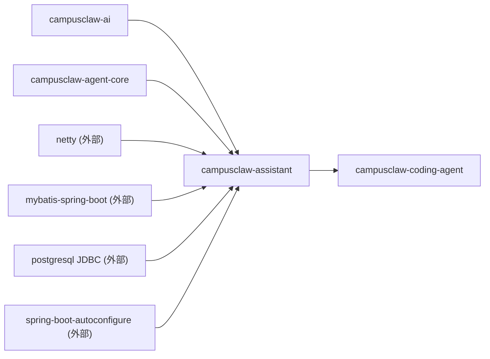
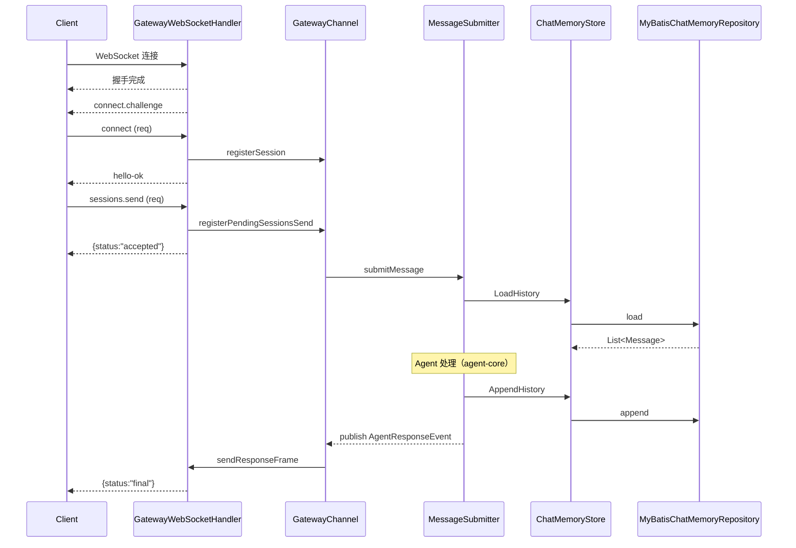
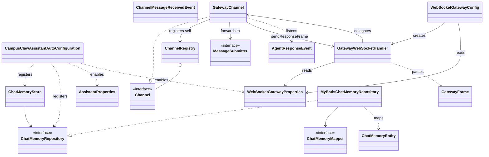

# assistant 模块实现设计文档（基于代码 v1）

## 文档信息

| 项目 | 内容 |
|---|---|
| Story 编号 | （待补充） |
| Story 名称 | assistant 设计文档（基于代码 v1） |
| 负责人 | （待补充） |
| 创建日期 | 2026-05-14 |
| 版本 | v1.0 (code-derived) |

---

## 1. Story 背景

### 1.1 需求来源

待开发者补充。代码仓库 `modules/assistant/README.md` 已自描述本模块为 "Channel 与 Memory 子模块对接文档"，定位为 CampusClaw（前身 pi-mono-java）的 **assistant 服务层**——把 CLI 内部的 Agent 通过 **WebSocket gateway** 暴露给外部 chat 客户端（OpenClaw 协议），并把会话历史**持久化到 GaussDB / PostgreSQL**。从 commit message 与依赖图可推断：将聊天会话能力从 CLI 进程内独立出来，便于多前端（IDE、Web、IM 桥）通过统一协议接入同一个 Agent 实例。

### 1.2 需求背景/价值/详情

**背景：** assistant 位于 `campusclaw-ai` / `campusclaw-agent-core` 之上、`campusclaw-coding-agent`（CLI）之下，是把 "本地 Agent" 转化为 "可远程接入的会话服务" 的桥梁。它承担两件事——

1. **会话通道 (Channel)**：通过内嵌的 **Netty WebSocket 服务端**，实现 OpenClaw 协议握手、鉴权、消息收发；外部客户端可像 chat API 一样和 CLI Agent 交互；
2. **会话持久化 (Memory)**：通过 **MyBatis + PostgreSQL** 把 `UserMessage / AssistantMessage / ToolResultMessage` 按 conversationId + sequence 持久化为 JSON，跨进程恢复会话历史。

**价值（公开 API 反推）：**

- `ChatMemoryStore`（`@Service`）：Facade，对上游 CLI 暴露 `load / append / clear` 三个原语，承载多轮对话上下文；
- `ChatMemoryRepository` SPI：可被替换成 Redis / ES 等其它存储实现，默认 `MyBatisChatMemoryRepository`；
- `Channel` / `ChannelRegistry` / `MessageSubmitter`：通道抽象，支持运行时挂载多个通道（WebSocket、IM 桥、自定义）；
- `GatewayChannel` + `GatewayWebSocketHandler` + `WebSocketGatewayConfig`：开箱即用的 OpenClaw WebSocket 服务，端口 18788，token 可选；
- `AgentResponseEvent`：Spring `ApplicationEvent`，把 Agent 处理结果回灌到 gateway，向客户端发 `{status:"final"}` 帧。

**详情：** 详见第 3 章。

### 1.3 关联需求

| 关联 Story/需求 | 关联关系 | 说明 |
|---|---|---|
| campusclaw-ai | 依赖 | 使用其 `Message` / `UserMessage` / `AssistantMessage` / `ToolResultMessage` 作为持久化的 payload 类型 |
| campusclaw-agent-core | 依赖 | 使用其 `com.campusclaw.agent.util.LoggingUncaughtExceptionHandler` 装配 `gateway-tick` 调度线程的未捕获异常处理 |
| campusclaw-coding-agent | 被依赖 | CLI 模块的 `InteractiveMode` 注入 `ChatMemoryStore` 做会话持久化；`LoopManager` 实现 `MessageSubmitter` 接收 gateway 转入消息；并在 Agent 处理完毕后 publish `AgentResponseEvent` 回灌 gateway |

---

## 2. Story 分析

### 2.1 Story 上下文



文字补充：

- **本模块 artifactId**：`campusclaw-assistant`
- **上游（pom 内项目依赖）**：`campusclaw-ai`、`campusclaw-agent-core`
- **下游（grep 反查 import）**：`campusclaw-coding-agent`
- **外部依赖（top）**：`netty-codec-http` / `netty-handler` / `netty-transport` / `netty-handler-proxy`（WebSocket gateway）、`mybatis-spring-boot-starter:3.0.4`（MyBatis 自动装配）、`spring-boot-starter-jdbc`（连接池）、`postgresql`（运行期 JDBC 驱动，兼容 GaussDB）、`jackson-databind` + `jackson-datatype-jsr310`（JSON / 时间类型）

### 2.2 功能点分解

| 序号 | 功能点 | 描述 | 优先级 | 预估工作量 |
|---|---|---|---|---|
| 1 | WebSocket Gateway 服务端 | 基于 Netty 的 OpenClaw 协议服务端，端口 18788，挂载 HTTP/WebSocket pipeline | 高 | - |
| 2 | OpenClaw 协议握手与鉴权 | `connect.challenge` → `connect` (含 token) → `hello-ok`；未认证请求拒绝 | 高 | - |
| 3 | sessions.send 消息路由 | 收到 `sessions.send` 立即 ack `{status:"accepted"}`；登记 pending 请求；通过 `MessageSubmitter` 转发到 Agent | 高 | - |
| 4 | AgentResponseEvent 回灌 | 监听 Spring 事件 → 找到 pending reqId → 发回 `{status:"final"}` 响应帧 | 高 | - |
| 5 | tick 心跳 | 每 `tickIntervalMs` 毫秒（默认 30s）向客户端发 `tick` event 保活 | 中 | - |
| 6 | Channel 注册表 | `ChannelRegistry` 持有所有通道实例，支持 `get(name)` / `getLatest()` / `getAll()` | 中 | - |
| 7 | ChatMemory 持久化 | `ChatMemoryStore.load/append/clear` 三原语，MyBatis 写库 | 高 | - |
| 8 | Message 多态序列化 | 通过 `Message` 的 `@JsonTypeInfo("role")` 分发到 `UserMessage` / `AssistantMessage` / `ToolResultMessage` | 高 | - |
| 9 | Repository SPI 可替换 | `@ConditionalOnMissingBean(ChatMemoryRepository.class)` 允许业务自定义存储后端 | 中 | - |
| 10 | Spring Boot 自动装配 | `CampusClawAssistantAutoConfiguration` 通过 `AutoConfiguration.imports` 注册 | 中 | - |

---

## 3. 实现设计

### 3.1 功能实现思路

assistant 的核心定位是 **"Agent 远程会话适配器"**，整体设计取两条相互正交的轴：

1. **入向（通道）**：Netty 启动 WebSocket 服务端 → `GatewayWebSocketHandler` 解析 OpenClaw JSON 帧 → 鉴权 → 把消息内容通过 `MessageSubmitter` 投递给 CLI 的 Agent 队列；
2. **出向（事件桥）**：CLI 处理完成后 publish `AgentResponseEvent` → `GatewayChannel.onAgentResponse` 监听 → 按 pending reqId 路由回原 WebSocket 连接，发 `{status:"final"}` 响应帧。

会话持久化则完全独立——`ChatMemoryStore` 是个不感知通道的 Facade，CLI 在 `InteractiveMode` 里直接调用 `load(conversationId)` 恢复历史、`append(...)` 记录新消息。两条轴通过 Spring Bean 装配桥接，**通道侧不强依赖持久化、持久化侧不感知通道**。

可扩展点：

- `Channel` + `MessageSubmitter` 抽象让"再加一个 Slack 通道"只需新增一个 `@Component`；
- `ChatMemoryRepository` 标了 `@ConditionalOnMissingBean`，业务可注入 Redis / ES 实现覆盖默认 MyBatis；
- `GatewayChannel` / `WebSocketGatewayConfig` 都标了 `@ConditionalOnProperty(prefix="pi.assistant.gateway", name="enabled", havingValue="true")`，默认关闭，按需开启。

### 3.2 功能实现设计

核心主流程是 **客户端 ↔ Gateway ↔ Agent ↔ DB** 一次完整往返。按代码抽出的 step 序列：

1. `WebSocket 连接`：客户端连 `ws://host:18788/`，Netty 触发 `channelActive` 登记 `sessions[channelId]`；
2. `握手完成`：`WebSocketServerProtocolHandler.HandshakeComplete` → `userEventTriggered` 发 `connect.challenge` event 并启动 `gateway-tick` 心跳；
3. `connect (req)`：客户端发 `connect` 方法 + `auth.token`；`handleConnect` 校验 token；通过则置 `authenticatedSessions[channelId]=true`，调 `gatewayChannel.registerSession(...)`，回 `hello-ok` 响应；
4. `sessions.send (req)`：`handleSessionsSend` 解析 `{key, message}`，调 `registerPendingSessionsSend(reqId, channelId, sessionKey)` 登记 pending，立即回 `{status:"accepted"}` 响应；
5. `submitMessage`：`gatewayChannel.handleIncomingMessage` → `messageSubmitter.submitMessage(content)`（实现方为 CLI 的 `LoopManager`）；
6. `LoadHistory`（可选）：CLI 在启动 / 切换会话时调 `ChatMemoryStore.load(conversationId)` → `ChatMemoryMapper.selectByConversationId` 经 MyBatis 取回 `List<ChatMemoryEntity>`，反序列化为 `List<Message>`；
7. `Agent 处理`：CLI 内部 Agent loop（属 `agent-core` 责任，此处略）；
8. `AppendHistory`：CLI 调 `ChatMemoryStore.append(conversationId, newMessages)` → `MyBatisChatMemoryRepository.append` 查最大 sequence、为每条 message 写 `ChatMemoryEntity` 并 `mapper.insert`；
9. `publish AgentResponseEvent`：CLI publish Spring `ApplicationEvent(replyText)`；
10. `onAgentResponse`：`GatewayChannel.onAgentResponse` `@EventListener` 触发，遍历 `pendingSessionsSend` map，对每个 pending 调 `completePendingSessionsSend`；
11. `sendResponseFrame`：通过 `GatewayWebSocketHandler.sendResponseFrame(ctx, reqId, payload)` 发 `{type:"res", ok:true, payload:{status:"final", message:...}}`；
12. `客户端收到 final`：客户端按 reqId 完成请求承诺。



**OpenClaw 协议帧清单：**

| 帧 type | event/method | 方向 | 用途 |
|---|---|---|---|
| `event` | `connect.challenge` | S→C | 握手挑战 (nonce, ts) |
| `req` | `connect` | C→S | 携带 token 鉴权 |
| `res` | (无 method) | S→C | `hello-ok` payload，含 protocol / server / features / snapshot / policy |
| `req` | `sessions.send` / `chat.send` | C→S | 发送一条消息到 Agent |
| `res` | (无 method) | S→C | 先回 `{status:"accepted"}`，最终回 `{status:"final", message}` |
| `req` | `policy.tick` | C→S | 简单 ping，回 `{tick:true}` |
| `event` | `tick` | S→C | 周期心跳（默认 30s） |
| `event` | `chat` | S→C | 流式 / 终态聊天事件（`delta` / `final`） |
| `res` | (含 `error`) | S→C | 错误码：`parseError` / `processingError` / `authRequired` / `authFailed` / `unknownMethod` / `invalidParams` / `connectError` |

### 3.3 GUI 前端设计

本模块不涉及前端界面（后端服务），但**对外暴露 WebSocket 协议**，由 OpenClaw 客户端（IDE 插件、Web UI、IM 桥）按 3.2 的 OpenClaw 协议帧消费。

### 3.4 接口描述

#### WebSocket 接口（OpenClaw 协议）

| 项 | 内容 |
|---|---|
| URL | `ws://<host>:<port><path>`（默认 `ws://0.0.0.0:18788/`） |
| 协议帧 | JSON 文本帧，最大 16MB（`maxPayload`） |
| 鉴权 | 可选 token（`pi.assistant.gateway.token`），在 `connect` 请求的 `auth.token` 字段 |
| 心跳 | 服务端每 `tickIntervalMs` ms 主动发 `tick` event |
| 顶层字段 | `type` / `id` / `method` / `params` / `event` / `payload` / `ok` / `error` / `seq` / `stateVersion` |

详见 3.2 的 OpenClaw 协议帧清单。完整 DTO 在 `com.campusclaw.assistant.channel.gateway.protocol` 包内：`GatewayFrame`、`ConnectParams`、`AuthInfo`、`ClientInfo`、`SessionsSendParams`、`HelloOkPayload`、`ServerInfo`、`FeaturesInfo`、`PolicyInfo`、`ChatEventPayload`、`ErrorBody`。

#### 程序接口（Java SPI / Spring Bean）

| 接口 / 类 | 方法 | 入参 | 返回 | 说明 |
|---|---|---|---|---|
| `Channel` | `getName` | - | `String` | 通道名 |
| `Channel` | `sendMessage` | `String` | `void` | 向通道所有客户端广播 |
| `ChannelRegistry` | `register` | `Channel` | `void` | 注册通道 |
| `ChannelRegistry` | `get` / `getLatest` / `getAll` | `String` / - / - | `Channel` / `Channel` / `Collection<Channel>` | 查询通道 |
| `MessageSubmitter` | `submitMessage` | `String` | `boolean` | 由 CLI 实现，把消息投递到 Agent 队列 |
| `ChatMemoryStore` | `load` | `String conversationId` | `List<Message>` | 加载历史 |
| `ChatMemoryStore` | `append` | `String, List<Message>` | `void` | 追加消息 |
| `ChatMemoryStore` | `clear` | `String` | `void` | 清空会话 |
| `ChatMemoryRepository` | 同上三个方法 | 同上 | 同上 | 持久化 SPI，默认 `MyBatisChatMemoryRepository` |
| `GatewayChannel` | `registerSession` / `removeSession` | `String, ChannelHandlerContext` / `String` | `void` | 会话生命周期 |
| `GatewayChannel` | `registerPendingSessionsSend` | `reqId, channelId, sessionKey` | `void` | 登记待回灌请求 |
| `GatewayChannel` | `handleIncomingMessage` | `channelId, sessionKey, content` | `void` | 入向消息处理 |
| `GatewayChannel` | `onAgentResponse` | `AgentResponseEvent` | `void` | `@EventListener` 出向回灌 |
| `AgentResponseEvent` | `getMessage` | - | `String` | Spring `ApplicationEvent` 携带的最终消息 |

#### HTTP / LLM Tool 接口

本模块不暴露 HTTP REST 接口；不内置 `AgentTool` 实现。

### 3.5 数据库及持久化设计

assistant 是本仓**唯一**使用关系型数据库的模块，承担会话历史持久化。

#### 数据库选型

- **目标 DB**：GaussDB（华为高斯）；通过 `org.postgresql:postgresql` JDBC 驱动连接（GaussDB 兼容 PostgreSQL 协议，无需独立驱动）
- **连接池**：`spring-boot-starter-jdbc` 自带（HikariCP）
- **ORM**：`mybatis-spring-boot-starter:3.0.4`，注解式 Mapper（无 XML）
- **下划线↔驼峰**：`mybatis.configuration.map-underscore-to-camel-case=true`

#### Schema (`src/main/resources/schema.sql`)

```sql
CREATE TABLE IF NOT EXISTS chat_memory (
    id BIGINT GENERATED BY DEFAULT AS IDENTITY PRIMARY KEY,
    conversation_id VARCHAR(255) NOT NULL,
    role VARCHAR(50) NOT NULL,
    content TEXT NOT NULL,
    sequence INT NOT NULL,
    created_at TIMESTAMP DEFAULT NOW()
);

CREATE INDEX IF NOT EXISTS idx_chat_memory_conversation
    ON chat_memory (conversation_id, sequence);
```

| 列 | 类型 | 说明 |
|---|---|---|
| `id` | `BIGINT` (IDENTITY) | 自增主键 |
| `conversation_id` | `VARCHAR(255)` | 会话 ID，等同于上游 `SessionManager.getSessionId()` |
| `role` | `VARCHAR(50)` | `user` / `assistant` / `toolResult` 三选一 |
| `content` | `TEXT` | 完整 `Message` 对象的 JSON 序列化 |
| `sequence` | `INT` | 会话内单调递增的消息序号 |
| `created_at` | `TIMESTAMP` | 创建时间，DB 侧默认 `NOW()` |

`idx_chat_memory_conversation (conversation_id, sequence)` 联合索引覆盖 "按会话取所有消息按序号排序" 这条最热查询路径。

#### MyBatis Mapper（`ChatMemoryMapper`）

| 方法 | SQL | 注入风险评估 |
|---|---|---|
| `selectByConversationId` | `SELECT ... FROM chat_memory WHERE conversation_id = #{conversationId} ORDER BY sequence` | **安全**——`#{}` 走 PreparedStatement，参数预编译占位 |
| `insert` | `INSERT INTO chat_memory (...) VALUES (#{conversationId}, #{role}, #{content}, #{sequence})` | **安全**——全部 `#{}` |
| `deleteByConversationId` | `DELETE FROM chat_memory WHERE conversation_id = #{conversationId}` | **安全**——`#{}` |

**全仓 grep 确认**：`ChatMemoryMapper.java` 内**仅使用 `#{}` 占位符，未出现 `${}` 字符串拼接**，无 SQL 注入风险。

#### 序列化策略

`Message` 是 sealed interface，通过 Jackson 多态注解分发：

```java
@JsonTypeInfo(use = JsonTypeInfo.Id.NAME, property = "role")
@JsonSubTypes({
    @JsonSubTypes.Type(value = UserMessage.class, name = "user"),
    @JsonSubTypes.Type(value = AssistantMessage.class, name = "assistant"),
    @JsonSubTypes.Type(value = ToolResultMessage.class, name = "toolResult")
})
public sealed interface Message permits UserMessage, AssistantMessage, ToolResultMessage {}
```

写入时 `objectMapper.writeValueAsString(message)` 产出含 `role` 字段的 JSON；读取时按 `role` 自动路由到具体子类型。`MyBatisChatMemoryRepository.extractRole` 同步用 Java pattern matching `switch` 派生 DB 列 `role` 字段（与 `@JsonSubTypes` 的 name 保持一致）。

#### Sequence 分配

`append(conversationId, messages)` 实现：

1. 先 `selectByConversationId` 取出已有列表（按 sequence 排序）；
2. `nextSequence = existing.isEmpty() ? 0 : existing.getLast().sequence() + 1`；
3. 逐条 insert，sequence 单调递增。

**注意（已知风险）**：分配过程不加锁、不走 DB 序列。在**同一 conversationId 的并发 append** 下存在 sequence 冲突风险——当前调用方（`InteractiveMode`）保证单线程顺序追加，故未暴露问题；若未来引入多通道并发写同一 conversationId，需要改为 DB 侧 `MAX(sequence) FOR UPDATE` 或加唯一索引 `(conversation_id, sequence)` 兜底。

#### 优雅降级（来自 README）

- 无 DB 连接 / `ChatMemoryStore` Bean 创建失败 → CLI `InteractiveMode` 用 try/catch 接住并把字段置 `null`，跳过持久化；
- session 恢复优先走 ChatMemory，失败再 fallback 到本地 JSONL；
- 单次 append 失败 → log + 不影响主流程。

### 3.6 代码设计

按一级包列出对外/核心类，每个类一行职责：

**`com.campusclaw.assistant`**
- `CampusClawAssistantAutoConfiguration`：Spring Boot 自动装配入口（`@AutoConfiguration` + `@ComponentScan` + `@MapperScan("com.campusclaw.assistant.mapper")`），注册 `ObjectMapper`、`ChatMemoryRepository`、`ChatMemoryStore`
- `AssistantProperties`：`pi.assistant.*` 配置属性容器

**`com.campusclaw.assistant.channel`**
- `Channel`：通道抽象接口（`getName` / `sendMessage`）
- `ChannelRegistry`：`@Service`，进程级通道注册表
- `MessageSubmitter`：消息提交契约（由 CLI 的 `LoopManager` 实现）
- `ChannelMessageReceivedEvent`：通道接收消息事件（record）

**`com.campusclaw.assistant.channel.gateway`**
- `GatewayChannel`：`@Component`（条件启用），WebSocket 通道核心——会话管理 + pending 请求 + `@EventListener` 监听 `AgentResponseEvent`
- `GatewayWebSocketHandler`：Netty `SimpleChannelInboundHandler<TextWebSocketFrame>`，OpenClaw 协议解析、鉴权、tick 心跳
- `WebSocketGatewayConfig`：`@Configuration`（条件启用），Netty `ServerBootstrap` 装配 + `SmartLifecycle` 启停
- `WebSocketGatewayProperties`：`pi.assistant.gateway.*` 配置属性
- `AgentResponseEvent`：Spring `ApplicationEvent`，承载 Agent 最终回复

**`com.campusclaw.assistant.channel.gateway.protocol`**
- `GatewayFrame`、`ConnectParams`、`AuthInfo`、`ClientInfo`、`SessionsSendParams`、`HelloOkPayload`、`ServerInfo`、`FeaturesInfo`、`PolicyInfo`、`ChatEventPayload`、`ErrorBody`：OpenClaw 协议 DTO（全 record）

**`com.campusclaw.assistant.memory`**
- `ChatMemoryStore`：`@Service`，Facade，对外暴露 `load / append / clear`
- `ChatMemoryRepository`：持久化 SPI
- `MyBatisChatMemoryRepository`：默认实现，依赖 `ChatMemoryMapper` + `ObjectMapper`
- `ChatMemoryEntity`：DB 行 record

**`com.campusclaw.assistant.mapper`**
- `ChatMemoryMapper`：MyBatis `@Mapper`，三条注解式 SQL（全 `#{}` 占位符）



### 3.7 安装部署设计

本模块由上游 `coding-agent-cli` 作为依赖聚合启动，**不单独部署**；但作为 Spring Boot AutoConfiguration（`META-INF/spring/org.springframework.boot.autoconfigure.AutoConfiguration.imports`），上游引入即生效。

**Spring 装配点：**

- `CampusClawAssistantAutoConfiguration` 标 `@AutoConfiguration` + `@ComponentScan` + `@MapperScan("com.campusclaw.assistant.mapper")`，自动收集本模块所有 `@Service` / `@Component`
- `GatewayChannel` 与 `WebSocketGatewayConfig` 都标 `@ConditionalOnProperty(prefix="pi.assistant.gateway", name="enabled", havingValue="true")`，默认关闭
- `ChatMemoryRepository` / `ChatMemoryStore` 都标 `@ConditionalOnMissingBean`，可被业务覆盖

**配置项（`application.yml` / 环境变量）：**

| 配置 key | 默认值 | 说明 |
|---|---|---|
| `spring.datasource.url` | `jdbc:postgresql://localhost:5432/pi_assistant` | DB 连接 URL（GaussDB 走同一驱动） |
| `spring.datasource.username` | `postgres`（`application-assistant.yml`） | DB 用户名 |
| `spring.datasource.password` | `123456`（`application-assistant.yml`） | DB 密码——**默认值仅用于本地开发，部署必须覆盖** |
| `spring.datasource.driver-class-name` | `org.postgresql.Driver` | JDBC 驱动 |
| `mybatis.configuration.map-underscore-to-camel-case` | `true` | DB 列名 ↔ Java 字段名映射 |
| `pi.assistant.gateway.enabled` | `false` (默认) / `true` (随 `application-assistant.yml` 启用) | Gateway 总开关 |
| `pi.assistant.gateway.name` | `gateway` | 通道名 |
| `pi.assistant.gateway.port` | `18788` | 监听端口 |
| `pi.assistant.gateway.path` | `/` | WebSocket 路径 |
| `pi.assistant.gateway.token` | (空) | Bearer token，空则跳过校验 |
| `pi.assistant.gateway.tickIntervalMs` | `30000` | 心跳间隔 |
| `pi.assistant.gateway.protocolVersion` | `3` | 协议版本 |
| `pi.assistant.gateway.serverVersion` | `1.0.0` | 服务端版本字符串 |
| `pi.assistant.gateway.maxPayload` | `16777216` (16MB) | 单帧最大字节数 |
| `pi.assistant.gateway.maxBufferedBytes` | `1048576` (1MB) | 缓冲水位 |

**运行期外部依赖：** JDK 21、GaussDB / PostgreSQL（如启用 Memory）、监听 TCP 端口（如启用 Gateway）。

---

## 4. DFX 设计

### 4.1 性能设计

- **网络并发**：Netty 双 `EventLoopGroup`——`NioEventLoopGroup(1)` 作 boss、`NioEventLoopGroup()`（默认 `2 * CPU`）作 worker。`SO_KEEPALIVE=true`、`SO_BACKLOG=128`；
- **HTTP 聚合上限**：`HttpObjectAggregator(65536)` + WebSocket `maxFramePayloadLength=65536`（注：与 `maxPayload=16MB` 属性不一致——`HttpObjectAggregator` 仅用于 HTTP 升级请求体，握手后 WebSocket 帧使用 `WebSocketServerProtocolHandler` 的 64KB 限制；如需大帧需同步调高，**当前实现的 16MB 配置实际不生效**，是一个待澄清点）；
- **心跳调度**：单线程 `ScheduledExecutorService`（`gateway-tick`），daemon + 装配 `LoggingUncaughtExceptionHandler`；
- **会话状态**：`sessions`、`authenticatedSessions`、`sessionSeqCounters`、`tickFutures`、`sessionContexts`、`sessionKeyToChannel`、`channelToSessionKey`、`pendingSessionsSend` 全用 `ConcurrentHashMap`；
- **DB I/O**：HikariCP 默认配置（未做调优）；`append` 内部先 SELECT 再循环 INSERT，**未启用 batch**，高频写入可能成为瓶颈；
- **性能指标**：未集成 Micrometer / 自定义指标。

### 4.2 兼容性设计

- **JDK 版本**：21（root pom `<release>21</release>`），用到 sealed interface、record、pattern matching switch；
- **接口稳定性**：所有顶层 public 类标注 `@version [br_eCampusCore 25.1.0_Next, 2026/05/06 或 05/13]` + `@since`；
- **OpenClaw 协议**：`protocolVersion=3`，`HelloOkPayload` 中宣告 `features.methods=[sessions.send, chat.send, sessions.list, policy.tick]`、`features.events=[chat, tick, connect.challenge]`——客户端可据此特性协商；
- **DB 兼容**：使用 PostgreSQL 标准语法（`GENERATED BY DEFAULT AS IDENTITY`、`TEXT`、`TIMESTAMP DEFAULT NOW()`），通过 PostgreSQL JDBC 驱动兼容 GaussDB；
- **未发现 `@Deprecated`**。

### 4.3 可维护性设计

- **日志**：全模块使用 SLF4J（`GatewayChannel`、`GatewayWebSocketHandler`、`WebSocketGatewayConfig` 各持有自己的 `LoggerFactory.getLogger(...)`），无 `System.out.println` / `e.printStackTrace()`；
- **未捕获异常**：`gateway-tick` 调度线程显式装配 `com.campusclaw.agent.util.LoggingUncaughtExceptionHandler.INSTANCE`，符合仓库规范；
- **错误模型**：OpenClaw 错误统一为 `ErrorBody(code, message, stack?, retryable, status)`，code 枚举一目了然（`parseError` / `processingError` / `authRequired` / `authFailed` / `unknownMethod` / `invalidParams` / `connectError`）；
- **优雅启停**：`WebSocketGatewayConfig implements SmartLifecycle`，`getPhase()=Integer.MAX_VALUE-1`（最晚启动），`stop()` 顺序关闭 server channel → worker group → boss group；
- **健康检查**：未提供 `HealthIndicator`，建议补充以暴露 gateway 端口存活与 DB 连接状态；
- **指标**：未接入 Micrometer，建议补埋点（在线会话数、pending 请求数、append 延迟）。

### 4.4 全球化设计

本模块不涉及多语言资源 / 多时区处理。`ChatMemoryEntity.createdAt` 用 `LocalDateTime`（不带时区）——若跨时区部署需在 DB 侧统一为 UTC 或改用 `OffsetDateTime`，目前是隐含的"DB 本地时区"语义。所有面向客户端的 protocol 字符串（`type`、`event`、`status`、`error.code`）均为机器可读 ASCII，无本地化诉求。

### 4.5 产品资料设计

| 资料 | 关系 |
|---|---|
| `modules/assistant/README.md` | 模块对接文档（中文），详尽描述 Channel / Memory 子模块的架构、协议、对接方式 |
| `docs/asyncapi/chat-ws.yaml` | `/api/ws/chat` WebSocket AsyncAPI 契约（仓库根 docs，与本模块协议家族相关） |
| `docs/module-architecture.md` | 包含 assistant 模块说明段落，接口变更需同步 |
| `schema.sql` | `chat_memory` 表 DDL，由上游应用启动时执行 |

---

## 5. 安全 Checklist

| 序号 | 检查项 | 是否涉及 | 说明 |
|---|---|---|---|
| 5.1 | 是否有认证机制 | **是** | `GatewayWebSocketHandler.handleConnect` 在 `pi.assistant.gateway.token` 非空时强校验客户端 `connect` 请求中的 `auth.token`，匹配失败发 `authFailed` 错误并关闭连接；非 `connect` 方法的请求会被 `authenticatedSessions` map 拦截，未认证返回 `authRequired`。**风险**：token 为空时跳过校验、且当前 token 为简单字符串比较（非 OAuth / JWT），仅适合受信网络内部使用 |
| 5.2 | 纵向/横向越权 | **是（部分）** | `pendingSessionsSend` 用 reqId 作 key，回灌时按 pending 记录里的 channelId 路由——理论上不会跨连接串响应。但 `onAgentResponse` 处的注释明确写出："遍历所有 pending 完成"——若同一进程内多客户端**同时**各有 pending sessions.send，Agent 单串行处理时**当前响应会被广播到所有 pending**，可能造成回复跨会话泄漏。**建议**：把 `AgentResponseEvent` 加上 conversationId / sessionKey 字段，回灌时按 sessionKey 精确路由 |
| 5.3 | 记录操作日志 | 是 | `GatewayWebSocketHandler` 在 JSON parse 错误、未知方法、未认证请求、token 校验失败、连接异常处均通过 SLF4J 记录；`GatewayChannel` 在 channel 失活、handler 缺失、submit 失败时同样记录。**未审计**：未发现把 token 值打到日志的代码 |
| 5.4 | SQL 注入 | **不涉及（已实证）** | `ChatMemoryMapper` 三条 SQL 全部使用 MyBatis `#{}` 占位符（走 PreparedStatement，参数预编译），未出现 `${}` 字符串拼接。`MyBatisChatMemoryRepository` 也未在 Java 侧拼 SQL |
| 5.5 | XSS 注入 | 不涉及 | 后端模块，不渲染 HTML；OpenClaw 协议帧由客户端按 JSON 解析消费，转义责任在客户端 UI |
| 5.6 | XML 注入 | 不涉及 | 全链路 JSON（Jackson），未使用 `DocumentBuilderFactory` / `SAXParserFactory` |
| 5.7 | 命令注入 | 不涉及 | 未使用 `ProcessBuilder` / `Runtime.exec` |
| 5.8 | 输入校验 | 是 | `GatewayWebSocketHandler.handleSessionsSend` 对 `params.key()` 做 null 检查并返回 `invalidParams`；`ChatMemoryStore.append` 中 `Objects.requireNonNull` 校验入参；`Message` JSON 反序列化由 Jackson sealed type binding 强约束，未知 role 直接抛异常 |
| 5.9 | 敏感数据/个人隐私数据 | **是** | `chat_memory.content` 列存储完整聊天 JSON，**包含用户原文、Agent 回复、工具调用产物**——可能包含 PII / 凭据片段。`application-assistant.yml` 默认 DB 密码 `123456` 是占位值，**部署必须替换**。`WebSocketGatewayProperties.token` 在内存中以明文字符串持有，存在 heap dump 泄漏风险但未在日志/toString 中外露。**建议**：（1）DB 行级 / 列级加密；（2）token 改读环境变量；（3）日志在记录 frame 内容时打码 |
| 5.10 | 加解密 | 不涉及 | 未使用 `Cipher` / `MessageDigest`；WebSocket 走明文 ws，**未启用 wss**——生产部署建议在前置 nginx/反向代理处终结 TLS |
| 5.11 | 文件上传下载 | 不涉及 | 未使用 `MultipartFile` / `Files.copy` |
| 5.12 | 硬编码 | **存在风险** | `application-assistant.yml` 中 `spring.datasource.password: 123456` 是硬编码字面量（虽是开发占位值，仍属违反"配置外置"惯例）。**建议**：改为 `${POSTGRES_PASSWORD:}` 占位符并文档化环境变量。`WebSocketGatewayProperties` 字面量默认值都是非敏感的配置（端口、超时等），可保留 |
| 5.13 | 安全资料（通信矩阵/用户清单等） | 否 | 待补充——建议产出 gateway 端口暴露范围（如仅内网回环 127.0.0.1）、token 分发流程 |
| 5.14 | 不安全算法/协议 | **是** | （1）默认 `ws://` 明文协议，未在代码中支持 `wss`；（2）`nonce` 仅用 `UUID.randomUUID()` 生成但**握手挑战未做实际签名校验**——`connect.challenge` 是 server→client 单向的，客户端不需要回送 nonce 签名，token 才是唯一鉴权凭据，nonce 仅作展示。**建议**：明确文档化这一点，或引入 challenge-response 强鉴权 |
| 5.15 | 文件权限 | 不涉及 | 模块不创建文件 |
| 5.16 | 权限最小化 | 是 | DB 用户应只授予 `chat_memory` 表的 SELECT/INSERT/DELETE，**不需要 DDL**（DDL 由上游应用启动时通过 `schema.sql` 一次性执行）。当前 `application-assistant.yml` 默认用 `postgres` 超级用户连库，**不符合**最小权限——部署需切到业务账号 |
| 5.17 | Sudo 提权 | 不涉及 | 无 `sudo` 调用 |

---

## 6. Story 转测 Checklist

| 序号 | 检查项 | 是否完成 | 说明 |
|---|---|---|---|
| 6.1 | 串讲与反串讲是否完成 | 否 | 待执行 |
| 6.2 | 设计文档是否齐全 | 是 | 本文档即设计文档 v1（基于代码逆向）；模块自带 `README.md` 描述对接方式 |
| 6.3 | CodeChecker 是否清零 | 否 | 需跑 `./mvnw -pl modules/assistant validate` 后填 |
| 6.4 | 代码审视意见是否清零 | 否 | 待 review |
| 6.5 | 接口是否已经归档 | 否 | 接口列表见 3.4；OpenClaw 协议与 `docs/asyncapi/chat-ws.yaml` 的关系待对齐 |
| 6.6 | 是否完成开发自测用例输出并且用例和 US 关联 | **否** | **`modules/assistant/src/test` 目录不存在，零单测**——建议在 PR 中补 `ChatMemoryStore` / `MyBatisChatMemoryRepository` / `GatewayWebSocketHandler` 的单测 |

---

## 7. Story 讨论与决策记录

| 日期 | 提出人 | 角色 | 问题/议题 | 讨论过程 | 决策结论 | 状态 |
|---|---|---|---|---|---|---|
| 2026-05-14 | - | - | 设计文档由 codebase-module-design skill 基于代码逆向生成 v1 | - | 由开发者补充关键决策 | 开放 |
| 2026-05-14 | - | - | `onAgentResponse` 当前会向**所有** pending 请求广播同一回复，存在跨会话回复泄漏隐患 | 见 5.2 安全 checklist | 待评估是否给 `AgentResponseEvent` 加 sessionKey 维度 | 待定 |
| 2026-05-14 | - | - | `WebSocketServerProtocolHandler` 帧上限 64KB 与 `maxPayload=16MB` 不一致 | 见 4.1 性能 | 待澄清/统一 | 待定 |
| 2026-05-14 | - | - | `MyBatisChatMemoryRepository.append` 无并发保护，sequence 单调依赖单线程调用方 | 见 3.5 持久化 | 单通道场景可接受；引入多通道写入时需补 DB 端唯一约束 | 待定 |
