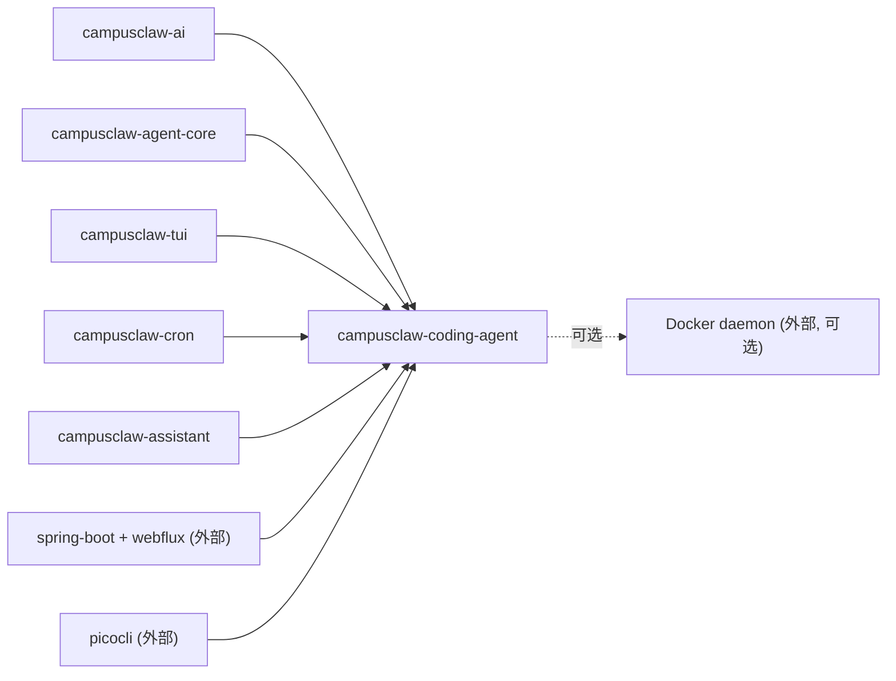
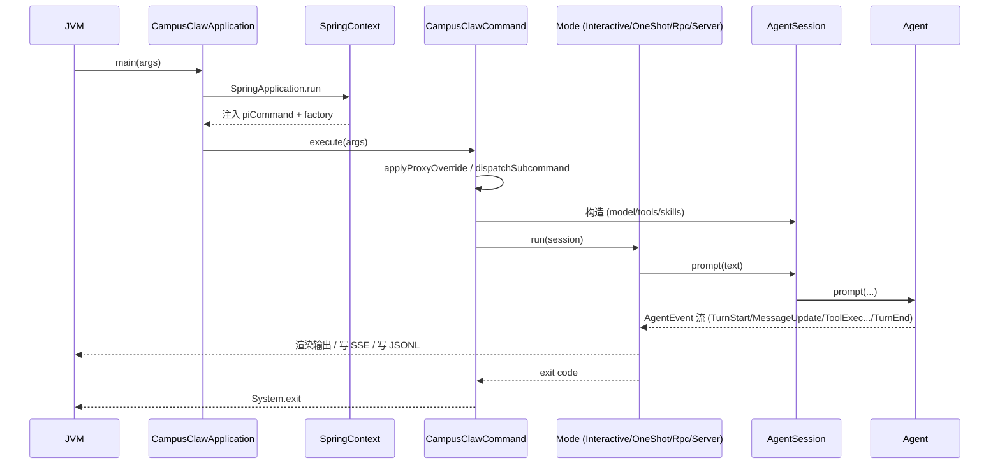
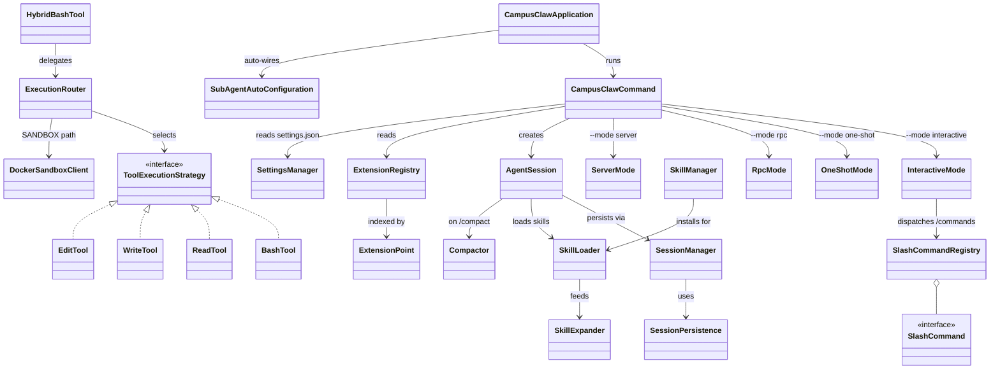

# coding-agent-cli 模块实现设计文档（基于代码 v1）

## 文档信息

| 项目 | 内容 |
|---|---|
| Story 编号 | 待开发者补充 |
| Story 名称 | coding-agent-cli 设计文档（基于代码 v1） |
| 负责人 | 待开发者补充 |
| 创建日期 | 2026-05-14 |
| 版本 | v1.0 (code-derived) |

> 本文档基于 `modules/coding-agent-cli` 现有源码逆向生成。该模块是 CampusClaw 项目（前身 pi-mono-java）的最终装配层与 CLI 入口，artifact 为 `campusclaw-coding-agent`，打包产物 `campusclaw-agent.jar`（fat JAR）。

---

## 1. Story 背景

### 1.1 需求来源

待开发者补充。从仓库根 `CLAUDE.md` 与 `docs/module-architecture.md` 可推断为"演进式架构治理"——把分散在 ai / tui / agent-core / cron / assistant 五个 lib 中的能力，聚合到一个独立的 Spring Boot CLI 应用，提供给最终用户作为"终端 AI 编码代理"产品。`pom.xml` 中 `<start-class>com.campusclaw.codingagent.CampusClawApplication</start-class>` 与 `<finalName>campusclaw-agent</finalName>` 表明这是面向用户交付的可执行包。

### 1.2 需求背景/价值/详情

**背景：** 项目分层结构里，`coding-agent-cli` 位于依赖图的下游汇聚点：

- `ai`（LLM 抽象）+ `agent-core`（agent 运行时）+ `tui`（终端 UI）+ `cron`（定时调度）+ `assistant`（会话持久化）—— 五个 lib 单独可复用，但要让"用户在终端跑起来一个 AI 编码助手"必须有装配胶水；
- 工具实现（read/write/edit/bash/glob/grep/ls 等 14 个 `AgentTool` 实现 + 6 个 hybrid 路由变体）落在本模块，而非下沉到 `agent-core` —— 因为工具实现强依赖 cwd / 文件系统 / shell / Docker，属于"应用层关注点"；
- 多种执行模式（interactive / one-shot / rpc / server / print / acp）由本模块的 `mode/` 子包统一分发；
- 用户扩展能力（`skill/` 安装包 + `extension/` 编译期扩展点）也在这里实现。

**价值（公开能力反推）：**

- **CLI 入口**：Picocli `@Command` 解析参数；支持 `-m`/`--mode`/`--prompt`/`--cwd`/`--proxy`/`--session`/`--resume` 等 25+ 选项；
- **多模式分发**：5 种主模式（interactive/one-shot/rpc/server/print）+ 隐藏 cron-tick 模式 + ACP 模式；
- **工具实现**：14 个 LLM `AgentTool` 落地实现（包含 LOCAL/SANDBOX 双路由）；
- **HTTP server**：Reactor Netty 暴露 REST + SSE + WebSocket（参考 `docs/openapi/campusclaw-api.yaml`）；
- **会话持久化**：JSONL 格式记录历史消息，跨进程恢复；
- **Skill 扩展机制**：用户可在 `~/file/.campusclaw/packages` 安装 git/本地目录形式的 skill 包；
- **Extension 扩展机制**：仓库内开发者可注册新 `AgentTool` / `SlashCommand` / `BeforeToolCallHandler` 等；
- **Slash 命令**：26 个内置斜杠命令（`/model` `/login` `/cron` `/share` `/export` 等）；
- **沙箱集成**：通过 `tool.execution.*` 配置在 Docker 容器中隔离运行高风险工具。

**详情：** 详见第 3 章。

### 1.3 关联需求

| 关联 Story/需求 | 关联关系 | 说明 |
|---|---|---|
| campusclaw-ai | 依赖 | 使用 `CampusClawAiService`、`ModelRegistry`、`Message` / `AssistantMessage` / `TextContent` 等类型驱动 LLM 调用 |
| campusclaw-agent-core | 依赖 | 使用 `Agent` 门面、`AgentTool` 接口、`AgentEvent` 流、`SubAgentRegistry`、`ProxyConfig` |
| campusclaw-tui | 依赖 | 使用 `JLineTerminal` / `Terminal` 抽象、ANSI 工具、组件 |
| campusclaw-cron | 依赖（可选 `@Nullable`） | 调用 `CronService` 创建/触发定时任务；本模块通过 `--cron-tick` 暴露给 launchd/crontab |
| campusclaw-assistant | 依赖 | WebSocket gateway 通道、MyBatis/PostgreSQL 会话持久化（按 `pi.assistant.gateway.enabled` 开关） |
| docs/openapi/campusclaw-api.yaml | 输出 | HTTP server 模式 API 契约文档（由本模块 `ServerMode` 实现） |
| docs/asyncapi/chat-ws.yaml | 输出 | `/api/ws/chat` WebSocket 契约（由 `ChatWebSocketHandler` 实现） |

---

## 2. Story 分析

### 2.1 Story 上下文

文字补充：

- **本模块 artifactId**：`campusclaw-coding-agent`，`<finalName>campusclaw-agent</finalName>`
- **上游（pom `<dependency>`）**：`campusclaw-ai`、`campusclaw-agent-core`、`campusclaw-tui`、`campusclaw-cron`、`campusclaw-assistant`（全部 5 个内部模块）
- **下游**：本模块是**应用层**，无 Java 模块依赖它——它产出的是 fat JAR / 二进制
- **外部关键依赖**：`spring-boot-starter`、`spring-boot-starter-webflux`（server 模式）、`picocli-spring-boot-starter`、`jackson-databind`、`snakeyaml`、`micrometer-core`、`reactor-netty`（来自 webflux，server 模式用）；测试链路含 `okhttp3:mockwebserver`
- **运行期可选**：Docker daemon（hybrid 模式 / sandbox 模式启用时）

### 2.2 功能点分解

| 序号 | 功能点 | 描述 | 优先级 | 预估工作量 |
|---|---|---|---|---|
| 1 | CLI 解析与子命令分发 | `CampusClawCommand` 解析参数，按 `--mode` 路由到 InteractiveMode / OneShotMode / RpcMode / ServerMode / PrintMode | 高 | - |
| 2 | 工具实现（local） | `ReadTool` / `WriteTool` / `EditTool` / `EditDiffTool` / `BashTool` / `GlobTool` / `GrepTool` / `LsTool` 八个核心 + `LoopTool` / `SpawnAgentTool` 两个编排 | 高 | - |
| 3 | 工具混合路由（hybrid） | `Hybrid*Tool` 六个变体通过 `ExecutionRouter` + `ToolExecutionStrategy` 在 LOCAL / SANDBOX / AUTO 间分派 | 中 | - |
| 4 | Docker 沙箱执行 | `DockerSandboxClient` + `SandboxSecurityPolicy` + `ResourceLimits` 把工具操作封装在容器内 | 中 | - |
| 5 | HTTP server 模式 | `ServerMode` 用 Reactor Netty 暴露 `/api/chat` (SSE)、`/api/skills` (CRUD)、`/api/ws/chat` (WS) | 高 | - |
| 6 | RPC 模式 | `RpcMode` 通过 stdin/stdout JSONL 与外部 controller 通信 | 中 | - |
| 7 | ACP 模式 | `AcpMode` 把本进程封装为 ACP stdio agent，供其它进程嵌入 | 低 | - |
| 8 | 会话 JSONL 持久化 | `SessionPersistence` / `SessionManager` 把消息历史写入 `~/file/.campusclaw/agent/sessions/--<cwd>--/<id>.jsonl` | 高 | - |
| 9 | Skill 包安装与加载 | `SkillManager` 从 git/本地目录安装 skill 包到 `~/file/.campusclaw/packages`；`SkillLoader` + `SkillExpander` 把 skill 内容注入 system prompt | 中 | - |
| 10 | Extension 编译期扩展点 | `ExtensionRegistry` 收集仓库内 `@Component` 注册的 6 种 `ExtensionPoint`（TOOL / COMMAND / BEFORE_TOOL_CALL / AFTER_TOOL_CALL / CONTEXT_TRANSFORMER / EVENT_LISTENER） | 中 | - |
| 11 | Slash 命令系统 | `SlashCommandRegistry` 注册 26 个内置 `SlashCommand`（`/model` `/login` `/cron` `/share` 等），交互模式下解析触发 | 中 | - |
| 12 | 历史压缩 | `Compactor` 把过长对话用 LLM 二次摘要回写，由 `/compact` 触发 | 中 | - |
| 13 | TUI 渲染组件 | `mode/tui/` 下 10 个组件类（消息气泡、Editor、Footer、覆盖层）订阅 `AgentEvent` 流 | 高 | - |
| 14 | 设置与认证 | `SettingsManager` 读写 `~/file/.campusclaw/settings.json`；`AuthStore` 管理 provider 凭据 | 中 | - |
| 15 | 系统调度集成 | `SystemSchedulerInstaller` 把 `--cron-tick` 注册为 launchd plist / crontab 条目 | 低 | - |

---

## 3. 实现设计

### 3.1 功能实现思路

`coding-agent-cli` 的角色是**装配 + 落地**：上游 5 个 lib 提供能力抽象，本模块负责实例化、串接、暴露给最终用户。整体技术路线：

1. **Spring Boot + Picocli 双重启动器**：`CampusClawApplication` 是 `@SpringBootApplication`，通过 `picocli-spring-boot-starter` 把 Spring bean 注入到 `@Command` 注解的 `CampusClawCommand` 中；`SpringApplication.run` 完成包扫描后由 `CommandLineRunner` 把 args 交给 Picocli 解析，最终调用 `call()`；
2. **模式分发**：`call()` 内 if/else 链按 `--mode` / `--print` / `--export` / `--list-models` / `--cron-tick` 等开关路由到对应 mode 类（`InteractiveMode` / `OneShotMode` / `RpcMode` / `ServerMode` / 直接出口）；
3. **工具实现作为 `AgentTool` bean**：每个工具一个 `@Component`，靠 `ConditionalOnProperty(name = "tool.execution.hybrid-enabled", havingValue = "false")` 切换 LOCAL vs Hybrid 变体——同名工具二选一注入 `List<AgentTool>`；
4. **Reactor Netty 嵌入式 HTTP**：server 模式不走 spring-mvc tomcat，而是直接 `HttpServer.create(...)` + `RouterFunctions.toHttpHandler(...)` —— Webflux 的函数式路由更轻；同一 server 同时挂 `routes.get("/api/ws/chat", ...)` 走原生 reactor-netty WebSocket；
5. **JSONL 会话**：消息序列化为 polymorphic Jackson JSON（`role` 字段作为 discriminator），按 `--<encoded-cwd>--/<id>.jsonl` 路径组织，每条消息一行，方便 grep / 增量追加；
6. **Skill / Extension 双层扩展**：Skill 是**运行时**用户可装的 markdown 包（带 `SKILL.md` 元数据），主要内容是 prompt 片段；Extension 是**编译期**仓库内 Java 类实现，注册到 6 种 `ExtensionPoint`；
7. **Hybrid 路由**：每个工具实现 `ToolExecutionStrategy`（local 策略）+ 对应的 `SandboxExecutionStrategy`（Docker 策略），`ExecutionRouter` 按 `ExecutionMode` 选一个执行；这套机制独立于 agent-core 的 `ToolExecutionPipeline`，只在工具内部生效；
8. **配置外置**：`application.yml`（canonical 副本，仓库根曾经有第二份已删除）声明 `tool.execution.*` / `subagent.backends.*` / `pi.assistant.gateway.*` / `server.session.persistence.enabled`。

设计取向：**保持上游 lib 的纯粹性，所有应用胶水（Spring 装配、bean 选择、容器交互、CLI flag）都收敛到本模块**——上游模块可在没有 Spring Boot / Picocli / Docker 的环境下独立测试。

### 3.2 功能实现设计

核心主流程位于 `CampusClawApplication.main()` → `CampusClawCommand.call()` → 各 mode 类。下面是从源码抽出的 step 序列，与时序图一一对应：

1. `main(args)`：JVM 启动，设置 `io.netty.noUnsafe=true` 等抑制 JLine/Netty 启动警告，调 `SpringApplication.run`；
2. `Spring 包扫描`：`@SpringBootApplication(scanBasePackages = "com.campusclaw")` 扫描 5 个 lib + 本模块的所有 bean，含全部 `AgentTool`、`SlashCommand`、配置；
3. `CommandLineRunner.run`：Spring 上下文 ready 后注入 `CampusClawCommand` 与 `IFactory`，构造 `CommandLine` 并执行 args；
4. `Picocli 解析`：填充 `@Option` / `@Parameters` 字段（含 `--mode` / `-m` 等），调用 `call()`；
5. `applyProxyOverride`：若 `--proxy` 非空，`ProxyConfig.fromUrl(...).installAsDefault()` 装 JVM 全局 ProxySelector；
6. `dispatchSubcommand`：先看是否走 export / list-models / cron-tick / print 短路出口；否则进入主路径；
7. `构造 AgentSession`：装载 `Settings`、`ModelRegistry`、`SystemPromptBuilder`、`SkillLoader`、tools 列表；
8. `按 mode 路由`：`InteractiveMode` / `OneShotMode` / `RpcMode` / `ServerMode` 之一接管；
9. `mode.run(session)`：mode 内部驱动 `Agent.prompt(...)`、订阅 `AgentEvent` 流、渲染输出 / 返回响应；
10. `会话退出`：写回 JSONL session 文件、关闭 cron engine、关闭 sub-agent backend；
11. `getExitCode`：把 Picocli 返回值作为 JVM exit code 退出。

**模式分派表（step 8 路由表）：**

| `--mode` 值 | 入口类 | 主用途 | I/O 通道 |
|---|---|---|---|
| `interactive`（默认） | `InteractiveMode` | TUI 全屏交互，订阅 `AgentEvent` 实时渲染 | JLine 终端 |
| `one-shot` | `OneShotMode` | 一次 prompt → 一次响应 → 退出 | stdout 文本 |
| `print`（或 `-p`） | `PrintMode`（通过 OneShotMode 内部分支） | 非交互模式，配合管道使用 | stdout 文本 |
| `rpc` | `RpcMode` | 外部 controller 用 JSONL 协议 | stdin/stdout JSONL |
| `server` | `ServerMode` | 嵌入式 HTTP server，多 conversation 复用 | Reactor Netty (8080 默认) |
| `--cron-tick`（隐藏选项） | `executeCronTick()` | OS scheduler 拉起，执行到期 job | 无 stdin 交互 |

### 3.3 GUI 前端设计

#### 3.3.1 设计图

本模块的"前端"是终端 TUI，无传统图形 UI。组件由 `mode/tui/` 下的渲染类构成，订阅 `AgentEvent` 流绘制到终端 cell 矩阵（继承自 `tui` 模块的 `Terminal` + `Renderer`）。

#### 3.3.2 页面（视图）功能描述

| 视图 | 功能描述 | 备注 |
|---|---|---|
| 主对话视图 | 顶部消息列表（User/Assistant 气泡），底部输入框，中间工具执行状态行 | `InteractiveMode` 全屏 |
| Model 选择浮层 | Ctrl+P 弹出当前 provider 下可用模型 | `ModelSelectorOverlay` |
| Session 选择浮层 | `/resume` 触发，列出 `~/file/.campusclaw/agent/sessions/--<cwd>--/` 下的历史 JSONL | `SessionSelectorOverlay` |
| Tree 选择浮层 | `/fork` 触发，展示同一 cwd 下的会话树 | `TreeSelectorOverlay` |
| 工具状态行 | 显示当前 tool 名称、参数摘要、流式增量结果 | `ToolStatusComponent` / `BashExecutionComponent` |
| Footer | 显示当前模型、token 用量、键位提示 | `FooterComponent` |

#### 3.3.3 页面模块

| 视图 | 组件 | 说明 |
|---|---|---|
| 主对话视图 | `AssistantMessageComponent` / `UserMessageComponent` / `CommandOutputComponent` | 一条消息 = 一个组件实例 |
| 主对话视图 | `EditorContainer` | 多行输入框（继承自 `tui.editor`） |
| 主对话视图 | `FooterComponent` | 固定底部一行 |
| 主对话视图 | `ToolStatusComponent` / `BashExecutionComponent` | 工具调用占位 |
| 弹层 | `ModelSelectorOverlay` / `SessionSelectorOverlay` / `TreeSelectorOverlay` | 全屏覆盖式选择器 |

#### 3.3.4 接口使用

| 视图/组件 | 调用接口 | 触发方式 | 说明 |
|---|---|---|---|
| 主对话视图 | `AgentSession.prompt(text)` | 用户回车 | 提交用户消息，等待 agent 响应流 |
| 主对话视图 | `agent.subscribe(listener)` | 启动时 | 订阅 sealed `AgentEvent`，按事件类型分发到组件 |
| Footer | `ModelCatalogService` / `Compactor.tokenUsage(...)` | 每帧重绘 | 拉模型信息与 token 用量显示 |
| `SessionSelectorOverlay` | `ConversationLister.list(cwd)` | `/resume` 命令 | 列出当前 cwd 的 JSONL 文件 |
| `ModelSelectorOverlay` | `ModelRegistry.list()` + `Settings.modelsFilter` | `Ctrl+P` 键 | 取交集后展示 |

### 3.4 接口描述

#### HTTP 接口（`--mode server`，由 `ServerMode` 提供，权威契约 `docs/openapi/campusclaw-api.yaml`）

| 接口名称 | 请求方式 | URL | 请求参数 | 响应参数 | 说明 |
|---|---|---|---|---|---|
| 健康检查 | GET | `/api/health` | - | `{"status":"ok"}` | 探活 |
| 流式对话 | POST | `/api/chat` | JSON: `{conversation_id, message, model?}` | SSE `event: message` / `event: tool_call` / `event: done` | 多 conversation 持久会话 |
| 列出会话 | GET | `/api/conversations` | - | `{conversations: [...]}` | 列出 server pool 中的 conversation |
| 删除会话 | DELETE | `/api/conversations/{id}` | path: id | `{removed: bool}` | 释放 server pool 槽位 |
| WebSocket 对话 | GET (Upgrade) | `/api/ws/chat?conversation_id=...` | query: conversation_id | WebSocket text frame (AsyncAPI 契约) | 双向流，由 `ChatWebSocketHandler` 处理 |
| 上传 skill | POST | `/api/skills` | multipart: `file=<archive>` (.zip/.tar.gz/.tgz) | `{name, packageName, installed}` | 上传后立即解压安装 |
| 列出 skill | GET | `/api/skills` | - | `{skills: [...]}` | 含 enabled / disabled 状态 |
| 删除 skill | DELETE | `/api/skills/{name}` | path: name | `{removed: bool}` | 按 package name 移除 |
| 启用 skill | POST | `/api/skills/{name}/enable` | path: name | `{enabled: true}` | 影响下次新建 session |
| 禁用 skill | POST | `/api/skills/{name}/disable` | path: name | `{enabled: false}` | 同上 |

#### LLM Tool 接口（`AgentTool` 实现，由 agent 在对话中自动调用）

| 工具名称 | 类 | 主要参数 | 说明 |
|---|---|---|---|
| `read` | `ReadTool` / `HybridReadTool` | `file_path, offset?, limit?` | 读取文件，cat -n 行号格式 |
| `write` | `WriteTool` / `HybridWriteTool` | `file_path, content` | 写入或覆盖文件 |
| `edit` | `EditTool` / `HybridEditTool` | `file_path, old_string, new_string, replace_all?` | 精确字符串替换 |
| `edit_diff` | `EditDiffTool` | `file_path, diff` | 应用 unified diff |
| `bash` | `BashTool` / `HybridBashTool` | `command, timeout?` | 执行 bash 命令 |
| `glob` | `GlobTool` / `HybridGlobTool` | `pattern, path?` | 路径 glob 匹配 |
| `grep` | `GrepTool` / `HybridGrepTool` | `pattern, path?, glob?, output_mode?` | 跨文件正则搜索 |
| `ls` | `LsTool` | `path, ignore?` | 列目录 |
| `loop` | `LoopTool` | `prompt, interval` | 创建轮询任务（委托 `LoopManager`） |
| `spawn_agent` | `SpawnAgentTool` | `backend, prompt, ...` | 拉起 sub-agent（委托 `agent-core` 的 `SubAgentRegistry`） |
| `cron` | `cron` 模块的 `CronTool` | `action ∈ {create, list, delete, ...}` | 由 `campusclaw-cron` 注入（不在本模块实现） |

#### Slash 命令接口（`SlashCommand`，交互模式下用户键入触发）

`SlashCommandRegistry` 注册的 26 个内置命令（位于 `command/builtin/`）：

| 命令 | 类 | 说明 |
|---|---|---|
| `/help` | `HelpCommand` | 列出所有命令 |
| `/quit` `/exit` | `QuitCommand` | 退出（抛 `QuitException`） |
| `/model` | `ModelCommand` | 切换模型 |
| `/login` `/logout` | `LoginCommand` / `LogoutCommand` | provider 凭据管理 |
| `/auth` | `AuthCommand` | 显示当前认证状态 |
| `/providers` | `ProvidersCommand` | 列出 provider |
| `/new` | `NewCommand` | 新建会话 |
| `/resume` | `ResumeCommand` | 恢复历史会话 |
| `/fork` | `ForkCommand` | 派生新会话分支 |
| `/session` | `SessionCommand` | 显示当前会话信息 |
| `/compact` | `CompactCommand` | 触发对话压缩 |
| `/export` | `ExportCommand` | 导出会话为 HTML |
| `/share` | `ShareCommand` | 分享会话（远端发布） |
| `/copy` | `CopyCommand` | 复制最后一条消息 |
| `/cron` | `CronCommand` | 列 / 操作定时任务 |
| `/loop` | `LoopCommand` | 列轮询任务 |
| `/name` | `NameCommand` | 给会话起名 |
| `/import` | `ImportCommand` | 导入外部 JSONL |
| `/settings` | `SettingsCommand` | 编辑 settings.json |
| `/reload` | `ReloadCommand` | 重载 skills |
| `/changelog` | `ChangelogCommand` | 查看版本变更 |
| `/debug` | `DebugCommand` | 显示调试信息 |
| `/hotkeys` | `HotkeysCommand` | 显示键位绑定 |
| `/tree` | `TreeCommand` | 显示会话树 |
| `/scoped-models` | `ScopedModelsCommand` | 当前 scope 下的模型 |

#### 程序接口（Java SPI）

| 接口 / 类 | 方法 | 入参 | 返回 | 说明 |
|---|---|---|---|---|
| `SlashCommand` | `name()` / `aliases()` / `execute` | `SlashCommandContext` | `void` | 内置或扩展命令契约 |
| `ExtensionRegistry` | `register` | `ExtensionPoint, Extension` | `void` | 编译期扩展注册 |
| `SkillLoader` | `load` | `Path` | `List<Skill>` | 从 `~/file/.campusclaw/packages` 加载 |
| `SkillManager` | `installFromGit` / `installFromLocal` / `remove` / `list` | varies | `InstalledSkillRecord` | Skill 包生命周期 |
| `AgentSession` | `init` / `prompt` / `agent()` / `messages()` | text / `Message` | `CompletableFuture<Void>` / `Agent` / `List<Message>` | session 门面 |
| `SessionManager` | `save` / `load` / `list` | session id / path | `List<Message>` | JSONL 持久化路由 |
| `Compactor` | `compact` | `List<Message>` | `CompactionResult` | LLM 二次摘要历史 |
| `ToolExecutionStrategy` | `execute` | params + ctx | `AgentToolResult` | local / sandbox 策略契约 |
| `ExecutionRouter` | `route` | `ExecutionMode + AgentTool params` | `AgentToolResult` | hybrid 分派 |

### 3.5 数据库及持久化设计

本模块**自身**不直接操作数据库（无 `@Entity` / `@Mapper` / `executeQuery`）。持久化分两类：

**1. 文件持久化（本模块直接负责）：**

| 路径 | 格式 | 写入类 | 说明 |
|---|---|---|---|
| `~/file/.campusclaw/agent/sessions/--<encoded-cwd>--/<id>.jsonl` | JSONL（一行一条 polymorphic `Message`） | `SessionPersistence` | 会话消息历史，按 cwd 隔离 |
| `~/file/.campusclaw/agent/sessions/--<encoded-cwd>--/.tree.json` | JSON | `SessionTreePersistence` | 会话 fork 关系树 |
| `~/file/.campusclaw/agent/cron/jobs.json` | JSON | `campusclaw-cron` 模块 | 定时任务（不在本模块） |
| `~/file/.campusclaw/agent/loops/loops.json` | JSON | `LoopManager` | 轮询任务 |
| `~/file/.campusclaw/agent/sub-agent-sessions/...` | JSON | `FileSubAgentSessionStore` | sub-agent 会话快照（可选） |
| `~/file/.campusclaw/packages/.installed.json` | JSON manifest | `SkillManager` | 已安装 skill 索引 |
| `~/file/.campusclaw/packages/<pkg>/...` | git clone / 解压目录 | `SkillManager` | skill 内容 |
| `~/file/.campusclaw/settings.json` | JSON | `SettingsManager` | 用户设置 |
| `~/file/.campusclaw/auth/<provider>.json` | JSON | `AuthStorage` | provider 凭据（apiKey / refreshToken 等） |

**2. 数据库持久化（间接转发到 `assistant` 模块）：**

当 `pi.assistant.gateway.enabled=true` 时，`spring.datasource.url` 指向 PostgreSQL/GaussDB（`application.yml` 默认 `jdbc:postgresql://localhost:5432/pi_assistant`），MyBatis 通过 `assistant` 模块的 mapper 把消息写入 DB。本模块只提供 datasource 配置入口与 lazy-init bean 排除（`webSocketGatewayConfig,gatewayChannel`），实际表结构与 SQL 在 `campusclaw-assistant` 模块的 `schema.sql` 中。

**默认状态：** `pi.assistant.gateway.enabled=false`，DB 链路不启用；纯本地使用时只走 JSONL 文件持久化。

### 3.6 代码设计

按一级包列出对外/核心类，每个类一行职责：

**`com.campusclaw.codingagent`**
- `CampusClawApplication`：Spring Boot 启动器 + `CommandLineRunner` + `ExitCodeGenerator`，main 入口

**`com.campusclaw.codingagent.cli`**
- `CampusClawCommand`：Picocli `@Command` 主命令，解析 25+ 选项并路由到各 mode

**`com.campusclaw.codingagent.mode`**
- `InteractiveMode`：TUI 交互模式
- `OneShotMode`：单次 prompt 模式
- `PrintMode`：非交互打印模式

**`com.campusclaw.codingagent.mode.server`**
- `ServerMode`：Reactor Netty HTTP server 启动器，注册路由
- `ChatHandler`：`/api/chat` SSE handler
- `ChatWebSocketHandler`：`/api/ws/chat` WebSocket handler
- `SkillHandler`：`/api/skills/*` REST handler
- `SessionPool`：server 模式下 conversation_id → `AgentSession` 复用池

**`com.campusclaw.codingagent.mode.rpc`**
- `RpcMode`：JSONL stdin/stdout 协议入口
- `RpcCommand` / `RpcEvent`：协议消息 record

**`com.campusclaw.codingagent.mode.acp`**
- `AcpMode`：ACP stdio agent 暴露入口（未在 CLI 主路由中默认接入，作为预留扩展）

**`com.campusclaw.codingagent.mode.tui`**
- `AssistantMessageComponent` / `UserMessageComponent` / `BashExecutionComponent` / `CommandOutputComponent`：消息气泡组件
- `EditorContainer`：输入框
- `FooterComponent`：底部状态栏
- `ModelSelectorOverlay` / `SessionSelectorOverlay` / `TreeSelectorOverlay`：弹层

**`com.campusclaw.codingagent.session`**
- `AgentSession`：单 session 门面（model + tools + skills + agent）
- `SessionManager`：JSONL 路由器，按 cwd 编码路径定位
- `SessionPersistence`：JSONL 读写
- `SessionTree` / `SessionTreePersistence`：会话 fork 树
- `ConversationLister`：列出 cwd 下的历史会话

**`com.campusclaw.codingagent.tool.bash`**
- `BashTool`：`AgentTool` 实现
- `BashExecutor`：`ProcessBuilder` 包装层
- `ShellResolver`：跨平台 shell 路径发现（bash / git-bash / sh）

**`com.campusclaw.codingagent.tool.{read,write,edit,editdiff,glob,grep,ls}`**
- `ReadTool` / `WriteTool` / `EditTool` / `EditDiffTool` / `GlobTool` / `GrepTool` / `LsTool`：八个 `AgentTool` 落地实现

**`com.campusclaw.codingagent.tool.ops`**
- `BashOperations` / `LocalBashOperations`：bash 执行 SPI + 本地实现
- `EditOperations` / `LocalEditOperations`：edit SPI + 本地实现
- `ReadOperations` / `LocalReadOperations` / `WriteOperations` / `LocalWriteOperations` / `LsOperations` / `LocalLsOperations`：成对的 SPI + 本地实现

**`com.campusclaw.codingagent.tool.hybrid`**
- `HybridBashTool` / `HybridReadTool` / `HybridWriteTool` / `HybridEditTool` / `HybridGlobTool` / `HybridGrepTool`：六个 hybrid 路由变体

**`com.campusclaw.codingagent.tool.execution`**
- `ExecutionMode`：枚举 LOCAL / SANDBOX / AUTO
- `ExecutionRouter`：按 mode 选 strategy
- `ToolExecutionStrategy`：策略契约

**`com.campusclaw.codingagent.tool.sandbox`**
- `DockerSandboxClient`：Docker daemon 调用客户端
- `SandboxSecurityPolicy`：容器安全策略（capability drop / readonly fs 等）
- `ResourceLimits`：内存 / CPU 限额
- `SandboxResult`：执行产物

**`com.campusclaw.codingagent.command`**
- `SlashCommand`：命令接口
- `SlashCommandContext`：命令执行上下文
- `SlashCommandRegistry`：注册表
- `QuitException`：退出信号
- `command.builtin/*`：26 个内置命令实现

**`com.campusclaw.codingagent.skill`**
- `SkillManager`：安装 / 卸载 / 列出
- `SkillLoader`：扫描目录解析 `SKILL.md`
- `SkillRegistry`：进程内 skill 索引
- `SkillExpander`：把 skill 内容展开到 prompt
- `SkillPromptFormatter`：格式化为 system prompt 片段
- `SkillStateStore`：enable/disable 状态持久化
- `SandboxSkillParser`：解析 sandbox 模式专用 skill
- `InstalledSkillRecord`：manifest record

**`com.campusclaw.codingagent.extension`**
- `Extension` / `ExtensionPoint` / `ExtensionRegistry`：编译期扩展点 SPI

**`com.campusclaw.codingagent.config`**
- `AppPaths`：`~/file/.campusclaw/...` 路径常量
- `ToolExecutionProperties`：`@ConfigurationProperties("tool.execution")`
- `ConfigValueResolver`：值解析
- `CustomModelLoader`：从 settings 加载自定义模型
- `SettingsBackedProviderConfigResolver`：把 settings.json 映射到 provider 配置

**`com.campusclaw.codingagent.settings`**
- `Settings`：配置 record
- `SettingsManager`：读写 `~/file/.campusclaw/settings.json`

**`com.campusclaw.codingagent.auth`**
- `AuthStore` / `AuthStorage`：provider 凭据存取
- `Credential`：凭据 record

**`com.campusclaw.codingagent.compaction`**
- `Compactor`：长对话压缩
- `CompactionConfig` / `CompactionResult`：参数与结果
- `FileOperationTracker`：跟踪 read/write/edit 影响的文件

**`com.campusclaw.codingagent.prompt`**
- `SystemPromptBuilder`：组装 system prompt（含 skills、context 文件、平台信息）
- `PromptTemplate` / `PromptTemplateEntry` / `PromptTemplateLoader`：模板加载

**`com.campusclaw.codingagent.context`**
- `ContextFileLoader`：加载 `CLAUDE.md` / `AGENTS.md` 等项目级上下文

**`com.campusclaw.codingagent.subagent`**
- `SubAgentAutoConfiguration`：按 `subagent.backends.*` 注入 `SubAgentBackend` bean
- `SubAgentProperties`：`@ConfigurationProperties("subagent")`
- `FileSubAgentSessionStore`：把 sub-agent session 持久化到磁盘
- `subagent.tool/SpawnAgentTool`：把 sub-agent 暴露为 `AgentTool`

**`com.campusclaw.codingagent.cron`**
- `SystemSchedulerInstaller`：把 `--cron-tick` 注册为 OS 调度器条目（launchd plist / crontab）

**`com.campusclaw.codingagent.loop`**
- `LoopManager`：轮询任务管理
- `LoopTool`：暴露为 `AgentTool`

**`com.campusclaw.codingagent.diff` / `diagnostic` / `export` / `footer` / `guard` / `keybinding` / `migration` / `model` / `pkg` / `resolver` / `resource` / `source` / `theme` / `util`**
- 各类辅助包：diff 渲染、诊断、HTML 导出、键位绑定、目录迁移、模型目录、主题、通用工具等

### 3.7 安装部署设计

本模块是**最终可执行产物**，是依赖图最下游，单独可启动。

**构建产物：**

- Maven 坐标：`com.campusclaw:campusclaw-coding-agent:1.0.0-SNAPSHOT`
- 打包：Spring Boot `repackage` 插件，`<finalName>campusclaw-agent</finalName>` → `target/campusclaw-agent.jar`（fat JAR，含所有 5 个内部模块 + 全部传递依赖）
- 主类：`com.campusclaw.codingagent.CampusClawApplication`
- JDK 要求：21（root pom `<java.version>21</java.version>`；virtual thread、sealed interface、record 等特性在用）

**构建命令：**

| 命令 | 用途 |
|---|---|
| `./mvnw package -pl modules/coding-agent-cli -am -DskipTests` | 仅构建 fat JAR |
| `./mvnw verify` | 全量构建 + 测试 |
| `./campusclaw.sh -m glm-5` | 推荐入口脚本（自动检测 JDK 21 + 自动重建） |
| `java -jar target/campusclaw-agent.jar --mode server --port 8080` | 直接运行 |

**配置文件：**

- 主配置：`src/main/resources/application.yml`（canonical 副本，**禁止**在仓库根再放一份）
- profile：`application-k8s.yml`（k8s 部署用，Spring profile 切换）
- 用户配置：`~/file/.campusclaw/settings.json`（由 `SettingsManager` 读写，不打入 JAR）

**关键配置项：**

| 配置项 | 默认值 | 说明 |
|---|---|---|
| `tool.execution.default-mode` | `LOCAL` | 工具执行模式：LOCAL / SANDBOX / AUTO |
| `tool.execution.hybrid-enabled` | `false` | 启用 hybrid 路由变体（要求 Docker 可用） |
| `tool.execution.local-execution-enabled` | `true` | 允许本地执行 |
| `tool.execution.sandbox-execution-enabled` | `true` | 允许沙箱执行 |
| `tool.execution.docker-host` | `unix:///var/run/docker.sock` | Docker daemon |
| `tool.execution.sandbox-worker-image` | `alpine:3.19` | 沙箱工作镜像 |
| `tool.execution.sandbox-worker-memory` | `512m` | 容器内存限额 |
| `tool.execution.sandbox-worker-cpu` | `1.0` | 容器 CPU 限额 |
| `tool.execution.sandbox-timeout-seconds` | `120` | 沙箱执行超时 |
| `tool.execution.local-timeout-seconds` | `60` | 本地执行超时 |
| `subagent.enabled` | `true` | 启用 sub-agent 框架 |
| `subagent.backends.*` | 内置 `claude-code` / `codex` / `remote-http` 三例 | 每条目类型 acp 或 http |
| `pi.assistant.gateway.enabled` | `false` | 是否启用 assistant gateway WebSocket |
| `server.session.persistence.enabled` | `true` | server 模式下是否持久化 conversation JSONL |
| `spring.datasource.url` | `jdbc:postgresql://localhost:5432/pi_assistant` | DB URL（仅 gateway 启用时使用） |
| `logging.level.root` | `WARN` | 默认日志级别 |
| `logging.level.CampusClawStartupBanner` | `INFO` | server 模式启动 banner 固定 INFO |

**环境变量：**

| 变量 | 用途 |
|---|---|
| `JAVA_HOME` | 指向 JDK 21 |
| `HTTP_PROXY` / `HTTPS_PROXY` / `NO_PROXY` | 由 `agent-core` 的 `ProxyConfig` 自动读取 |
| `GAUSSDB_URL` / `GAUSSDB_USER` / `GAUSSDB_PASSWORD` | 覆盖 `spring.datasource.*` |
| `CAMPUSCLAW_REMOTE_AGENT_TOKEN` | `subagent.backends.remote-http.auth-token` 替换源 |
| 各 provider API key（如 `ANTHROPIC_API_KEY`、`OPENAI_API_KEY` 等） | 由 `campusclaw-ai` 模块的 provider 实现读取 |

**用户目录布局（`~/file/.campusclaw/`）：**

| 子路径 | 内容 |
|---|---|
| `settings.json` | 用户设置 |
| `auth/<provider>.json` | provider 凭据 |
| `agent/sessions/--<encoded-cwd>--/<id>.jsonl` | 会话历史 |
| `agent/sessions/--<encoded-cwd>--/.tree.json` | 会话 fork 树 |
| `agent/cron/jobs.json` | 定时任务（由 cron 模块写入） |
| `agent/loops/loops.json` | 轮询任务 |
| `agent/sub-agent-sessions/` | sub-agent 会话快照 |
| `packages/` | 已安装 skill 包 |
| `packages/.installed.json` | skill 安装 manifest |

启动时 `AppPaths.ensureUserDirs()` 保证上述目录存在；`MigrationManager`（位于 `migration/` 包）兼容老路径（如曾用 `~/.pi/`）。

**OS 调度器集成：**

`SystemSchedulerInstaller`（位于 `cron/` 包）把 `java -jar campusclaw-agent.jar --cron-tick` 注册为：

- macOS：`~/Library/LaunchAgents/com.campusclaw.cron.plist` 每分钟触发
- Linux：用户 crontab `* * * * * java -jar ...`
- Windows：Schtasks（如已实现，详见模块代码）

由 `--cron-tick` 隐藏 flag 进入 `executeCronTick()` 短路出口：执行所有到期 job 并立即退出，不进 TUI / server。

---

## 4. DFX 设计

### 4.1 性能设计

- **启动优化**：
  - `spring.main.lazy-initialization: true`——bean 按需实例化，缩短 cold start；
  - `spring.main.banner-mode: off`——抑制 Spring 横幅；
  - JVM 启动 props：`io.netty.noUnsafe=true`、`org.jline.terminal.jansi=false` 抑制 JLine/Netty 警告 IO；
- **并发模型**：
  - 主 agent loop 走 `agent-core` 的虚拟线程；
  - HTTP server 模式走 **Reactor Netty**（webflux 函数式路由，`ReactorHttpHandlerAdapter` + SSE/Flux）——单进程承载多 conversation；
  - 工具内部 IO（bash drainer / Docker stream）用独立 daemon `Thread`，全部装 `LoggingUncaughtExceptionHandler`；
- **资源限额**：
  - 工具输出截断常量：`BashTool.MAX_OUTPUT_LINES=2000` / `MAX_OUTPUT_BYTES=100_000`（`TruncationUtils` 统一处理）；
  - Sandbox 内存 / CPU / timeout 由 `application.yml` 配置；
- **缓存**：
  - `SessionPool` 在 server 模式按 `conversation_id` 复用 `AgentSession`，避免每次请求重新构造 agent 与 skill 状态；
  - `ModelCatalogService` 缓存模型目录避免重复 IO；
- **指标**：依赖 `micrometer-core`，代码中预留埋点位（与 agent-core 一致），但 PROD 用法待补。

### 4.2 兼容性设计

- **JDK 版本**：21（虚拟线程、sealed、record、pattern matching switch）；
- **接口稳定性**：所有 public 类标注 `@version [br_eCampusCore 25.1.0_Next, YYYY/MM/DD]` + `@since`；
- **CLI 参数兼容**：`-p` 与 `--print` 同时存在并向 `--mode one-shot` 路由（参考 `call()` 中 `if (printMode) { mode = "one-shot"; }`）——向后兼容；
- **目录迁移**：`MigrationManager` 把老 `~/.pi/` 等历史路径上的内容迁到 `~/file/.campusclaw/`，对老用户透明；
- **OS 兼容**：
  - shell：`ShellResolver` 在 Windows 上回退到 `/bin/bash`（Git Bash） → `which bash` → `sh`；
  - 调度器：`SystemSchedulerInstaller` 区分 macOS launchd / Linux crontab；
- **HTTP 契约**：`docs/openapi/campusclaw-api.yaml` 是权威，`docs/server-api.md` 是历史遗留快照（已标 deprecated）；
- **WebSocket 契约**：`docs/asyncapi/chat-ws.yaml`；
- **subagent 协议**：ACP 版本号在 `agent-core` 的 `AcpProtocol` 中固定，HTTP backend 通过 `HttpAgentConfig.protocolVersion` 暴露。

### 4.3 可维护性设计

- **日志**：
  - 全部走 SLF4J（仓库根 `CLAUDE.md` 强制规则 `no_system_out_err` + `no_print_stack_trace`）；
  - 默认 `logging.level.root: WARN`、`com.campusclaw: WARN`、`io.netty: ERROR`；
  - 独立 logger `CampusClawStartupBanner` 固定 INFO——让 `--mode server` 的启动 endpoint 列表不会被运行时噪音过滤策略误伤；
- **错误处理**：`Agent.formatError`（在 agent-core）已展开 `CompletionException`，本模块上层只关心向用户呈现；交互模式有 `OutputGuard` 把异常文本过滤后再输出；
- **诊断**：`diagnostic/` 包提供运行时诊断信息（环境、模型、provider 连通性）；
- **健康检查**：`/api/health` 暴露简单 `{"status":"ok"}` —— 由 reverse proxy / k8s liveness 用；
- **后台线程**：所有 `new Thread(...)` 装 `LoggingUncaughtExceptionHandler`（如 `LocalBashOperations` 的 bash drainer）—— 仓库强约束；
- **测试**：38 个测试类，覆盖 mode / session / skill / tool ops / cli 主要分支。

### 4.4 全球化设计

本模块**不涉及**真正的多语言 i18n 资源束（`ResourceBundle` / `messages_*.properties`）。约束规则：

- 所有日志消息走 SLF4J 且**不含中文**（仓库强约束 `no_chinese_in_log`）；
- 所有大小写转换、数字格式化显式 `Locale.ROOT`（仓库强约束）；
- 面向最终用户的提示文本（错误消息、命令帮助）当前主要为英文；少量 `application.yml` 内嵌注释为中文，但属于配置文件，非日志。

时区：`AgentSession` 不主动处理时区；cron 模块的 `CronExpr` 支持显式 zone 参数。

### 4.5 产品资料设计

| 资料 | 关系 |
|---|---|
| `README.md`（仓库根） | 用户 quickstart、CLI flag 概览、provider 列表（面向本模块用户） |
| `CLAUDE.md`（仓库根） | 全仓约束 + 本模块构建/部署说明 |
| `docs/module-architecture.md` | 多模块依赖图，含本模块的角色 |
| `docs/openapi/campusclaw-api.yaml` | HTTP server 模式 API 权威契约（本模块实现） |
| `docs/asyncapi/chat-ws.yaml` | `/api/ws/chat` WebSocket 契约（本模块实现） |
| `ARCHITECTURE-HYBRID.md` / `IMPLEMENTATION-HYBRID.md` / `DOCKER-SANDBOX-GUIDE.md` | hybrid 执行 + sandbox 设计文档 |
| `docs/server-api.md` | 历史快照，已 deprecated，新接口看 OpenAPI yaml |
| `docs/DEFERRED.md` | 未完成项登记（按强约束 TODO/FIXME 禁止入代码） |

---

## 5. 安全 Checklist

| 序号 | 检查项 | 是否涉及 | 说明 |
|---|---|---|---|
| 5.1 | 是否有认证机制 | 是 | （a）本模块对外 HTTP server 当前**未实现**鉴权（`/api/chat` / `/api/skills` 路由无 `@PreAuthorize` / SecurityFilter，由部署侧通过反向代理添加鉴权）；（b）对**外部** provider 走 API key / OAuth，凭据由 `AuthStore` 持久化到 `~/file/.campusclaw/auth/<provider>.json`，`LoginCommand` / `LogoutCommand` 管理；（c）对 sub-agent HTTP backend 支持 `bearer` / `header` / `none` 三种鉴权（继承 `agent-core` 的 `HttpAgentConfig`），token 由 `subagent.backends.<id>.auth-token` 注入，支持 `${ENV}` 占位 |
| 5.2 | 纵向/横向越权 | 否 | 本模块 server 模式为单租户本地服务，无多用户隔离；`SessionPool` 按 conversation_id 路由 session，但 conversation_id 本身不绑定 owner——**部署到公网必须前置鉴权代理** |
| 5.3 | 记录操作日志 | 是 | SLF4J 全链路日志：mode 切换、session 加载、skill install/remove、bash 命令执行（命令本身不记录到 INFO，避免泄露 secret）、HTTP 请求由 reactor-netty 内置 access log |
| 5.4 | SQL 注入 | 不涉及（间接相关） | 本模块自身无 SQL 调用（grep 验证：无 `executeQuery` / `String.format` + SQL）。当 `pi.assistant.gateway.enabled=true` 时通过 `assistant` 模块的 MyBatis Mapper 落库——SQL 注入风险由 `assistant` 模块 `#{}` 占位防护负责，不在本模块边界 |
| 5.5 | XSS 注入 | 是（导出 HTML 场景） | `/export` 把会话导出为 HTML（`export/` 包），消息文本来自 LLM / 用户输入；当前流程下导出文件供用户本地查看不上线公网，但导出器应对 user content 做 HTML escape。**待审计**：`ExportCommand` 链路是否对 message.text 做了 `StringEscapeUtils.escapeHtml4` 类处理 |
| 5.6 | XML 注入 | 不涉及 | 全链路 JSON（Jackson）+ YAML（snakeyaml）；无 `DocumentBuilderFactory` / `SAXParserFactory` |
| 5.7 | 命令注入 | **是（核心风险面）** | 多处 `ProcessBuilder` 调用：（a）`BashExecutor` / `LocalBashOperations.buildProcessBuilder` —— `bash` 工具是 LLM **设计要执行用户/agent 提供的命令**的能力，本质上属于"开放命令面"。防护策略：（i）`ProcessBuilder(List<String>)` 形式而非 `Runtime.exec(String)`——argv 不经 `/bin/sh -c` 拼接（避免 shell 元字符注入到 argv 边界），但 `command` 字符串本身确实通过 `bash -c <command>` 由 bash 解析，shell 元字符按设计有效；（ii）超时机制：`BashExecutor` 强制 `timeout` 参数与全局 `local-timeout-seconds`；（iii）进程树清理：`killProcessTree` 递归杀子进程，防止悬挂；（iv）输出截断：`BashTool.MAX_OUTPUT_BYTES=100_000` 防止巨型输出耗尽内存；（v）**沙箱**：当 `tool.execution.default-mode=SANDBOX` 或 hybrid 路由判定为高风险，命令在 `DockerSandboxClient` 拉起的临时容器（默认 alpine:3.19，512m / 1.0 CPU）中执行，配合 `SandboxSecurityPolicy`（capability drop / readonly fs / 网络隔离）——把命令注入降级为"容器内部行为"，逃逸需要 Docker 漏洞。（b）`ShellResolver.resolveBashPath` 调 `which bash` —— argv 固定，无外部输入。（c）`SkillManager.installFromGit` 调 `git clone <url>` —— URL 来自用户 `/skills install <url>`，argv 形式不经 shell，但 URL 本身仍流入 git，建议进一步白名单/校验协议（`https://` / `git@`）。**总体**：bash 工具的命令注入是**设计能力**，沙箱是核心防线；非 bash 路径（git / which / docker exec）走 argv list 形式避免拼接 |
| 5.8 | 输入校验 | 是 | （a）所有 `AgentTool` 的入参由 `agent-core` 的 `ToolExecutionPipeline.validateArguments` 用 networknt JSON-Schema (2020-12) 校验，schema 在每个 tool 的 `parameters()` 方法中声明；（b）`SkillHandler.upload` 校验文件扩展名（`.zip` / `.tar.gz` / `.tgz`）；（c）Picocli 自动对 `--mode` / `--port` 等做类型校验；（d）`ChatHandler.chat` 反序列化 JSON 由 Jackson 校验类型 |
| 5.9 | 敏感数据/个人隐私数据 | 是 | provider API key、sub-agent `auth-token` 是敏感凭据。处理：（a）`AuthStorage` 写入 `~/file/.campusclaw/auth/`，**未加密**（与 ssh / aws cli 行为一致，依赖 UNIX 文件权限保护）；（b）日志中**不输出** token（`HttpAgentConfig` 的 `toString` 排除 token，`ProxyConfig.toUrl()` 屏蔽 password）；（c）`application.yml` 的 secret 通过 `${ENV:default}` 占位，避免 commit 明文；（d）`/share` 命令上传会话需 review：会否携带 stack trace 中的环境变量 |
| 5.10 | 加解密 | 不涉及 | 本模块无 `Cipher` / `MessageDigest` 调用。TLS 由 HttpClient 默认（JDK / OkHttp）负责；本模块未自管证书 |
| 5.11 | 文件上传下载 | 是 | （a）上传：`SkillHandler.upload` 用 webflux `FilePart.transferTo(tempFile)` 接 multipart，写入 `Files.createTempFile`，限定扩展名为压缩包，由 `SkillManager` 解压到 `~/file/.campusclaw/packages/`——zip 解压需防 zip slip（`SkillManager` 的 `Files.copy(zis, entryPath)` 应校验 `entryPath` 在 target dir 之内，**待审计**确认 path traversal 防护）；（b）下载：`/export` 把会话写到本地 HTML 文件，由用户指定路径（命令参数），路径越权风险由 OS 文件权限承担；（c）`MigrationManager.Files.copy` 在备份目录间复制——内部路径，受控 |
| 5.12 | 硬编码 | 否 | secret 通过 `${ENV:default}` 占位（如 `CAMPUSCLAW_REMOTE_AGENT_TOKEN`、`GAUSSDB_PASSWORD`）或 `~/file/.campusclaw/auth/` 持久化获取；`application.yml` 默认 `root/root` 仅本地开发占位；常量如 `DEFAULT_MODEL="claude-sonnet-4-20250514"`、`alpine:3.19` 等是模型名/镜像名，非凭据 |
| 5.13 | 安全资料 | 否 | 待补充：通信矩阵（server 模式默认 listen `localhost`，端口可配；sub-agent backend 出站到配置 URL；provider 出站到 SaaS LLM endpoint）、命令清单（26 个 slash 命令 + 14 个 LLM tool） |
| 5.14 | 不安全算法/协议 | 否 | （a）未使用 MD5/SHA1/DES；（b）未发现 `new Random()` 主路径用法；（c）HTTP server 默认明文（部署侧加 TLS 终结）；（d）WebSocket 默认 ws://，部署侧应升级 wss |
| 5.15 | 文件权限 | 是 | （a）`~/file/.campusclaw/auth/*.json` 含凭据应限制为 owner-only（0600）；当前代码在 `AuthStorage` 处**待审计**是否显式设置 POSIX 权限；（b）`SessionPersistence` 写 JSONL 用 JDK 默认权限（受 umask 控制）；（c）`SkillManager` 解压 zip 时若条目自带可执行位需谨慎 |
| 5.16 | 权限最小化 | 是 | （a）sandbox 容器：`SandboxSecurityPolicy` 设计为 capability drop + readonly fs（详见 `tool/sandbox/`）；（b）进程：本进程以用户身份运行，无 setuid；（c）网络：server 模式默认 bind `localhost`，`--host` 显式才暴露 |
| 5.17 | Sudo 提权 | 否 | 不需要 sudo；`SystemSchedulerInstaller` 安装到**当前用户** launchd / crontab，无 root 操作 |

---

## 6. Story 转测 Checklist

| 序号 | 检查项 | 是否完成 | 说明 |
|---|---|---|---|
| 6.1 | 串讲与反串讲是否完成 | 否 | 待执行 |
| 6.2 | 设计文档是否齐全 | 是 | 本文档即设计文档 v1（基于代码逆向） |
| 6.3 | CodeChecker 是否清零 | 否 | 需跑 `./mvnw -pl modules/coding-agent-cli validate` 后填 |
| 6.4 | 代码审视意见是否清零 | 否 | 待 review |
| 6.5 | 接口是否已经归档 | 否 | HTTP 接口已归档于 `docs/openapi/campusclaw-api.yaml`；slash / tool / SPI 待与 Story 关联 |
| 6.6 | 是否完成开发自测用例输出并且用例和 US 关联 | 否 | 现有 `src/test/java` 共 38 个 `*Test.java`，待与 Story 关联 |

---

## 7. Story 讨论与决策记录

| 日期 | 提出人 | 角色 | 问题/议题 | 讨论过程 | 决策结论 | 状态 |
|---|---|---|---|---|---|---|
| 2026-05-14 | - | - | 设计文档由 codebase-module-design skill 基于代码逆向生成 v1 | - | 由开发者补充关键决策（5.5 export HTML escape、5.11 zip slip 防护、5.15 auth 文件权限三处需安全 review） | 开放 |
