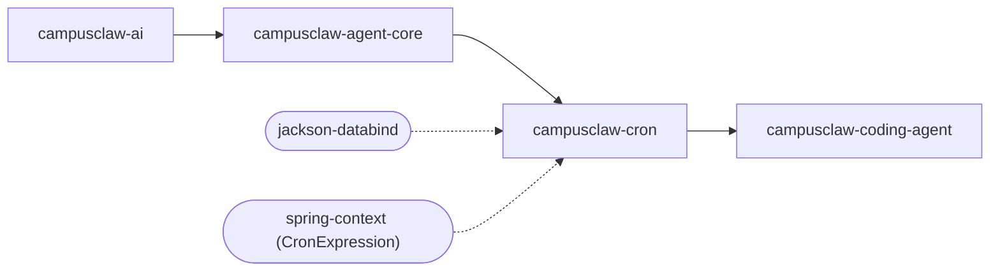
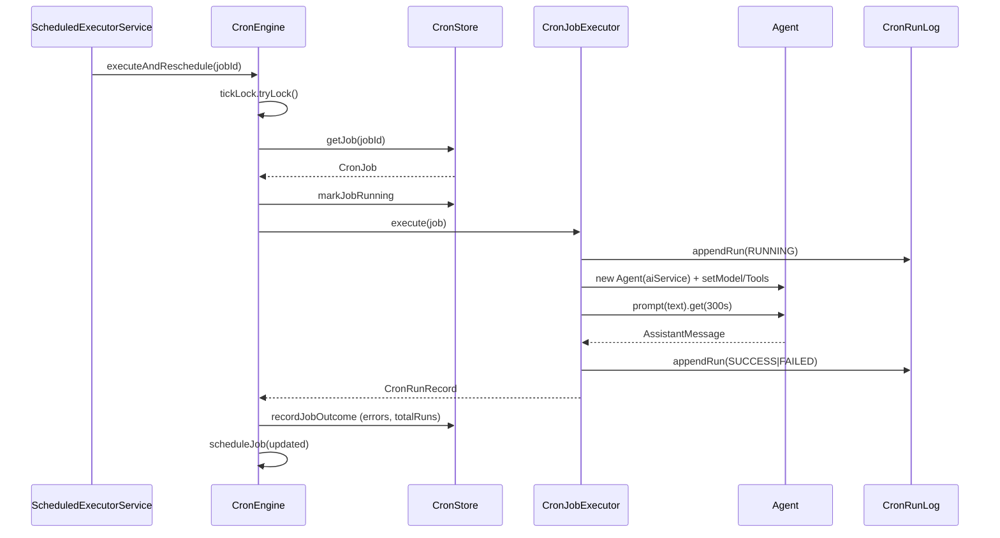
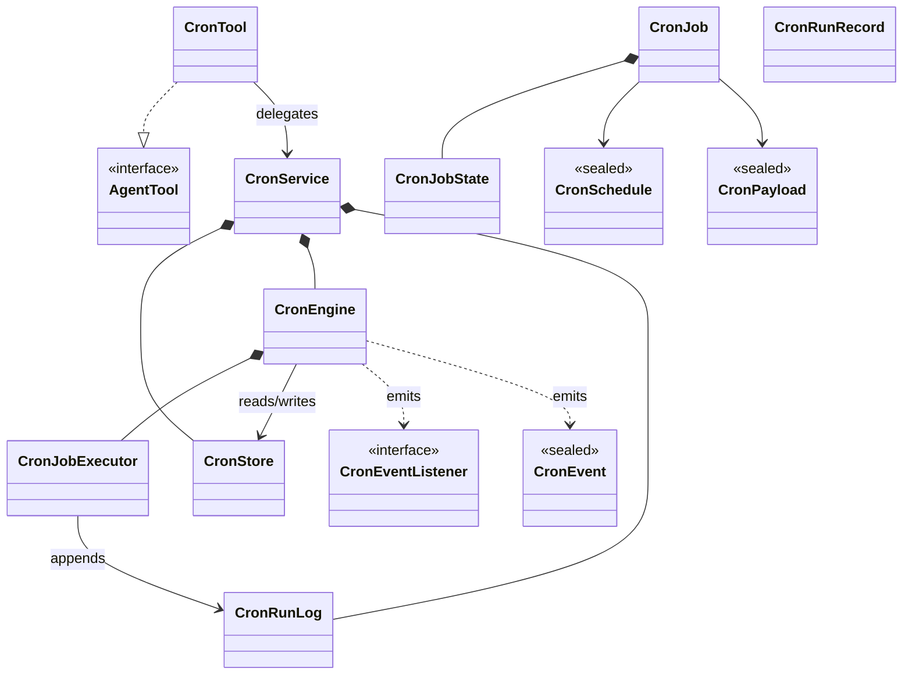

# cron 模块设计文档（基于代码 v1）

## 文档信息

| 项目 | 内容 |
|---|---|
| Story 编号 | 待开发者补充 |
| Story 名称 | cron 模块设计文档（基于代码 v1） |
| 负责人 | 待开发者补充 |
| 创建日期 | 2026-05-14 |
| 版本 | v1.0 (code-derived) |

> 本文档基于 `modules/cron` 现有源码逆向生成，复用 `docs/cron-module-design.md` 中已沉淀的设计原文（架构对照表、Phase 列表、文件清单等），按 AR 七章模板补齐章节。

---

## 1. Story 背景

### 1.1 需求来源

为 CampusClaw AI 编程助手添加定时任务能力，参考 OpenClaw 的 cron 扩展思路。用户可通过 LLM 对话创建/管理定时任务，由独立 Agent 实例自动执行。（原文出处：`docs/cron-module-design.md` Context 段）

具体的 Story/issue 编号代码中无法判定，**待开发者补充**。

### 1.2 需求背景/价值/详情

**背景：**
CampusClaw 主进程是 TUI 交互式 Agent，对话生命周期 = 进程生命周期；用户存在"定期执行某条 prompt"（每日总结、每小时巡检、定时构建）的诉求，但主对话无法长期驻留前台。需要在主 Agent 之外有一个可被持久化、可被独立调度的副 Agent 入口。

**价值：**
- 把 LLM 调度任务沉淀为可持久化记录（`~/file/.campusclaw/agent/cron/jobs.json`），跨会话存活
- 通过 `CronTool`（`AgentTool`）暴露给 LLM 自身——agent 可以自调度
- 通过 `tickOnce()` 与 `--cron-tick` CLI 模式与系统调度器（launchd / crontab）集成，主进程不在时仍可触发
- 不修改 `agent-core` / `ai` / `tui` 三个核心模块的 Java 源码，作为独立 Maven 模块挂载

**详情：**
模块对外提供三类入口：
- 程序门面 `CronService`（`createJob` / `listJobs` / `triggerJob` / `enableJob` / `disableJob` / `deleteJob` / `tickOnce` / `start` / `stop`）
- LLM 工具 `CronTool`（`action ∈ {create, list, delete, trigger, status, runs}`）
- 调度类型 `CronSchedule` 三态：`At`（一次性时间戳）、`Every`（固定间隔）、`CronExpr`（Spring `CronExpression` 表达式 + 可选时区）

### 1.3 关联需求

| 关联 Story/需求 | 关联关系 | 说明 |
|---|---|---|
| campusclaw-agent-core | 依赖 | 引用 `com.campusclaw.agent.Agent` 创建隔离实例、`com.campusclaw.agent.tool.AgentTool` 暴露 `CronTool`、`com.campusclaw.agent.util.LoggingUncaughtExceptionHandler` 装挂调度线程 |
| campusclaw-ai | 依赖（传递自 agent-core） | 引用 `CampusClawAiService` / `ModelRegistry` / `AssistantMessage` / `TextContent` 等类型 |
| campusclaw-coding-agent | 被依赖 | `CampusClawCommand` 注入 `@Nullable CronService`，`InteractiveMode` 启停 engine，`LoopTool` 调用 `cronService`，`SystemSchedulerInstaller` 安装外部触发 |

---

## 2. Story 分析

### 2.1 Story 上下文

文字补充：

- 本模块 artifactId：`campusclaw-cron`（`com.campusclaw:campusclaw-cron:1.0.0-SNAPSHOT`）
- 上游（项目内 `<dependency>`）：`campusclaw-agent-core`（间接引入 `campusclaw-ai`）
- 下游（grep `import com.campusclaw.cron`）：`coding-agent-cli` 的 `CampusClawCommand` / `InteractiveMode` / `LoopTool` / `SystemSchedulerInstaller`
- 外部依赖（top 3）：`jackson-databind`（JSON 持久化）、`spring-context`（`CronExpression` 解析 + `@Service`）、`slf4j-api`（日志）

### 2.2 功能点分解

| 序号 | 功能点 | 描述 | 优先级 | 预估工作量 |
|---|---|---|---|---|
| 1 | 任务定义与持久化 | 通过 `CronStore` 在 `~/file/.campusclaw/agent/cron/jobs.json` 保存 `CronJob` 列表，支持文件锁多进程共享 | 高 | - |
| 2 | 三种调度类型 | `CronSchedule.At` / `Every` / `CronExpr` sealed 协议，覆盖一次性、固定间隔、cron 表达式 | 高 | - |
| 3 | 进程内调度引擎 | `CronEngine` 用单线程 `ScheduledExecutorService` 驱动 tick，支持 `start` / `stop` / `scheduleJob` / `unscheduleJob` / `triggerJob` | 高 | - |
| 4 | 隔离 Agent 执行 | `CronJobExecutor` 每次任务 `new Agent(aiService)`，通过 `payload.modelId` / `allowedTools` / `systemPrompt` 定制 | 高 | - |
| 5 | 运行记录 JSONL | `CronRunLog` 按 `jobId` 维度 append-only 写入 `runs/{jobId}.jsonl` | 高 | - |
| 6 | 单次同步 tick | `CronService.tickOnce()` 给外部调度器（launchd / crontab）的 `--cron-tick` 模式使用 | 中 | - |
| 7 | LLM 自调度 | `CronTool` 实现 `AgentTool`，6 个 action：`create` / `list` / `delete` / `trigger` / `status` / `runs` | 高 | - |
| 8 | 故障收敛 | 连续 3 次错误自动 `enabled=false`；指数退避 `min(1000 * 2^errors, 3_600_000)` ms；陈旧 `runningAtMs` >2h 自动清除 | 中 | - |

工作量栏均填 `-`：逆向出文档时不知道当时估算。

---

## 3. 实现设计

### 3.1 功能实现思路

`CronService` 作为门面汇聚三个服务：`CronStore`（持久化层）、`CronEngine`（调度层）、`CronRunLog`（运行日志）。创建任务时持久化到 JSON，立即（若 engine 已 `start()`）调用 `engine.scheduleJob()` 注册到调度器。`CronEngine` 内部按 `CronSchedule` 类型分别用 `scheduler.schedule()`（At）/手工链式（Every、CronExpr）注入 `ScheduledExecutorService`，触发后委托 `CronJobExecutor.execute()` 用 `new Agent(aiService)` 创建一次性 Agent 实例运行，结果写入 `CronRunLog` 并通过 `CronEvent` 通知监听者。

关键设计取舍：**不用 `SmartLifecycle`**，避免 cron engine 在 `--list-models` 等非交互模式下被 Spring 自动拉起；由 `InteractiveMode` 显式 `cronService.start()` / `stop()` 控制。`CronJobExecutor` 用 `@Lazy List<AgentTool>` 与 `@Lazy CronService` 打破循环依赖（`CronTool` → `CronService` → `CronEngine` → `CronJobExecutor` → `List<AgentTool>` ↩ `CronTool`）。

### 3.2 功能实现设计

核心流程：调度任务触发 → 加 tick 锁 → 检查 enabled & 未在跑 → executor 创建 Agent → prompt 执行 → 记录结果 → 重调度。

主流程 step（措辞与时序图节点对齐）：

1. `executeAndReschedule(jobId)`：`ScheduledExecutorService` 触发回调
2. `tickLock.tryLock()`：单线程互斥，防止重入
3. `CronStore.getJob(jobId)`：读最新定义（可能已被 LLM 编辑）
4. `markJobRunning`：写 `runningAtMs = now()` 防止并发触发
5. `CronJobExecutor.execute(job)`：进入隔离执行
6. `appendRun(RUNNING)`：写入 JSONL 起始记录
7. `new Agent(aiService) + setModel/Tools`：构造一次性 Agent
8. `prompt(text).get(300s)`：默认 300 秒超时
9. `appendRun(SUCCESS|FAILED)`：写入终态记录
10. `recordJobOutcome`：更新 `totalRuns`、`consecutiveErrors`；连续 3 次失败 → `enabled=false`；`deleteAfterRun && success` → 删除
11. `scheduleJob(updated)`：For `Every` / `CronExpr`，链式重调度

事件清单（`CronEvent` sealed interface）：

| 事件 | 触发点 | 字段 |
|---|---|---|
| `JobStarted` | `executeJob` 入口 | `jobId, jobName, runId` |
| `JobCompleted` | `recordJobOutcome` 成功分支 | `jobId, jobName, runId, output` |
| `JobFailed` | `recordJobOutcome` 失败分支 / `recordJobException` | `jobId, jobName, runId, error` |

并发与容错矩阵：

| 机制 | 实现 |
|---|---|
| Store 读写锁 | `ReentrantReadWriteLock` (`CronStore`) |
| Tick 互斥 | `ReentrantLock tickLock` (`CronEngine`) |
| Skip-if-running | `job.state().runningAtMs() != 0` 跳过 |
| 指数退避 | `min(1000L * (1L << consecutiveErrors), 3_600_000L)` ms |
| 自动禁用 | `MAX_CONSECUTIVE_ERRORS = 3` → `enabled=false` |
| 陈旧标记 | `STALE_THRESHOLD_MS = 2 * 60 * 60 * 1000`，启动时 `cleanStaleRunning` |
| 多进程互斥 | `CronStore.acquireProcessLock()` 用 `FileChannel.tryLock` |

### 3.3 GUI 前端设计

本模块不涉及前端界面（纯后端 lib，被 `coding-agent-cli` 聚合）。

`CronTool` 输出经由 LLM 流式 ContentBlock 渲染到 TUI，但渲染逻辑在 `tui` / `coding-agent-cli` 模块，不属于本模块职责。

### 3.4 接口描述

**Java 程序接口**——`CronService` 公共方法签名：

| 接口 | 方法 | 入参 | 返回 | 说明 |
|---|---|---|---|---|
| CronService | createJob | `String name, @Nullable String description, CronSchedule schedule, CronPayload payload` | `CronJob` | 创建任务并立即注册到 engine（若 running） |
| CronService | deleteJob | `String jobId` | `boolean` | 从 engine 取消并从 store 删除 |
| CronService | listJobs | — | `List<CronJob>` | 读全部任务定义 |
| CronService | getJob | `String jobId` | `Optional<CronJob>` | 查单条 |
| CronService | enableJob | `String jobId` | `void` | 置 `enabled=true` 并 `scheduleJob` |
| CronService | disableJob | `String jobId` | `void` | 置 `enabled=false` 并 `unscheduleJob` |
| CronService | triggerJob | `String jobId` | `CronRunRecord` | 立即执行（绕过调度，但走 executor 流水） |
| CronService | getRecentRuns | `String jobId, int limit` | `List<CronRunRecord>` | JSONL 末尾倒数 N 条 |
| CronService | tickOnce | — | `List<CronRunRecord>` | 单次同步 tick（`--cron-tick` 用） |
| CronService | start / stop / isRunning | — | `void` / `void` / `boolean` | engine 生命周期 |
| CronService | addListener | `CronEventListener` | `void` | 注册事件回调 |
| CronService | setDefaultModelId / getDefaultModelId | `String` | `void` / `String` | 设置 cron 任务未指定 model 时的默认模型 |

**LLM Tool 接口**——`CronTool` 实现 `AgentTool`：

| 字段 | 取值 |
|---|---|
| `name()` | `"cron"` |
| `label()` | `"Cron"` |
| `description()` | "Manage persistent scheduled tasks (cron jobs) that run in isolated background agents. ..." |
| 必填 schema | `action` ∈ {`create`, `list`, `delete`, `trigger`, `status`, `runs`} |
| `create` 入参 | `name`, `schedule_type`, `schedule_value`, `prompt`, `description?`, `model?`, `system_prompt?`, `tools?`, `timezone?` |
| `delete/trigger/status/runs` 入参 | `job_id`，`runs` 另接 `limit?` |
| 返回 | `AgentToolResult` 包 `TextContent` |

**事件接口**——`CronEventListener` 单方法函数式接口 `void onCronEvent(CronEvent event)`。

本模块不暴露 HTTP / WS / gRPC 接口。

### 3.5 数据库及持久化设计

**不涉及关系型数据库**。持久化全部走本地文件：

| 路径 | 格式 | 写入器 | 说明 |
|---|---|---|---|
| `~/file/.campusclaw/agent/cron/jobs.json` | JSON `{"version": 1, "jobs": [CronJob...]}` | `CronStore` | 任务定义与运行时状态合并存储；写前 pretty-print；进程内 `ReentrantReadWriteLock`；进程间 `FileChannel.tryLock` |
| `~/file/.campusclaw/agent/cron/jobs.json.lock` | 二进制 advisory lock | `CronStore.acquireProcessLock` | 多进程互斥（主进程 + `--cron-tick` 子进程） |
| `~/file/.campusclaw/agent/cron/runs/{jobId}.jsonl` | JSON-Lines | `CronRunLog` | append-only；每行一条 `CronRunRecord`；`StandardCharsets.UTF_8` 显式编码 |

`CronJob` 字段（持久化结构）：

| 字段 | 类型 | 是否必填 | 默认值 | 说明 |
|---|---|---|---|---|
| id | String (UUID) | 是 | `UUID.randomUUID()` | 主键 |
| name | String | 是 | — | 用户提供 |
| description | String | 否 | null | 可选描述 |
| enabled | boolean | 是 | true | 是否参与调度 |
| deleteAfterRun | boolean | 是 | false | 一次性任务完成后是否自删 |
| schedule | CronSchedule (sealed) | 是 | — | `At` / `Every` / `CronExpr` |
| payload | CronPayload (sealed) | 是 | — | 目前仅 `AgentPrompt` |
| state | CronJobState | 是 | `initial()` | 内嵌运行时状态 |
| createdAtMs | long | 是 | `System.currentTimeMillis()` | 创建时间 |

`CronJobState` 字段：

| 字段 | 类型 | 说明 |
|---|---|---|
| nextRunAtMs | long | 下次预计执行时刻；调度时由 engine 写入 |
| runningAtMs | long | 当前执行起始时刻；非 0 即"在跑"，触发 skip-if-running |
| lastRunAtMs | long | 上次完成时刻 |
| lastRunStatus | String | `"success"` / `"failed"` / `"stale"` / null |
| consecutiveErrors | int | 连续失败计数，>=3 自动禁用 |
| totalRuns | int | 累计执行次数 |

`CronRunRecord` 字段（JSONL 单行）：

| 字段 | 类型 | 说明 |
|---|---|---|
| runId | String | 8 字符 UUID 截断 |
| jobId | String | 关联 job |
| startedAtMs | long | 起始 |
| finishedAtMs | long | 结束（RUNNING 状态时为 0） |
| status | enum `RUNNING/SUCCESS/FAILED/CANCELLED` | 终态 |
| error | String? | 失败原因 |
| output | String? | 最后一条 AssistantMessage 文本 |
| turnCount | int | 当前实现固定写 0，预留 |

### 3.6 代码设计

正文类清单（按包组织，与图严格对齐）：

`com.campusclaw.cron`

- `CronService`：门面（`@Service`），协调 store/engine/runLog，对外暴露 11 个方法

`com.campusclaw.cron.engine`

- `CronEngine`（`@Service`）：调度引擎，持 `ScheduledExecutorService` + `tickLock` + `scheduledJobs` map，`start/stop/scheduleJob/unscheduleJob/triggerJob/tickOnce/computeNextDelay`
- `CronJobExecutor`（`@Service`）：执行器，`execute(CronJob)` → `new Agent(aiService)` → `prompt().get(300s)` → 写 `CronRunLog`
- `CronEventListener`（`@FunctionalInterface`）：事件回调接口

`com.campusclaw.cron.store`

- `CronStore`（`@Service`）：JSON 持久化 + 进程内读写锁 + 进程间 `FileChannel.tryLock`
- `CronRunLog`（`@Service`）：JSONL append-only 日志

`com.campusclaw.cron.tool`

- `CronTool`（`@Component implements AgentTool`）：LLM 工具，6 action 路由

`com.campusclaw.cron.model`

- `CronJob`（record）：任务定义聚合根，含 `withState/withEnabled` 函数式更新
- `CronJobState`（record）：运行时状态
- `CronRunRecord`（record + enum `RunStatus`）：单次执行记录
- `CronSchedule`（sealed interface）：`At` / `Every` / `CronExpr` 三态，Jackson `@JsonTypeInfo`
- `CronPayload`（sealed interface）：`AgentPrompt`，预留扩展
- `CronEvent`（sealed interface）：`JobStarted` / `JobCompleted` / `JobFailed`

跨模块依赖：

- `AgentTool`（来自 `campusclaw-agent-core`）：`CronTool` 实现
- `Agent` / `CampusClawAiService` / `ModelRegistry` / `Model`（来自 agent-core / ai）：在 `CronJobExecutor` 内使用

### 3.7 安装部署设计

本模块作为 lib 由 `coding-agent-cli` 聚合，不单独部署。集成点（来自 `docs/cron-module-design.md` Phase 7 与代码实证）：

| 文件 | 改动 |
|---|---|
| `CampusClawCommand.java` | 注入 `@Nullable CronService`（`@Autowired(required = false)`），传递给 `InteractiveMode` 构造器 |
| `InteractiveMode.java` | tui 初始化后 `if (cronService != null) cronService.start()`；finally 块中 `stop()` |
| `SystemSchedulerInstaller.java`（coding-agent-cli/codingagent/cron/） | 安装 launchd / crontab → 外部周期调用 `--cron-tick`，进程内调用 `CronService.tickOnce()` |

运行时依赖外部资源：

- 文件系统写入权限：`$HOME/file/.campusclaw/agent/cron/`（jobs.json + runs/）
- JVM：JDK 21（继承自父 pom；用了 sealed interface / record / pattern matching switch）
- 无网络 / 无数据库

无独立配置文件——`application.yml` 内**没有** `cron.*` 前缀配置项（grep 已确认）。默认路径硬编码在 `CronStore.defaultJobsPath()` / `CronRunLog.defaultRunsDir()`，构造器重载允许测试注入。

---

## 4. DFX 设计

### 4.1 性能设计

- **并发模型**：单线程 `ScheduledExecutorService`（`Executors.newSingleThreadScheduledExecutor`），所有 tick 串行；`tickLock` 防 reentry；Agent 执行同步阻塞 `prompt().get(300 SECONDS)`，超时调 `agent.abort()`
- **吞吐**：受限于单调度线程，适合 N≤数十量级的低频任务；高频/并行场景需扩展为线程池（当前未实现）
- **退避**：连续失败用 `1000 * 2^errors` 指数退避，上限 1 小时
- **性能目标**：未在代码中声明具体 SLA，当前实现关注**调度准确性**与**任务隔离**，不追求高吞吐

### 4.2 兼容性设计

- **JDK 版本**：JDK 21（父 pom），用了 `sealed interface`、`record`、`switch pattern matching` —— 不可降级
- **接口稳定性**：`CronService` / `CronTool` / `CronSchedule` / `CronPayload` / `CronEvent` 均无 `@Deprecated` 标记，目前视为内部稳定接口
- **持久化兼容**：`jobs.json` 顶层带 `version=1` 字段，Jackson `FAIL_ON_UNKNOWN_PROPERTIES=false` 允许后续添加字段而不破坏旧版反序列化；`CronJobs` 删除字段是破坏性变更，需要迁移
- **协议版本**：本模块不对外暴露 HTTP/RPC 协议

### 4.3 可维护性设计

- **日志**：全部走 SLF4J `LoggerFactory.getLogger(...)`，未发现 `System.out.println` / `printStackTrace`（已 grep 验证）
- **关键日志位点**：`CronEngine.start/stop`（info）、`scheduleJob`（debug）、`auto-disabled`（warn）、`stale running mark`（warn）、`CronJobExecutor.execute` 失败（error 含异常）
- **指标**：未集成 Micrometer / `MeterRegistry`，无 `@Timed` 注解
- **健康检查**：未实现 `HealthIndicator`；`CronService.isRunning()` 是简单的 `engine.running` 字段读
- **线程命名**：调度线程显式命名 `"cron-engine"`，并装 `LoggingUncaughtExceptionHandler.INSTANCE` —— 符合本仓"后台线程必装 handler"规约

### 4.4 全球化设计

- 时区处理：`CronSchedule.CronExpr` 支持可选 `timezone` 字段，未设置时使用 `ZoneId.systemDefault()`（`CronEngine.computeNextDelay`）
- 文本本地化：`CronTool` 与 `CronEngine` 的用户可见字符串均英文，未引入 `ResourceBundle` / `messages*.properties`
- 时间格式化：`CronTool.TIME_FMT` 用 `DateTimeFormatter.ofPattern("yyyy-MM-dd HH:mm:ss").withZone(ZoneId.systemDefault())`，未传 `Locale`——展示场景目前可接受
- 评估：**本模块不涉及多语言文本资源**，时区处理已显式支持

### 4.5 产品资料设计

本模块影响以下产品资料：

- `docs/cron-module-design.md` —— 现有设计文档，与本文档并存
- `docs/module-architecture.md` —— `cron` 模块段落（已存在）
- `README.md` —— 顶部模块表 cron 行
- 本文档 `cron-with-existing-design/with_skill/outputs/cron.md` —— v1 基于代码逆向产出

无 `docs/openapi/*.yaml` 或 `docs/asyncapi/*.yaml` 关联（无 HTTP/WS 接口）。

---

## 5. 安全 Checklist

| 序号 | 检查项 | 是否涉及 | 说明 |
|---|---|---|---|
| 5.1 | 是否有认证机制 | 不涉及 | 模块只在本地进程内被 LLM agent 调用，无外部 endpoint；grep 未发现 `@PreAuthorize` / `Authentication` / `SecurityFilterChain` / Bearer / JWT |
| 5.2 | 纵向/横向越权 | 不涉及 | 单用户单进程；无 multi-tenant ownership 概念 |
| 5.3 | 记录操作日志 | 是 | `CronRunLog` 记录每次执行（runId / 起止时间 / 状态 / 错误 / 输出）；`CronEvent.JobStarted/Completed/Failed` 通知监听者；SLF4J 日志记录 `auto-disabled`、`stale running mark` 等关键状态变更 |
| 5.4 | SQL 注入 | 不涉及 | 模块无任何数据库访问；grep `executeQuery` / `PreparedStatement` 全无命中 |
| 5.5 | XSS 注入 | 不涉及 | 纯后端 lib，无 HTML 渲染；`CronTool` 输出为纯文本 `TextContent` 由 TUI 渲染 |
| 5.6 | XML 注入 | 不涉及 | 仅 JSON 持久化（Jackson）；grep `DocumentBuilderFactory` / `SAXParserFactory` 无命中 |
| 5.7 | 命令注入 | 不涉及 | 本模块自身**不**调 `ProcessBuilder` / `Runtime.exec`；执行体走 `new Agent(aiService).prompt(...)`，下游 `BashTool` 由 agent 自己的 `allowedTools` 决定，且其防护在 `coding-agent-cli` 的 `BashTool` / `HybridBashTool` 内（本模块不负责） |
| 5.8 | 输入校验 | 是 | `CronTool.parseSchedule` 显式校验 `at` 必为 epoch millis 或 ISO instant、`every` 必为正整数 ms、`cron` 必通过 `CronExpression.parse`；`handleCreate` 检查 `name` / `prompt` 非空；非法 schedule 返回错误文本而非抛异常 |
| 5.9 | 敏感数据/个人隐私数据 | 是 | `CronPayload.AgentPrompt.prompt` 可能包含用户输入文本，被持久化到 `jobs.json`；`CronRunRecord.output` 持久化 LLM 输出。当前未做脱敏；`jobs.json` 与 `runs/*.jsonl` 落在 `$HOME/file/.campusclaw/agent/cron/`，依赖文件系统权限保护 |
| 5.10 | 加解密 | 不涉及 | 无 `Cipher` / `MessageDigest` / `SecretKey` 引用；任务定义与运行日志明文存储 |
| 5.11 | 文件上传下载 | 不涉及 | 无 `MultipartFile`；`CronStore` / `CronRunLog` 只在固定路径读写自管理文件，无用户控制的路径输入（jobId 由 UUID 生成，不接受外部覆盖） |
| 5.12 | 硬编码 | 否（合规） | 无 password / apiKey / token 字面量；常量是路径片段（`.campusclaw/agent/cron/jobs.json`）与阈值（`MAX_CONSECUTIVE_ERRORS=3`、`STALE_THRESHOLD_MS`、`DEFAULT_TIMEOUT_SECONDS=300`）—— 业务参数硬编码，未来若需要可暴露为 `@ConfigurationProperties` |
| 5.13 | 安全资料 | 否，待补充 | 通信矩阵 / 用户清单 / 公网 IP / 命令清单暂未更新，模块无对外端口/连接 |
| 5.14 | 不安全算法/协议 | 否 | `UUID.randomUUID()` 用于 jobId / runId（非安全场景，无需 `SecureRandom`）；无 MD5 / SHA1 / DES / SSLv3 / TLSv1.0 引用 |
| 5.15 | 文件权限 | 否 | `CronStore` / `CronRunLog` 用默认创建权限，未显式 `Files.setPosixFilePermissions`；依赖 `$HOME` 目录用户级隔离。建议后续显式设为 `0600` |
| 5.16 | 权限最小化 | 不涉及 | 模块作为 JVM 内 lib 运行，与宿主进程同权限 |
| 5.17 | Sudo 提权 | 不涉及 | 本模块无 `sudo` 调用；`SystemSchedulerInstaller`（在 coding-agent-cli）若安装 launchd 用户级 plist 不需 sudo |

---

## 6. Story 转测 Checklist

| 序号 | 检查项 | 是否完成 | 说明 |
|---|---|---|---|
| 6.1 | 串讲与反串讲是否完成 | 否 | 待执行 |
| 6.2 | 设计文档是否齐全 | 是 | 本文档 + `docs/cron-module-design.md` |
| 6.3 | CodeChecker 是否清零 | 否 | 运行 `./mvnw -pl modules/cron validate` 后填 |
| 6.4 | 代码审视意见是否清零 | 否 | 待 review |
| 6.5 | 接口是否已经归档 | 否 | `CronService` / `CronTool` 接口待归档；无 OpenAPI |
| 6.6 | 是否完成开发自测用例输出并且用例和 US 关联 | 否 | 现 `src/test/java` 含 2 个测试类（`CronScheduleTest`、`CronStoreTest`），待补 engine/executor/tool 单测并与 Story 关联 |

---

## 7. Story 讨论与决策记录

| 日期 | 提出人 | 角色 | 问题/议题 | 讨论过程 | 决策结论 | 状态 |
|---|---|---|---|---|---|---|
| 2026-05-14 | - | - | 设计文档由 codebase-module-design skill 基于代码逆向生成 v1 | 复用 `docs/cron-module-design.md` 中的依赖关系、并发控制矩阵、Phase 设计原文；按 AR 七章模板补齐 1.1 / 2.1 / 3.2 / 3.5 / 3.6 / 4.x / 5.x 章节，并按新规则在 2.1 / 3.2 / 3.6 三处补 Mermaid 图 | 由开发者补充 1.1 需求来源具体 Story 编号、1.2 业务背景描述、6.x 转测项勾选 | 开放 |
| - | - | - | 是否将硬编码业务参数（`MAX_CONSECUTIVE_ERRORS=3`、`DEFAULT_TIMEOUT_SECONDS=300`、`STALE_THRESHOLD_MS=2h`）外置为 `@ConfigurationProperties` | - | 待评审 | 开放 |
| - | - | - | `jobs.json` / `runs/*.jsonl` 是否设置 POSIX 0600 文件权限（5.15） | - | 待评审 | 开放 |
