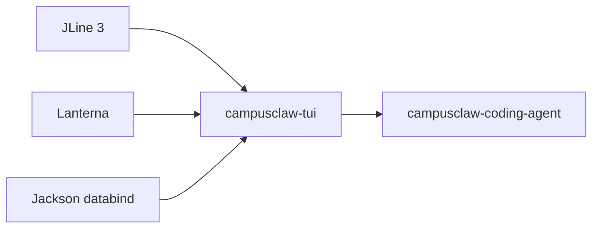
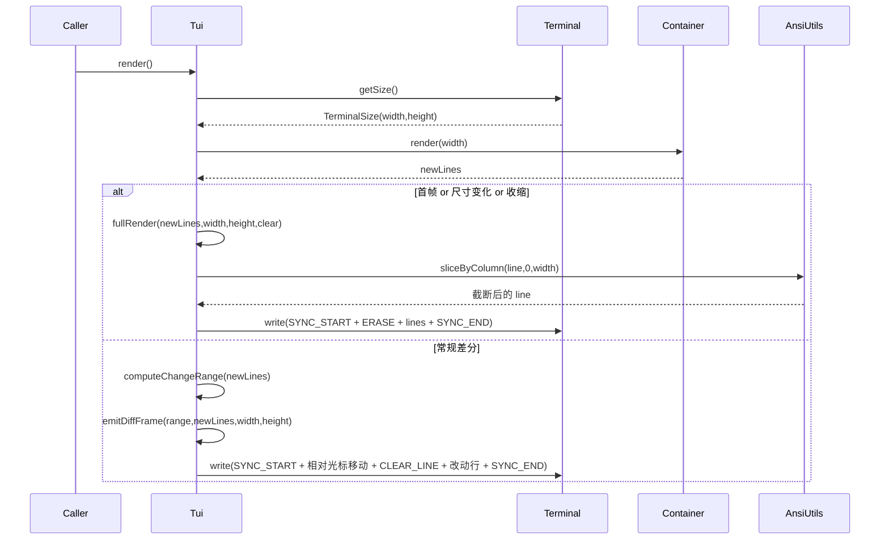
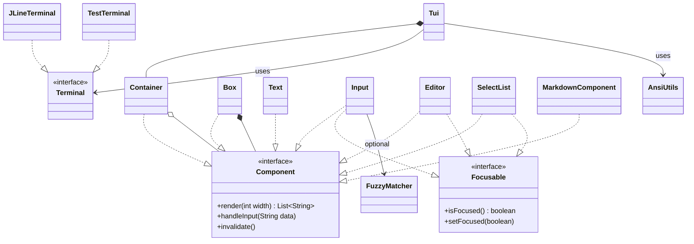

# tui 模块设计文档（基于代码 v1）

## 文档信息

| 项目 | 内容 |
|---|---|
| Story 编号 | 待补充 |
| Story 名称 | tui 模块设计文档（基于代码 v1） |
| 负责人 | 待补充 |
| 创建日期 | 2026-05-14 |
| 版本 | v1.0 (code-derived) |

---

## 1. Story 背景

### 1.1 需求来源

待开发者补充。模块自身无 README、无 *-design.md。从代码注释（`Tui` 类 javadoc 提到「mirrors the reference TypeScript implementation」、规避 macOS Terminal.app 的 NSPersistentUIManager 堆崩 bug）和 commit 演进规律推断：模块用于支撑 CampusClaw CLI 在终端中提供交互式 AI 编码体验，对标 Claude Code / Codex CLI 的 TUI 行为。

### 1.2 需求背景/价值/详情

**背景：** CampusClaw 是一个 terminal AI coding agent，CLI 主入口（`coding-agent-cli`）需要在原生终端环境下提供可滚动、可输入、可显示流式 LLM 输出的全屏 TUI。原生 JLine 只覆盖 line-editing 场景，Lanterna 提供画布但与终端 scrollback 兼容性不足。本模块在 JLine（终端 I/O 抽象 + raw mode）与少量 Lanterna 能力之上自建组件树 + 差分渲染。

**价值：** 提供一组与上层业务解耦的、可被 `coding-agent-cli` 直接组合的终端 UI 原语：

- 全屏渲染器 `Tui`，差分输出 + macOS Terminal.app 兼容性兜底
- 一套通用组件（输入框、多行编辑器、可选列表、Markdown 渲染、加载动画等）
- ANSI 工具集（宽度计算、East Asian wide / grapheme cluster、ANSI 跨行样式保持）
- 终端图像协议（Kitty / iTerm2 / Sixel）抽象

**详情：** 公开 API 集中在四个包内——`com.campusclaw.tui`（渲染器与协议）、`com.campusclaw.tui.terminal`（设备抽象）、`com.campusclaw.tui.component`（UI 组件）、`com.campusclaw.tui.ansi`（文本/宽度处理）、`com.campusclaw.tui.image`（图像协议）。所有组件实现统一的 `Component.render(int width)` 契约，由 `Tui` 编排为「component tree → lines → 差分写入终端」。

### 1.3 关联需求

| 关联 Story/需求 | 关联关系 | 说明 |
|---|---|---|
| campusclaw-coding-agent | 被依赖 | CLI 主模块通过 `Tui` + 多个组件（`Container`/`Editor`/`Input`/`SelectList`/`MarkdownComponent`/`FuzzyMatcher` 等）渲染交互界面 |
| JLine 3 (jline-terminal / jline-reader / jline-console / jansi / jna) | 外部依赖 | `JLineTerminal` 经由 JLine 进入 raw mode、获取尺寸、监听 SIGWINCH |
| Lanterna | 外部依赖 | 提供少量终端能力补充 |
| Jackson databind | 外部依赖 | 当前未直接 import；预留给 JSON 形式的主题/配置 |

本模块在 `modules/*` 之间属于**叶子模块**——`pom.xml` 没有任何 `com.campusclaw` 项目内模块的 `<dependency>`，下游仅 `coding-agent-cli`。

---

## 2. Story 分析

### 2.1 Story 上下文



文字补充：

- 本模块 artifactId：`campusclaw-tui`（`com.campusclaw:campusclaw-tui:1.0.0-SNAPSHOT`）
- 上游（项目内）：**无**——`pom.xml` 内没有任何 `com.campusclaw` 项目内模块依赖，是项目的叶子模块
- 下游（项目内）：`campusclaw-coding-agent`（CLI），grep `import com.campusclaw.tui.*` 命中 `Tui`、`Component`、`Focusable`、`Container`、`Text`、`Input`、`Editor`、`SelectList`、`MarkdownComponent`、`FuzzyMatcher`、`AnsiUtils`、`Terminal`、`JLineTerminal` 等多个公开类
- 外部依赖 top 3：JLine 3（terminal/reader/console/jansi/jna 全家桶）、Lanterna、Jackson databind

上下文图中出现的 `campusclaw-tui`、`campusclaw-coding-agent` 与 1.3 关联需求表中的模块名严格一致。

### 2.2 功能点分解

| 序号 | 功能点 | 描述 | 优先级 | 预估工作量 |
|---|---|---|---|---|
| 1 | 全屏 TUI 渲染主循环 | `Tui.start/render/stop`：管理 root `Container`、监听 resize/input、把组件树渲染为终端行 | 高 | - |
| 2 | 差分渲染算法 | `Tui.computeChangeRange` + `emitDiffFrame` + `fullRender`：基于 `previousLines`/`maxLinesRendered`/视口位置的最小化重绘策略 | 高 | - |
| 3 | 终端设备抽象 | `Terminal` 接口 + `JLineTerminal`/`TestTerminal` 两个实现：raw mode、`getSize`、`onResize`、`onInput`、daemon 虚拟线程读 stdin | 高 | - |
| 4 | 组件契约与组合 | `Component.render(width)` + `Container` 垂直堆叠 + `Focusable` 焦点协议 | 高 | - |
| 5 | 基础显示组件 | `Text`/`TruncatedText`/`Spacer`/`Box`/`KeybindingsComponent`：文本换行/截断/留白/边框/快捷键栏 | 高 | - |
| 6 | 输入与编辑 | `Input`（单行）/`Editor`（多行）：光标移动、Emacs kill ring、`UndoStack` 撤销、占位符 | 高 | - |
| 7 | 列表与选择 | `SelectList`/`SettingsList`/`Autocomplete`：键盘导航、滚动、Tab 补全（文件路径） | 高 | - |
| 8 | 模糊匹配 | `FuzzyMatcher`：autocomplete 与搜索打分（连续匹配/词首加权） | 中 | - |
| 9 | Markdown 渲染 | `MarkdownComponent` + `MarkdownTheme`：手写 line-by-line 解析为 ANSI 输出 | 中 | - |
| 10 | 加载动画 | `Loader`（spinner/dots）/`CancellableLoader`（Escape 可取消） | 中 | - |
| 11 | ANSI 工具集 | `AnsiUtils`/`AnsiCodeTracker`/`AnsiSegment`：可见宽度、按列切片、跨行样式保持、grapheme cluster | 高 | - |
| 12 | 终端图像 | `ImageComponent` + `TerminalImageProtocol`（KITTY/ITERM2/SIXEL/NONE）：内联图片显示与协议探测 | 中 | - |
| 13 | 差分渲染对象（独立 API） | `DiffRenderer` + sealed `RenderDiff`（`LineUpdates`/`FullRerender`）：可独立复用的帧差对象（与主 `Tui` 流程并行存在的工具型 API） | 低 | - |

---

## 3. 实现设计

### 3.1 功能实现思路

模块以「组件树 + 差分渲染」为核心。所有 UI 元素实现 `Component`，统一对外暴露 `List<String> render(int width)`——节点只关心可用宽度，不操心绝对定位，垂直堆叠交给 `Container`，整体编排交给 `Tui`。`Tui` 在每次 `render()` 中向 root `Container` 索要全帧 lines，与上一帧逐行比较，**只重写有差异的行**：仍在视口内的行用相对光标移动重写；超出视口下沿的行通过一次 `\r\n` 突发让终端把旧内容推入 scrollback，自然保留滚动历史。仅在首帧、尺寸变化或内容收缩到 high-water mark 之下时才发全清重画。终端 I/O 抽象成 `Terminal` 接口，生产用 `JLineTerminal`（raw mode + 守护虚线程读 stdin + SIGWINCH 监听），测试用 `TestTerminal`（内存录制写入与可编程注入输入/resize）。

### 3.2 功能实现设计

`Tui.render()` 是主流程入口，每次驱动一次「采集 → 比对 → 输出」周期：

1. **采集**：从 `terminal.getSize()` 拿到当前 `width`/`height`，调用 `root.render(width)` 得到 `newLines`
2. **比对**：
    - 首帧（`previousLines` 为空）→ `fullRender(..., clear=false)`
    - 尺寸变化或 `newLines.size() < maxLinesRendered`（收缩）→ `fullRender(..., clear=true)`
    - 否则 `computeChangeRange(newLines)` 求 `[first, last]` 变化区间；若 `first` 在视口顶之上 → 回退到 `fullRender`
3. **差分输出**（`emitDiffFrame`）：
    - 起始视同步输出（DEC private mode 2026）—— `Tui.isSyncOutputSupported()` 探测，Apple_Terminal 关闭以规避 NSPersistentUIManager 崩溃
    - 若变更区间在当前视口下方 → 通过 `\r\n.repeat(scroll)` 把旧内容滚入 scrollback
    - 相对光标移动到目标行（`\033[nA` / `\033[nB`），按行 `CLEAR_LINE` + 重写
    - 行宽超 `width` 时调用 `AnsiUtils.sliceByColumn` 按列截断（保 ANSI 完整）
4. **状态更新**：保存 `previousLines`/`previousWidth`/`previousHeight`/`previousViewportTop`/`hardwareCursorRow`/`maxLinesRendered`，供下一帧使用

输入与 resize 是事件驱动：`start()` 时向 `terminal.onInput` 注册 `inputHandler`，向 `terminal.onResize` 注册 `size -> render()`。`JLineTerminal` 内部用 `Thread.ofVirtual().name("campusclaw-tui-input")` 守护虚拟线程阻塞读 `NonBlockingReader`，把字节拼成 escape sequence 后通过监听器分发。

下面用 sequenceDiagram 描述一帧 render-flush 周期（actor 为真实类名）：



图中 `render(width)`、`newLines`、`fullRender`、`computeChangeRange`、`emitDiffFrame`、`sliceByColumn`、`SYNC_START/SYNC_END`、`CLEAR_LINE` 等措辞均与上面正文 step 列表一致。

事件清单（非 sealed 事件系统，靠监听器接口）：

| 事件源 | 触发条件 | 监听注册方式 |
|---|---|---|
| `Terminal.onInput` | stdin 收到键序列（escape sequence 已组装完整） | `Tui.start()` 中传入 `inputHandler` |
| `Terminal.onResize` | SIGWINCH（终端尺寸变化） | `Tui.start()` 中绑定 `size -> render()` |

### 3.3 GUI 前端设计

#### 3.3.1 设计图

本模块**本身就是 GUI 前端**（终端 UI），不存在另一份「设计稿」。视觉风格通过 ANSI 转义码 + Unicode box-drawing 字符 + Markdown/Loader/Select 主题对象表达。例子见 `Box` 的 javadoc 内嵌示意：

```
┌──────────────────┐  ← border top
│                  │  ← paddingY 行
│  [child content] │  ← 含 paddingX
│                  │  ← paddingY 行
└──────────────────┘  ← border bottom
```

#### 3.3.2 页面功能描述

本模块不绑定具体「页面」，提供给 `coding-agent-cli` 的是组件原语；下表按组件粒度对应「功能区」：

| 组件 | 功能描述 | 备注 |
|---|---|---|
| `Tui` | 全屏渲染器；维护组件树、监听 input/resize、调度差分输出 | 顶层装配，单实例 |
| `Container` | 垂直堆叠多个子组件，`CopyOnWriteArrayList` 保证并发渲染安全 | root 通常是它 |
| `Box` | 外框（`BorderStyle.SINGLE/DOUBLE/ROUNDED`）+ padding + 背景色 | 常用作分组容器 |
| `Text` | 多行文本，自动换行（`AnsiUtils.wrapTextWithAnsi`）、可加 padding/背景 | 普通文本展示 |
| `TruncatedText` | 单行文本，超宽末尾加 `…` | 标题/状态栏 |
| `MarkdownComponent` | 行内 Markdown → ANSI（标题/代码块/列表/链接/HR） | LLM 输出渲染 |
| `Input` | 单行输入；水平滚动、kill ring、`UndoStack` 撤销、Enter 提交 | 命令输入框 |
| `Editor` | 多行编辑器；Emacs 风格快捷键 + 撤销/重做 | 长文输入 |
| `SelectList` | 列表选择；↑/↓ 导航、Enter 确认、滚动 + 滚动指示 | 选择对话框 |
| `SettingsList<T>` | 键值对设置列表 | 设置面板 |
| `Autocomplete` | 包装 `Input`，Tab 触发文件路径补全；通过 `FuzzyMatcher` 排序 | 路径输入 |
| `KeybindingsComponent` | 紧凑的快捷键提示条 | 底部状态栏 |
| `Loader` | spinner/dots 动画 + 可选消息 | 等待 LLM |
| `CancellableLoader` | `Loader` + cancel hint + 取消回调 | 可中断等待 |
| `Spacer` | 固定空行 | 垂直留白 |
| `ImageComponent` | 内联图片显示，无支持则回退 alt text | 不支持终端走 fallback |

#### 3.3.3 页面模块

不区分「页面/模块」——本模块为组件库，组合层在 `coding-agent-cli`。

#### 3.3.4 接口使用

不涉及（本模块无 HTTP 接口；组件间调用见 3.6 类图）。

### 3.4 接口描述

本模块为 Java 程序接口（无 HTTP）。核心 SPI 列举如下：

| 接口 / 类 | 方法 | 入参 | 返回 | 说明 |
|---|---|---|---|---|
| `Component` | `render` | `int width` | `List<String>` | 把组件渲染为 ANSI 行序列 |
| `Component` | `handleInput` | `String data` | `void` | 处理键盘输入（default 空实现） |
| `Component` | `wantsKeyRelease` | — | `boolean` | 是否需要 Kitty 协议的 release 事件（默认 false） |
| `Component` | `invalidate` | — | `void` | 失效内部缓存，下一帧强制重算 |
| `Focusable` | `isFocused` / `setFocused` | — / `boolean` | `boolean` / `void` | 焦点状态读写 |
| `Focusable` | `isFocusable` (static) | `Component` | `boolean` | 判定组件是否 `Focusable` |
| `Terminal` | `write` | `String data` | `void` | 写入原始字节（含 ANSI） |
| `Terminal` | `clear` | — | `void` | 清屏 + home |
| `Terminal` | `getSize` | — | `TerminalSize` | 获取列/行 |
| `Terminal` | `enterRawMode` / `exitRawMode` | — | `void` | 切换 raw mode |
| `Terminal` | `onInput` | `Consumer<String>` | `void` | 注册输入监听 |
| `Terminal` | `onResize` | `Consumer<TerminalSize>` | `void` | 注册 SIGWINCH 监听 |
| `Terminal` | `clearListeners` | — | `void` | 清空已注册监听 |
| `Tui` | `setRoot` | `Container` | `void` | 设置根组件 |
| `Tui` | `setInputHandler` | `Consumer<String>` | `void` | 全局输入回调 |
| `Tui` | `start` / `stop` | — | `void` | 启停渲染器 |
| `Tui` | `render` | — | `void` | 同步执行一次帧绘制 |
| `Tui` | `getTerminal` | — | `Terminal` | 拿底层终端引用 |
| `DiffRenderer` | `computeDiff` | `List<String> lines` | `RenderDiff` | 计算与上一帧的最小差分 |
| `FuzzyMatcher` | `match`（多个静态重载） | `String query, List<...> items` | `List<MatchResult<T>>` | 模糊匹配 + 打分 |
| `AnsiUtils` | `visibleWidth` / `sliceByColumn` / `wrapTextWithAnsi` 等 | 文本 + 列宽 | `int` / `String` / `List<String>` | ANSI-aware 宽度/切片/换行 |
| `TerminalImageProtocol` | `detect` / `encode` | env / `byte[]` | `Protocol` / `String` | 探测图像协议 + 生成转义序列 |

### 3.5 数据库及持久化设计

**不涉及**。本模块为纯前端/库模块，所有状态保留在内存中（`Tui` 的差分状态、`UndoStack` 的快照、`KillRing` 的历史等）。仓库内 `find` 未发现 `schema.sql` / `@Entity` / MyBatis mapper xml；`pom.xml` 没有 JDBC / MyBatis / JPA 依赖。

### 3.6 代码设计

下面 classDiagram 给出关键类与关系（≤ 15 节点，类名集合 ⊆ 下方表中类名）：



正文表（按包组织，每个一级包列对外/入口/核心抽象，借用类的 javadoc 一行职责）：

**`com.campusclaw.tui`（顶层）**

- `Tui`：全屏 TUI 渲染器；管理组件树、按差分策略输出，规避 macOS Terminal.app NSPersistentUIManager 崩溃
- `Component`：核心组件接口；`render(width) → List<String>`、`handleInput`、`invalidate`
- `Focusable`：焦点标记接口；与 `Component` 联合实现的类参与焦点管理
- `DiffRenderer`：独立的帧差计算器，输出 `RenderDiff`
- `RenderDiff`：sealed interface，`LineUpdates` / `FullRerender` 两种结果
- `CampusClawTui`：模块标识占位类（私有构造）

**`com.campusclaw.tui.terminal`**

- `Terminal`：终端设备抽象（write/clear/getSize/raw mode/onInput/onResize）
- `JLineTerminal`：基于 JLine 3 的实现；raw mode、SIGWINCH、`Thread.ofVirtual()` 读 stdin
- `TestTerminal`：内存实现，记录写入、可注入输入/resize 事件
- `TerminalSize`：`record (int width, int height)`
- `StdinBuffer`：累积字节、组装 escape sequence 后产出完整键事件

**`com.campusclaw.tui.component`**

- `Container`：垂直堆叠子组件，`CopyOnWriteArrayList` 并发安全
- `Box`：边框 + padding + 背景 包装器
- `Text` / `TruncatedText` / `Spacer`：多行文本（带换行/padding/背景）/ 单行截断 / 空行
- `Input` / `Editor`：单行 / 多行编辑器（Emacs 风格、kill ring、undo）
- `SelectList` / `SettingsList` / `Autocomplete`：列表选择 / 设置列表 / 文件路径补全
- `MarkdownComponent` + `MarkdownTheme`：Markdown → ANSI 渲染 + 主题
- `SelectListTheme`：`SelectList` 配色配置
- `Loader` / `CancellableLoader`：spinner/dots 动画 / 可取消加载
- `KeybindingsComponent`：快捷键提示条
- `BorderStyle`：边框字符集枚举（SINGLE / DOUBLE / ROUNDED）
- `FuzzyMatcher`：模糊匹配 + 打分（`MatchResult<T>` record）
- `KillRing`：Emacs kill ring 环形缓冲
- `UndoStack<S>`：通用 undo 栈，clone-on-push

**`com.campusclaw.tui.ansi`**

- `AnsiUtils`：可见宽度、按列切片、ANSI-aware 换行；处理 East Asian wide / grapheme cluster
- `AnsiCodeTracker`：跟踪当前 SGR 状态以便跨行复用样式（package-private）
- `AnsiSegment`：`record(String text, boolean isAnsi)`

**`com.campusclaw.tui.image`**

- `ImageComponent`：内联图片组件，不支持时回退 alt text
- `TerminalImageProtocol`：协议探测 + 转义序列生成；`Protocol` 枚举（KITTY/ITERM2/SIXEL/NONE）

### 3.7 安装部署设计

**本模块作为 lib 由 `campusclaw-coding-agent` 聚合，不单独部署。** 无 `application.yml`、无 `META-INF/spring/*.imports`、无 `main`。打包产物 `campusclaw-tui-*.jar` 由上游通过 Maven 依赖引入。

运行时对宿主环境的隐式要求（由 `JLineTerminal` 决定）：

- 进程需绑定到真实 TTY（无 TTY 时 JLine 启动会失败）；非交互场景应使用 `TestTerminal`
- 环境变量 `TERM_PROGRAM`：`Apple_Terminal` 时 `Tui` 自动关闭 DEC 2026 同步输出（详见 `Tui.isSyncOutputSupported()`）
- 隐含依赖 jansi/jna 加载本地库（JLine 的 native provider）

---

## 4. DFX 设计

### 4.1 性能设计

- **渲染并发模型**：`Tui.render()` 用 `synchronized` 串行化；输入读取在 daemon **虚拟线程**（`Thread.ofVirtual().name("campusclaw-tui-input")`）中阻塞读 `NonBlockingReader`。无显式 `ExecutorService`、无 `CompletableFuture`、无 Reactor。
- **差分渲染**：最小化向终端写入的字节量——仅重写 `[firstChanged, lastChanged]` 区间；超出视口的内容通过 `\r\n` 突发让终端自身滚动。第一帧 + 尺寸变化 + 收缩才发全清重画。
- **同步输出**：DEC private mode 2026（`\033[?2026h`/`l`）成对包裹一次帧写入，避免中间状态被绘制（终端不支持时跳过，见 `isSyncOutputSupported`，Apple Terminal 关闭）。
- **缓存**：`Text` / `TruncatedText` / `Spacer` 内部按 `(text, width)` 缓存渲染结果，`invalidate()` 主动失效。`Container` 不缓存（子组件已各自缓存）。
- **性能目标**：当前实现关注**正确性与 macOS Terminal.app 兼容性**，无明确 P99/FPS 指标。具体性能目标待定。

### 4.2 兼容性设计

- **JDK**：由根 `pom.xml` 决定（项目要求 JDK 21）；使用 Java 21 特性 record、sealed interface（`RenderDiff`）、virtual thread（`Thread.ofVirtual()`）。下调 JDK 不兼容。
- **接口稳定性**：公开 API（`Component`/`Focusable`/`Terminal`/`Tui`/各 `*Component`）尚未标注 `@Deprecated`。当前仅 `coding-agent-cli` 一个内部下游，未对外发布稳定承诺。
- **终端兼容性**：`Tui.isSyncOutputSupported` 显式针对 `TERM_PROGRAM == Apple_Terminal` 关闭 DEC 2026；`TerminalImageProtocol.detect` 按环境降级 Kitty → iTerm2 → Sixel → NONE。

### 4.3 可维护性设计

- **日志**：本模块未使用 SLF4J（grep `LoggerFactory.getLogger` 无命中），也无 `System.out.println` / `printStackTrace`（grep 无命中）。原因：模块本身就在管理终端输出，任何附加日志都会污染 raw mode 下的画面。诊断信息预期由上游 `coding-agent-cli` 通过它自身的 SLF4J 输出到文件 appender。
- **指标**：无 Micrometer。
- **健康检查**：无（lib 模块）。
- **测试**：`src/test/java` 下 14 个 `*Test.java`，覆盖差分渲染、Editor、Input、SelectList、FuzzyMatcher、ANSI 工具等关键组件；`TestTerminal` 让组件能在无 TTY 环境下被测试。

### 4.4 全球化设计

- 本模块**不涉及**多语言资源（无 `messages*.properties`、无 `ResourceBundle`）。所有用户可见英文文本（如 `Loader` 默认 hint、`SelectList` 的 no-match 占位）由调用方传入，模块自身保持「文本无业务含义」。
- **Locale 使用**：`FuzzyMatcher.toLowerCase(Locale.ROOT)` 显式传 `Locale.ROOT`，符合 CLAUDE.md 中的 Locale 规范。
- **CJK 与 wide character**：`AnsiUtils.visibleWidth` 处理 East Asian wide character + grapheme cluster（`BreakIterator`），保证中日韩字符在终端中宽度计算正确——这是真正的「全球化」体现。

### 4.5 产品资料设计

本模块当前产出/影响的资料：

- `docs/module-architecture.md` 中关于 `modules/tui` 的描述段落
- 本设计文档：`docs/designs/tui.md`（基于代码逆向生成 v1）
- 本模块无 README、无 OpenAPI / AsyncAPI 文件（lib 模块）

---

## 5. 安全 Checklist

| 序号 | 检查项 | 是否涉及 | 说明 |
|---|---|---|---|
| 5.1 | 是否有认证机制 | 不涉及 | 纯前端/库模块，无网络入口，无用户身份概念 |
| 5.2 | 纵向/横向越权 | 不涉及 | 无资源属主概念 |
| 5.3 | 记录操作日志 | 否 | 模块不写日志（见 4.3）；操作审计由上游 `coding-agent-cli` 负责 |
| 5.4 | SQL 注入 | 不涉及 | 无数据库访问（见 3.5） |
| 5.5 | XSS 注入 | 不涉及 | 终端 UI，无浏览器渲染 |
| 5.6 | XML 注入 | 不涉及 | 无 XML 解析（grep `DocumentBuilderFactory` / `SAXParserFactory` 无命中） |
| 5.7 | 命令注入 | 不涉及 | grep `ProcessBuilder` / `Runtime.exec` 无命中；本模块不执行 shell |
| 5.8 | 输入校验 | 是 | `StdinBuffer` 校验 escape sequence 结构（仅接受合法 CSI/SS3/Alt+char 形式）；`Component.wantsKeyRelease` 默认 false，过滤 Kitty release 事件；`Autocomplete` 限制 Tab 候选来自实际目录条目 |
| 5.9 | 敏感数据/个人隐私数据 | 不涉及 | 不处理凭证/PII；用户输入字符回显由 Input/Editor 承担，无密码模式（如未来引入密码字段需补脱敏） |
| 5.10 | 加解密 | 不涉及 | 无加解密代码 |
| 5.11 | 文件上传下载 | 部分涉及 | `Autocomplete` 通过 `Files.newDirectoryStream` 列目录条目用于补全，不复制/写文件；`ImageComponent` 用 `Files.readAllBytes(Path)` 读取本地图片以内联展示。路径来源是调用方传入的 `Path`，未做沙箱限制——若上游对路径不可信，应在传入前过滤 |
| 5.12 | 硬编码 | 否 | 无密钥/口令/主机名硬编码；存在 ANSI 转义码常量（`SYNC_START`、`CLEAR_LINE` 等），属协议常量非敏感数据 |
| 5.13 | 安全资料 | 否 | 待补充 |
| 5.14 | 不安全算法/协议 | 不涉及 | 无 MD5/SHA1/DES/SSL 使用 |
| 5.15 | 文件权限 | 不涉及 | `ImageComponent` 仅读取已有文件，不创建文件；不调用 `Files.setPosixFilePermissions` |
| 5.16 | 权限最小化 | 不涉及 | 库模块，跟随宿主进程权限 |
| 5.17 | Sudo 提权 | 不涉及 | grep `sudo` 无命中 |

---

## 6. Story 转测 Checklist

| 序号 | 检查项 | 是否完成 | 说明 |
|---|---|---|---|
| 6.1 | 串讲与反串讲是否完成 | 否 | 待执行 |
| 6.2 | 设计文档是否齐全 | 是 | 本文档即设计文档 v1（code-derived） |
| 6.3 | CodeChecker 是否清零 | 否 | 跑 `./mvnw -pl modules/tui validate` 后填 |
| 6.4 | 代码审视意见是否清零 | 否 | 待 review |
| 6.5 | 接口是否已经归档 | 否 | 待归档 |
| 6.6 | 是否完成开发自测用例输出并且用例和 US 关联 | 否 | `src/test/java` 现有 14 个测试类，待与 Story 关联 |

---

## 7. Story 讨论与决策记录

| 日期 | 提出人 | 角色 | 问题/议题 | 讨论过程 | 决策结论 | 状态 |
|---|---|---|---|---|---|---|
| 2026-05-14 | - | - | 设计文档由 codebase-module-design skill 基于代码逆向生成 v1 | 通过静态分析 `pom.xml` + 包结构 + 关键类 javadoc 完成 | 由开发者补充关键决策（如：为何手写差分渲染而不直接用 Lanterna 全屏画布；macOS Terminal 兼容策略的取舍） | 开放 |
